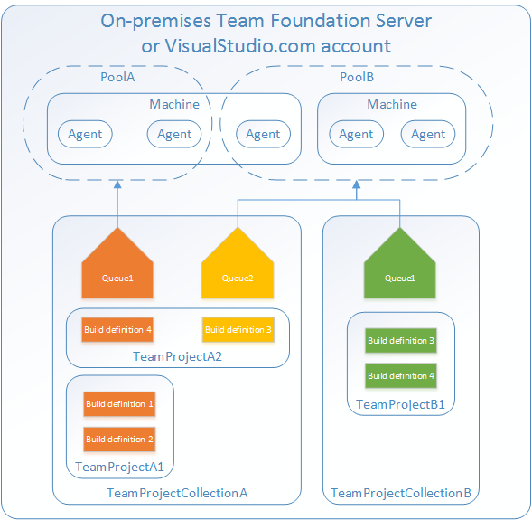
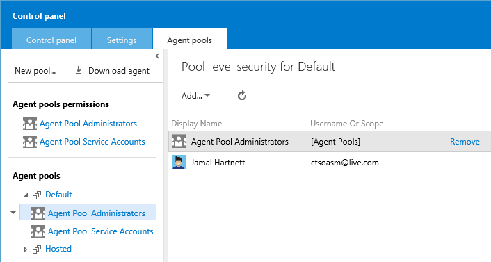
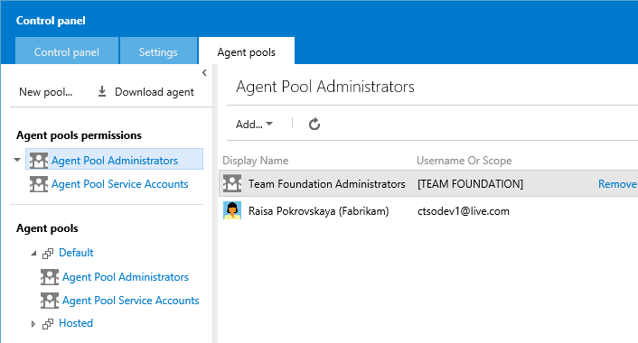
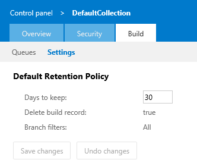

Title: Scale out and administer your build system
Description: You need at least one agent to build something, and if your team is large, you will probably need more.
ms.TocTitle: Scale out and administer
toc: show
ms.ContentId: BD5478A8-48CF-4859-A0CB-6E1948CE2C89

# Scale out and administer your build system

To build your code you need at least one agent, and as you add more code and people, you'll eventually need more.



[//]: # (This art was touched up by designer. He didn't change the text color, but I wonder if white is hard to read)

## Deploy an agent

 * [Deploy Windows agents](windows.md) to build Windows, Azure, and other Visual Studio solutions.
 
 * [Deploy Xplat agents](xplat.md) to build Xcode, Android, Java, or other kinds of apps.

<a name="agent-pools"></a>
## Agent pools

Use agent pools to organize and define permission boundaries around your build agents. Pools are scoped to your your Team Foundation Server application tier or Visual Studio Online account. You can share your pool across multiple team project collections.

You create and manage them from the Agent pools control panel tab (on-premises ```http://{your_server}:8080/tfs/_admin/_AgentPool``` or Visual Studio Online ```https://{youraccount}.visualstudio.com/_admin/_AgentPool```).

 


### Delegate administration of your agent pools

You can grant people permission to manage agent pools if you are a member of the Team Foundation Administrators group or a member of the Agent Pools Administrators group. For Visual Studio Online accounts, the original account creator is by default the only member of this group. 

You can scope the authority to a specific agent pool. Members of the Agent Pool Administrators group of a specific agent pool can  register new agents in that pool, add users to the Agent Pool Service Accounts and add other administrators to the pool. 



Or, you can grant permission manage all the agent pools. 



<a name="managing-permissions"></a>
### Managing Permissions

The security model for agent pools provide two groups that operate as roles instead of requiring to manage specific permissions for different users. These groups are defined for each pool created and are scoped as such.  There are also groups defined at the account or server level that are automatically added to the pool level groups.  

Note: By default the only member of the account level Agent Pool Administrators group is the Team Foundation Administrators group. By default in VSO the only member of this group is the user who created the account. You will need someone in the Team Foundation Administrators group to add users or groups to the account agent pools admin group to get you started.

* *Agent Pool Administrators* - Members of this group can register new agents in the pool and add additional users as administrators or service accounts.
* *Agent Pool Service Accounts* - Users in this group have permission to listen to the message queue for the specific pool to receive work.  In most cases you should not have to manage members of this group, the agent registration process will take care of it for you. For Team Foundation Server the service account you specify for the agent (commonly Network Service) is automatically added when you register the agent.  In Visual Studio Online we automatically create an internal service identity called ```{Pool Name} - Agent Service ({youraccount})```. 

## Queues

Give your build definition access to an agent pool using a queue. Queues are scoped to your team project collection, so you can share them across build definitions in multiple team projects.

You create and manage your queues from the Build tab of the collection control panel (on-premises ```http://{your_server}:8080/tfs/DefaultCollection/_admin/_BuildQueue``` or Visual Studio Online ```https://{youraccount}.visualstudio.com/DefaultCollection/_admin/_BuildQueue```).

 

 


## Collection level build settings

Here you can specify settings that drive the defaults for all build definitions in the project collection.

### Default Retention Policy

From here you can specify the default settings for how long the system retains completed builds.

For example; In the screenshot below we can see that our default retention policy for this project collection is 30 days.  This means that regardless of what is set on the individual build definition all builds that have not been marked to "Retain indefinitely" will be deleted 30 days after they complete.

