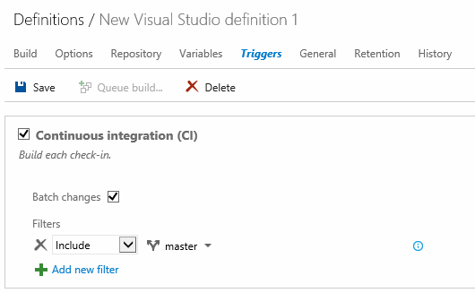
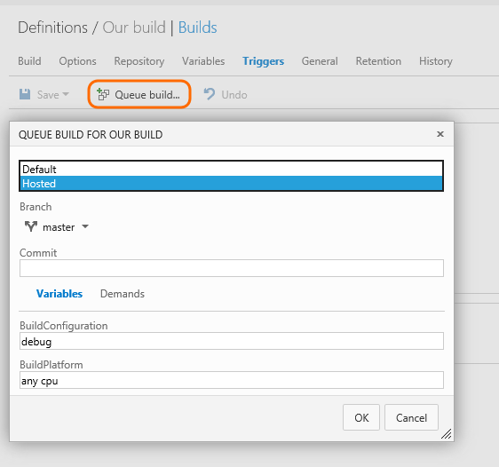

Toc: show
Parent: ./index.md
Title: Build your Visual Studio solution
ShortTitle: Visual Studio solution
ms.TocTitle: Visual Studio solution
ms.ContentId: 2BFC43A2-4F6C-4A5C-86EE-6DDA8733829D

# Make some changes

After you have [deployed a Windows build agent](/Library/vs/alm/Build/agents/windows.md), you are ready to define a CI build that compiles and tests your Visual Studio solutions whenever your team checks in code.

<iframe width="420" height="315" src="https://www.youtube.com/embed/Jx8s7KAATH4" frameborder="0" allowfullscreen="true"></iframe>

## Create the definition

0. Create the build definition.

 

 

0. Select the continuous integration (CI) trigger and specify the code you want to build

 

0. Save the definition.

 

 

0. Queue your new definition to make sure it works.

 

 

[!INCLUDE [temp](../_shared/definition-draft.md)]

[!INCLUDE [temp](../_shared/definition-replicate.md)]

## Q&A

<!-- BEGINSECTION class="md-qanda" -->

#### How do I customize my build?

[Run a PowerShell script](/Library/vs/alm/Build/scripts/index.md)

#### How do I combine check-ins to run fewer builds?
On the Triggers tab, select Batch changes. When you select this option, the build system runs only one build per branch at a time. Any pushes or check-ins that occur while a build is running are combined and built together when the current build is completed.

#### How do I automatically purge old builds?

If you are using Visual Studio Online, you can specify retention rules. This feature is not yet available for on-premises Team Foundation servers.

#### How do I build multiple configurations for multiple platforms? Can I build them in parallel?

Select MultiConfiguration to build multiple configurations for multiple platforms. Select Parallel if you want to distribute the jobs (one for each combination of values) to multiple agents in parallel if they are available.

Make sure to declare and assign values to the variables. To specify multiple values, separate them with commas.

Pass the variables to to the Visual Studio build step so that it passes them as arguments to MSBuild.

[!INCLUDE [temp](/library/vs/alm/build/_shared/qa-variable-secret.md)]

<!-- ENDSECTION -->