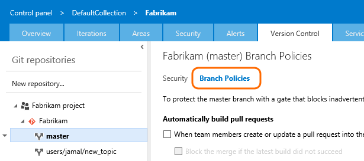
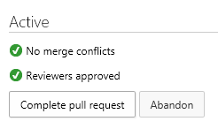
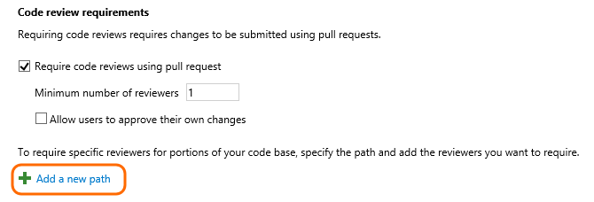
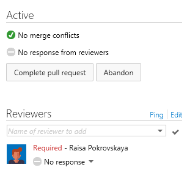
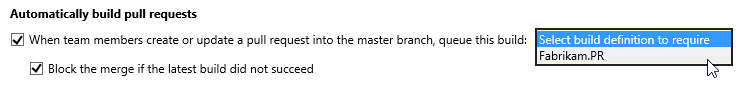
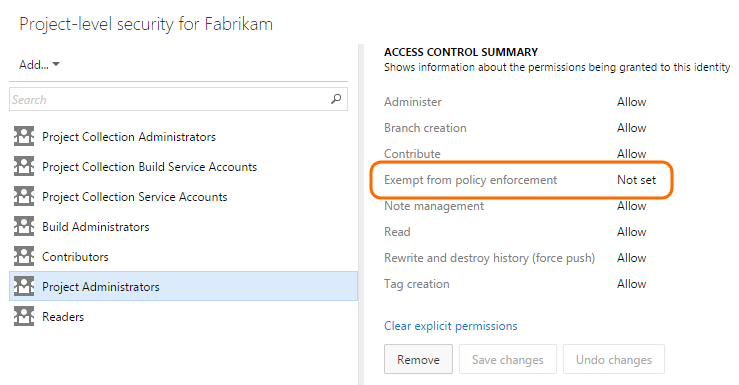

Title: Improve code quality with branch policies
Description: Branch policies provide teams with the means to protect their important branches.
ms.ContentId: 5D76697E-16A0-4048-91D1-806FE24C92A3
ms.topic: code reference (API)

# Improve code quality with branch policies

Branch policies help teams protect their important branches.  Whether it's [ensuring the build is never broken](#build) or just [getting the right people to review a change](#require_reviewers) to a sensitive piece of code, policies can help improve code quality.    

[How do branch policies work?](#how_works)

## Enable branch policies

0. Open the control panel.

	

0. Select the repository and branch.  

	

0. Select **Branch Policies**.

	

## Require code reviews

Requiring code reviews is generally accepted as a best practice for most software development projects. Pull requests make code reviews simple and effective.  To require teams to review their changes, select code review requirements.

### Require a minimum number of reviewers

The simplest policy is to require that another developer has looked at and approved the code.

  

If the specified number of reviewers does not sign off, the requestor cannot complete and merge the pull request into the branch with the policy.

When the required number of reviewers have approved, the pull request can be completed and merged.

 

### Automatically add reviewers

If you want to designate code reviewers who should review changes to specific portions of your codebase, add a new file path.

Enter the path or browse using the elipses.  Add individual reviewers and groups using the **Add user** and **Add group** links.

> **Tip:** Separate multiple paths with a semicolon.  Wildcards are also supported - click the  for examples.

#### Required reviewers

If you select required, then the pull request cannot be completed and merged until:

 * Every indvidual has approved the pull request.

 * At least one person in every group has approved the pull request.

Clear the required checkbox if you want to have users automatically added as reviewers, but not require their approval.   

#### Reviewers added to the pull request

When new pull requests are created the users and groups you specified are automatically added to the reviewers list.

If the required reviewers do not approve, the user cannot complete and merge the pull request into the branch with the policy.

When the required reviewers have approved, the pull request can be completed and merged.

## Require the pull request to build

Most teams using automated builds have CI builds set up for their development branches to help identify build breaks as soon as the break is introduced.  You can take this kind of quality assurance a step further.

 0. [Create a build definition](https://msdn.microsoft.com/Library/vs/alm/Build/overview). Note: you cannot use XAML builds in branch policies.

 0. On the branch policies tab, select the build definiton and specify if you want to block the merge if the build does not succeed.

 

When a pull request is created, or when new changes are pushed to an existing pull request, a new build is automatically queued.

If the build does not succeed, the policy rejects the pull request.

If you specified **Block the merge...**, the requestor cannot complete and merge the pull request.

After the requestor pushes changes to result in a successful build, the build is approved.

## Bypass branch policies

After you configure a branch policy, you cannot directly push or merge changes to the branch.

In some cases (for example, an emergency hotfix), you might need to update a branch directly and bypass the policy requirements. In these cases, you can grant the **Exempt from policy enforcement** permission to a user or group. You can scope this permission to an entire project, a repo, or a single branch. You manage this permission along with other [Git permissions](https://msdn.microsoft.com/en-us/library/ms252587.aspx#Git).  

> **Important:** If you are granted **exempt from policy enforcement**, you will not be warned nor blocked from pushing or merging directly to a branch. Also, pull requests can be completed and merged, bypassing the configured policies.

## Q & A

<!-- BEGINSECTION class="md-qanda" -->

#### Q: How do branch policies work?

Policies work in conjunction with pull requests, allowing developers to publish their code to a topic branch, and then evaluate the policy requirements using that code.  Branch policies are evaluated on the server, so teams can rest assured that the exact code meeting the policy is the code that will be merged when the pull request is complete.  

#### Q: What type of wildcard characters are supported when configuring required code reviewers?
Single asterisks (`*`) are supported, and will match any number of characters, including both forward-slashes (`/`) and back-slashes (`\`).  Question marks (`?`) will match any single character.  

Examples:

* `*.sql` will match all files with the .sql extension
* `/ConsoleApplication/*` will match all files under the folder named ConsoleApplication
* `/.gitattributes` will match the .gitattributes file in the root of the repo
* `*/.gitignore` will match any .gitignore file in the repo

#### Q: Are the required code reviewer paths case-sensitive?
No, branch policies are not case-sensitive at this time.

#### Q: How can I configure multiple users as required reviewers, but only require that one of them approve?
You can add the users to a group, and then add the group as a reviewer.  Any member of the group can then approve on behalf of the group to meet the policy requirement.

#### Q: I have the exempt from policy permission set, why am I still seeing policy failures in the pull request status?
Even for users that are exempt from policy enforcement, the configured policies are still evaluated when changes are added to a pull request.  For exempt users, policy status is simply advisory and will not block completion of the pull request.

#### Q: Where can I get more information on advanced policy configurations?
Check out the [REST API documentation](http://go.microsoft.com/fwlink/?LinkId=526702) for more details.    

<!-- ENDSECTION --> 