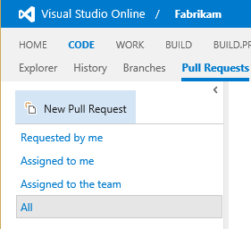
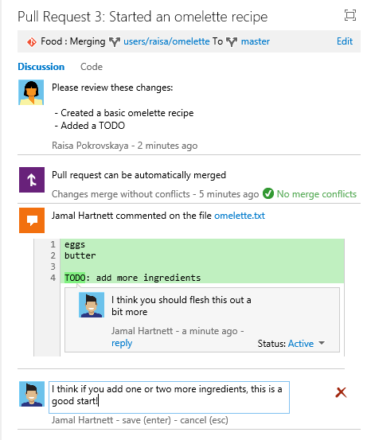
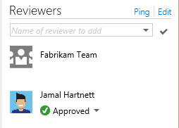
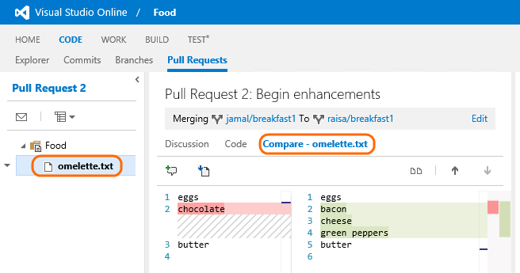

Title: Conduct a Git pull request
ms.TocTitle: Pull requests
Description: Many teams use code reviews to improve code quality. To conduct a code review in a Git team project on Visual Studio Online, create a pull request.
Toc: show
Parent: ../../index.md
ms.ContentId: 4C9DFD24-E894-454A-A080-DA511C90CA74

# Conduct a Git pull request

When you want people on your team to review code in a [Git team project](http://msdn.microsoft.com/en-us/library/vstudio/hh850436.aspx), you can use a pull request to review and merge the code. Pull requests enable developers working in topic branches to get feedback on their changes from other developers prior to submitting the code into the master branch. Any developer participating in the review can see the code changes, leave comments in the code, and give a "thumbs up" approval if they're satisfied with those changes.

## Create a topic branch

Before you commit your code in Visual Studio, create a topic branch. 

To create a topic branch, right click on master and select "New Local Branch From..."

 

Type in a name for the topic branch:

And click Create Branch, which will add this branch to the Branches page:

## Commit changes in the branch

Commit your changes to the topic branch.

You can add more commits too, if needed.

## Publish the branch

When you are ready to share your work, publish the branch.  (Note that if you want to [rebase](./rebase.md) the branch, before publishing is a safe time to do it).  You can publish either from the Branches page:

Or from the Sync page:

## Create a pull request

Open the web portal.

In your web browser, navigate to the Code hub, and click on Pull Requests, then New Pull Request.

Select your topic branch, the branch to merge into, enter a description, and assign reviewers.  Then click "Create Pull Requests".

## Conduct a pull request

Now a teammate can see that there is a pull request available for review:

Reviewers can comment on specific lines of code by highlighting the line(s) or a specific block, before inserting a comment:

Or add general comments:

**Tip:** To add a new line to a comment, press Shift+Enter. 

## Make changes on the source branch

To act on the feedback, the requestor revises the code in their branch and pushes the changes so that reviewers can see them. For example, Raisa takes Jamal's feedback and adds some ingredients:

And then pushes the new commit to the server:

## Complete the pull request

Each reviewer approves or rejects the pull request.

Unless other policies are configured on the repo, a single approval is sufficient to approve the pull request. A single rejection overrides all approvals and causes the status to be rejected. When you approve or reject the pull request, team members are alerted if they have subscribed to alerts.

If the code in topic branch changes, your vote does not automatically 
change. So for example, if you approved the pull request but would want to re-check it if 
changes were made, you should [make sure you stay notified about changes](#notifications).

When the requestor and the reviewers are satisfied that the pull request is ready to merge, 
you can do it from the web browser by clicking on "Complete pull request":

After the merge, the target branch is updated with the changes from the topic branch.  This either results in a new merge commit, or a fast forward merge if possible.

After the merge, the topic branch is still in the repository. To keep your repository from
getting cluttered by obsolete branches, you can delete the topic branch in your web 
browser.

## Q&A

#### Q: How can I make sure I'm notified when a pull request is created or changed?

<strong>A:</strong> If you are in the [team room](http://msdn.microsoft.com/en-us/library/vstudio/dn169471.aspx), you'll see notifications there. 

If you want to be notified about new pull requests, changes, approvals, and rejections, then subscribe to email alerts.

#### Q: How do I see the full content of the file?

<strong>A:</strong> Select the file in the left pane.

To see changes inline:

#### Q: Why do I see "Target branch updated, retry merge"? What should I do about it?

<strong>A:</strong> If changes are pushed to the target branch during the pull request, retry the merge to make sure there are no conflicts.

If there are no conflicts, then you are ready to merge again.

If there are conflicts, see [Q: Why do I see "Merge conflicts"? What should I do about it?](#conflicts)

#### Q: Why do I see "Merge conflicts"? What should I do about it?

<strong>A:</strong> Conflicts can occur when you try to merge two branches. For example, a conflict often occurs when you merge two branches in which the 
same file is changed. 

If you are trying to merge from source to target, you see merge conflicts in the pull 
request.

You are also blocked by the conflict if you try to merge from target to source.

To handle the conflicts, merge the branches in Visual Studio, then use the merge tool to resolve the conflicts.

Next, commit the merge.

Finally, push the merge.

#### Q: Why did a comment move or disappear? 

<strong>A:</strong> Comments are anchored to the line number and column of the commit on 
which comment was made. That's why comments can disappear or move in the discussion view.