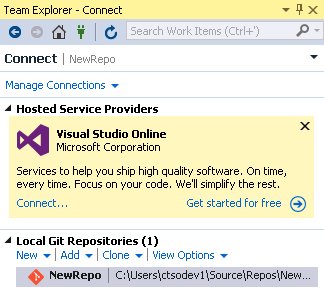

toc: show
Title: What's new in version control
ShortTitle: What's new
ms.TocTitle: What's new
ms.ContentId: 3A82A72F-FFBB-416A-BF3D-E8B4768B03E8

# What's new in version control

## Git in Visual Studio 2015

### Branches

You can organize your branches hierarchically, using `/` as a delimiter in the branch name. Local branches and remote branches (including those you have not created locally) are shown separately in a tree view.

 

Other changes: 

* You can now merge from remote branches, as well as local branches.

* The branch that you are merging into is now fixed to the branch that is currently checked out.

* You can now rebase from the current branch onto any local or remote branch.

* You can check out a remote branch that you are not yet tracking by double-clicking it, or right-clicking it and then selecting Checkout.

### Rebase

You can [rebase branches](./git/rebase.md).

### History

Right click on any folder in Solution Explorer, the Changes page, or the Commit Details page, and get the history of changes to files within that folder. 

You can create a new branch or tag from the history.

Use the detailed view to see the commit graph and how the commits diverged in the history.

In the graph, merge commits are gray and non-merge commits are a brighter color. If the graph is truncated, you can resize it. 

### Remotes management

You can add, edit, and remove Git remotes from the Repository Settings page

### Performance and usability improvements

Changes include:

* If you're working in a large repo, you'll see significant improvements in the performance of operations like fetch, checkout, and merge.

* When you authenticate to the first cloud service in Visual Studio, we will automatically sign you in, or reduce the authentication prompts for other integrated cloud services.

### Publish to Visual Studio Online

It's easier to publish a local repo to Visual Studio Online.

From the Synchronization page you can publish to a new or existing Git team project.

## Git on the web portal

### Pull requests

Instead of merging on your dev machine, create a pull request to make sure your code quality is high before you merge.

Your team can see the code changes, leave comments in the code, and give a "thumbs up" approval if they're satisfied with those changes. 

See [Conduct a Git pull request](git/pull-requests.md).

### Branch policies

Branch policies help teams protect their important branches.

  

After you configure a branch policy, your team must merge using a pull request. You cannot directly push or merge changes to the branch.

You can specify required reviewers. 

You can also specify that if the build does not succeed, the policy rejects the pull request.

See [Branch policies](git/branch-policies.md).

### New web history view

You can view the history of pushes and pull requests in a branch.

### Web edit

You can edit your code directly in your web browser.

To make sure your changes are good, compare with the previous commit. When you are ready, commit to a new branch and create a pull request to merge the changes.

You can also add, rename, and delete files.

**Note:** To add a new folder, you must use a client tool such as Visual Studio.

