Title: More about release definitions
Description: More about release definitions in Microsoft Release Management for VSO and TFS 2015
ms.TocTitle: More about release definitions
ms.ContentId: 64D6388E-A3F9-452B-AC72-D109F9DDD676

# More about release definitions

[!INCLUDE [preview-header-shared](../_shared/preview-header-shared.md)]

This topic describes some of the general techniques, features, and options for
release definitions. 

**In this topic:**

 * [Viewing and editing release definitions](#viewedit)
 * [Running tests during a release](#runtests)
 * [Securing releases and managing users](#security)
 * [Global configuration properties](#globalconfig)
 * [Release versioning](#versioning)
 * [Triggers](#triggers)
 
[!INCLUDE [back-to-index-shared](../_shared/back-to-index-shared.md)]

## Viewing and editing release definitions

Use the **Overview** section of the **All definitions** page (on the **Explorer** tab
of the **RELEASE** section) to see a list of release definitions and their 
environments, including an overview of the releases for each definition. The vertical 
bars in each environment represent the relative time taken and the result for specific 
releases using that definition.

 
### Viewing and editing environments and tasks

To see more information about a specific definition, or to edit an existing definition, 
select the definition in the left pane and choose the **Edit** link at 
the top of the right pane.

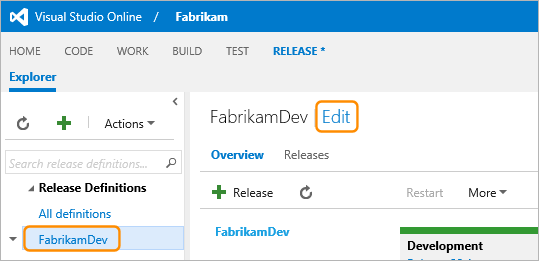
 
You can see and edit all of the environments in a release definition on the 
**Environments** tab. Select an environment to see and edit the tasks for that 
environment.

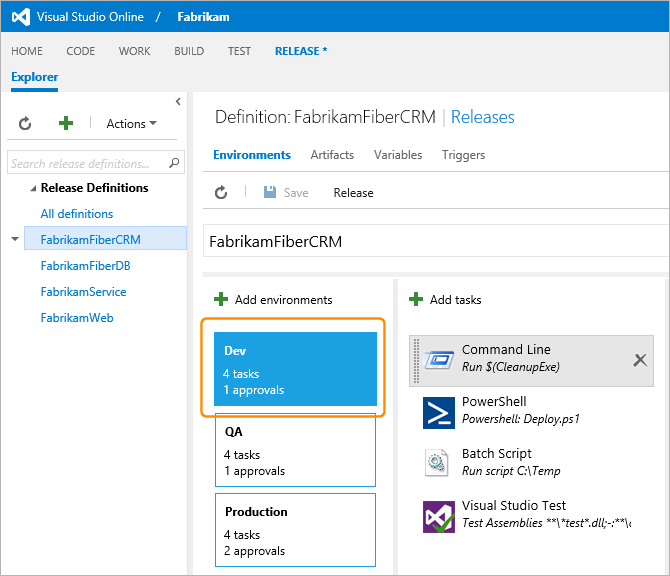
 
Select a task to see and edit the settings for the task. 

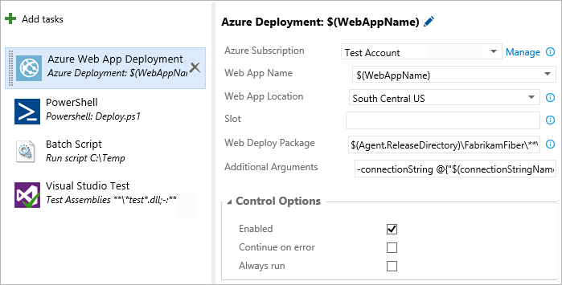

Reorder tasks within an environment by selecting them and dragging them to the 
required place in the list.

Refresh the release definition, save the definition, or start a new release for a 
definition using the icons and links on the **Definition** page toolbar.

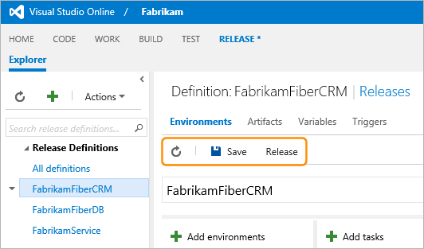

_For information about creating and cloning environments, and using templates, see
**[Where to deploy? Understanding environments](../author-release-definition/understanding-environments.md)**._

### Viewing and editing artifacts

You can see all of the artifacts in a release definition on the **Artifacts** tab of 
the **Definition** page. 
 
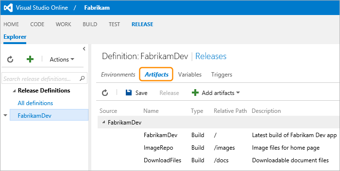

Add a new artifact, or select an existing artifact to add to a release definition, 
using the **Add artifacts** drop-down list. 

<!--
***-TBD-*** A list of all the artifacts you have defined for all definitions is shown in the 
**Artifacts** (hub) page.
-->

_Remember that artifacts are global to your Release Management instance, not to a 
task or environment. This means that **every artifact you define must have a unique 
name**._ 

## Running tests during a release

The tasks you can add to a release environment include some that execute tests. These
can be Visual Studio tests that use the built-in Visual Studio Test framework, UI and
performance tests, or one of several other types of test. It's also possible, by 
using a task that executes PowerShell or other scripts, to execute custom tests and 
use other test frameworks.

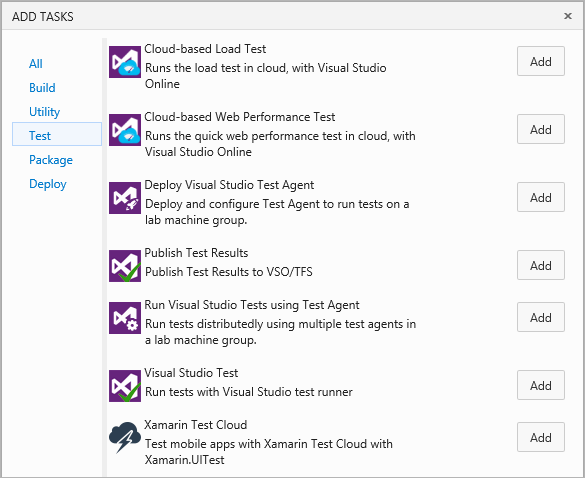
 
The **Visual Studio Test** task allows you to filter the tests that will run, and 
over-ride the test parameters. As with all tasks, you can use custom variables (such 
as **$WebAppName** in this example) and the Release Management built-in properties 
(such as **Agent.ReleaseDirectory**) to simplify defining the task settings.

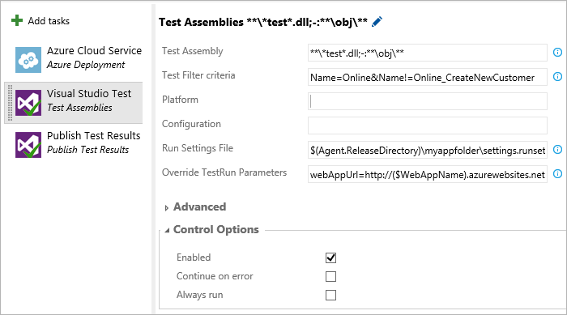
 
To publish the test results and link them to this environment in the release, use a 
**Publish Test Results** task.
 
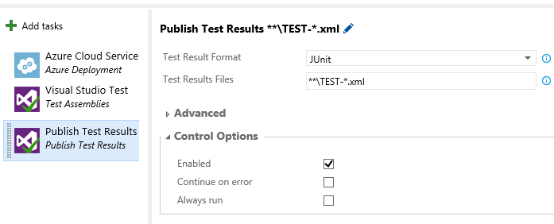

View the results of the tests after they have completed by clicking the status line 
for the test task in the **Logs** page. The test result file is downloaded from the 
application deployment location and it opens in your default text editor.
For more details, see 
**[Viewing release logs](../managing-releases/track-release.md#viewlogs)**.

For more information about using test tasks, see 
**[Test](https://www.visualstudio.com/get-started/test/create-a-test-plan-vs)** on 
the VisualStudio.com website.

## Securing releases and managing users

You can manage the permissions for Release Management users globally using the 
**Security** tab of the administration page for a project, in exactly the same way as 
you do for all Visual Studio Online or Team Foundation Server features. Release 
Management adds a security group called **Release Managers** that, by default, has 
full permissions for all release-related asks. 

You can add new security groups, and manage the members and permissions of groups 
such as the default project team members group, using the administration page. For 
example, you can create a group that allows operations staff to create releases from 
existing definitions, but not create or edit definitions.

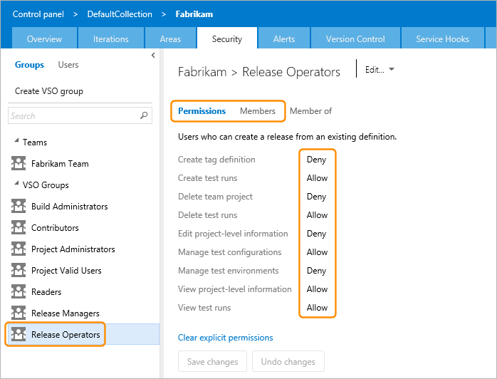

You can also manage release permissions for individual teams and users within Release
Management. Access the security controls for a release definition using the **Security** 
option on the **Actions** menu or on the context menu for a definition.
 
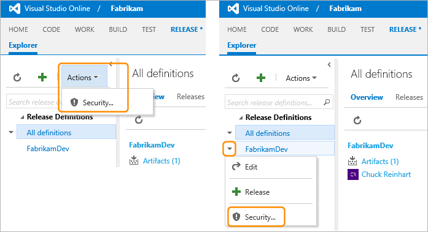

In the PERMISSIONS dialog, set the individual permissions for each user if you want 
to override the default permissions inherited from the top-level security settings. 
You can turn inheritance on and off in this dialog, and add more users to closely 
control the actions each can take on a release definition. 
 
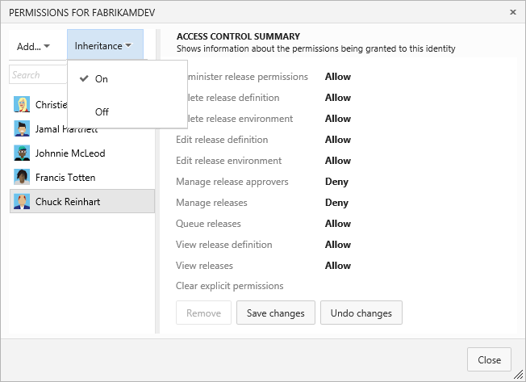

## Global configuration properties

You can define configuration properties as custom variables that are global to a 
release definition, and use these to specify values for any of the environments,
tasks, artifacts, and other properties of a release definition. This can help to
simplify both creating definitions and creating releases from a definition. You
need to update the value in only a single location in order to update all the
places where it is used.

For details of how you can define global and environment-level configuration
variables, see **[Configuration properties](understanding-environments.md#configproperties)**.

You can also use the built-in properties of Release Management in your environments,
tasks, artifacts, and other properties of a release definition. For a list of these
properties, see **[Pre-defined variables](understanding-tasks.md#predefvariables)**.

## Release versioning

_Content not yet available._

## Triggers

A release definition can be configured to detect when a new artifact (typically the
result of a new build of the applictaion) is available, and start the release
pipeline automatically. For more details, 
see **[Creating a release automatically on completion of a build](../managing-releases/create-release.md#automaticbuild)**. 

## Related topics

 * [What to deploy? Understanding Artifacts](understanding-artifacts.md)
 * [Where to deploy? Understanding Environments](understanding-environments.md)
 * [How to deploy? Understanding Tasks](understanding-tasks.md)

[!INCLUDE [back-to-index-shared](../_shared/back-to-index-shared.md)]
 
[!INCLUDE [help-support-shared](../_shared/help-support-shared.md)]
