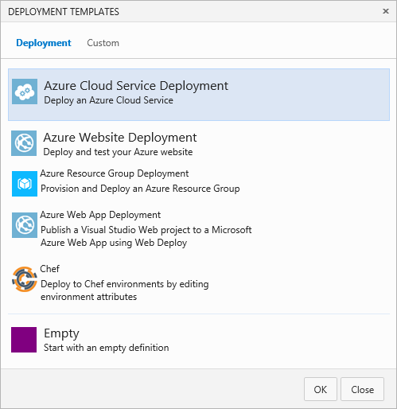
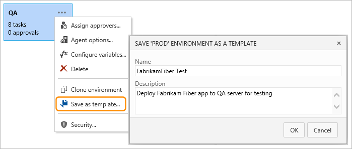
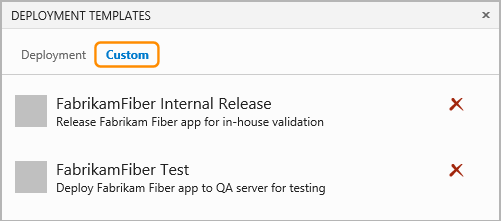
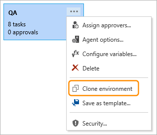
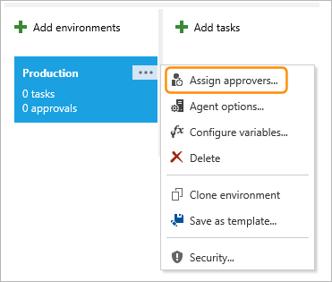
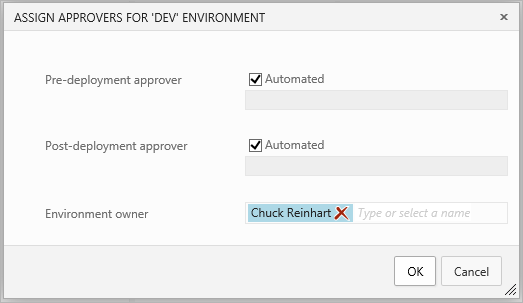
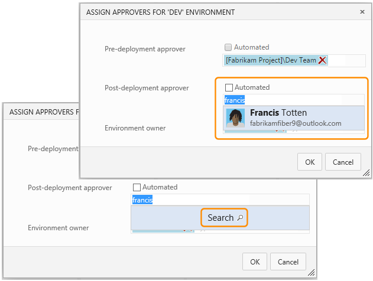
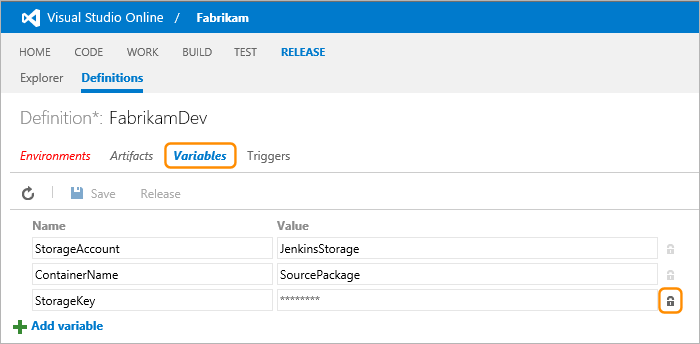
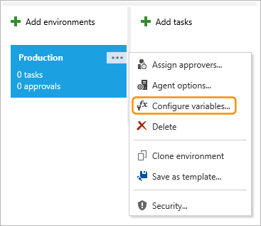
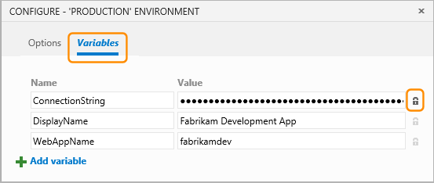

Title: Where to deploy? Understanding environments
Description: Where to deploy? Understanding environments in Microsoft Release Management for VSO and TFS 2015
ms.TocTitle: Where to deploy? Understanding environments
ms.ContentId: 8ABB0E98-EC00-49A4-9EDF-553FFDB88400

# Where to deploy? Understanding environments

[!INCLUDE [preview-header-shared](../_shared/preview-header-shared.md)]

Release Management makes it easy to create a pipeline composed 
of multiple environments, and manage the individual steps and 
tasks for a release across these environments. Each environment 
represents one or more physical or virtual servers to which the 
application can be deployed. You define one or more tasks for 
each environment, manage the release through the environments 
by specifying approvers, and use variables to pass the 
appropriate values to each task. 

**In this topic:**

 * [Environment options](#enviromentoptions)
 * [Configuring environments](#configenvir)
 * [Environment templates](#templates)
 * [Cloning environments](#cloneenvironment)
 * [Approvals and approvers](#approvers)
 * [Configuration properties](#configproperties)
 
[!INCLUDE [back-to-index-shared](../_shared/back-to-index-shared.md)]

_For more details of the tasks and the built-in variables you 
 can use, see 
**[How to deploy? Understanding Tasks](understanding-tasks.md)**_.

## Environment options

An environment specifies:

 * How Release Management locates the physical or virtual servers where the 
   application will be deployed.
 * The underlying technology used to connect to and interact with the servers.
   Typically this is an agent that is installed and runs on the target server. 
 * The tasks that will be executed in turn for each environment. These tasks can
   include:
   - Preparing the target server.
   - Deploying artifacts such as the application itself and any other files, 
     components, or resources it requires.
   - Running tests on the server against the newly deployed application.
 * The people or groups that must approve specific steps as the tasks are executed.
 * Variables and settings that Release Management will use in the environments 
   and tasks.
  

## Configuring environments

_Content not yet available._

### Environment templates

When you start a new release definition, or when you add an environment to an 
existing release definition, you can choose from a list of deployment templates 
that create release definitions or environments of various types.

These templates pre-populate the release definition or environment with the appropriate
tasks and settings, which can considerably reduce the time and effort required to 
create a release definition. Alternatively, you can choose to start with an 
empty release definition that contains only a single default empty environment, or an
empty environment that contains no tasks. 

You can also create your own custom environment templates from an environment you have
populated and configured. Choose **Save as template** on the shortcut menu that opens
from the environment's ellipses (**...**). Fill in the name and description, and choose
**OK**.

The custom templates you create appear in the **Custom** tab of the deployment templates dialog.

### Cloning environments

A release definition often contains a pipeline made up of several environments such as
development, testing, QA, and production. Typically, all of these environments are
fundamentally similar, and the techniques used to set up and deploy to each one are
the same with the exception of minor differences in configuration for each environment 
and task (such as target URLs, service paths, and server names).   

After you have added an environment to a release definition and configured it by adding tasks
and setting the properties for each one, you can clone it to create another environment
within the same definition. The cloned environment has the same tasks, task properties, 
and configuration settings.

To create a copy of an environment within a release definition, choose **Clone environment**
on the shortcut menu that opens from the environment's ellipses (**...**). Then enter a name for
the new environment.

### Approvals and approvers

You define approvers for each stage by configuring the environments in a release 
definition. Use the ellipses (**...**) to show the environment pop-up menu and 
choose **Assign approvers**.

 
When the **Automated** checkbox is set for an approval step, the release pipeline 
automatically approves the operation and continues. Notice that you can edit the 
environment owners list in this dialog if you need to assign management permission 
to other users.

 
To specify one or more approvers for an operation, uncheck the **Automated** checkbox
and enter the approver's email addresses, or enter part of the name and choose 
**Search**. You can select from a drop-down list of matching user names defined for 
the project. Notice that you can specify groups of users for an approval stage. 
For example, you might want to specify the development team for the current project 
for some approval steps.
 

When a release is created from a release definition that contains approvers, the
in-progress release stops at each point where approval is required until the
specified approver grants approval or cancels the release (or re-assigns the 
approval to another user). For more details, see
**[Approving a release](../managing-releases/track-release.md#approve)**.

## Configuration properties

You can configure properties across environments by defining 
custom variables. Both a release definition and an individual 
environment can define configuration properties that are used 
in environments, tasks, and artifacts. You can:

 * Share values across all of the environments, tasks, and 
   artifacts within a release definition.
 * Share values across all of the tasks within one specific 
   environment.
 * Avoid duplication of values, making it easier to update 
   all occurrences as one operation.
 * Store sensitive values in a way that they cannot be seen 
   or changed by users of the release definitions.   
 
### Properties scoped to a release definition
You can see and edit all of the variables defined for an entire 
release definition on the **Variables** tab of the definition. 
To hide a sensitive value from users of the release definition, 
select the "padlock" icon. 
 

 
### Properties scoped to a single environment

You can see and edit all of the variables defined for an 
individual environment within a release definition by opening 
the CONFIGURE dialog for the environment from the (**...**) ellipses.

 
Then select the **Variables** tab in the CONFIGURE dialog. Again, 
you can hide a sensitive value from users of the release definition 
using the "padlock" icon.
 

 
You can also use globally defined connections and the built-in 
properties and variables in the settings of tasks and artifacts. 
For more details, see **[How to deploy? Understanding Tasks](understanding-tasks.md)**.

## Related topics

 * [What to deploy? Understanding Artifacts](understanding-artifacts.md)
 * [How to deploy? Understanding Tasks](understanding-tasks.md)
 * [More about release definitions](more-release-definition.md)

[!INCLUDE [back-to-index-shared](../_shared/back-to-index-shared.md)]
 
[!INCLUDE [help-support-shared](../_shared/help-support-shared.md)]

