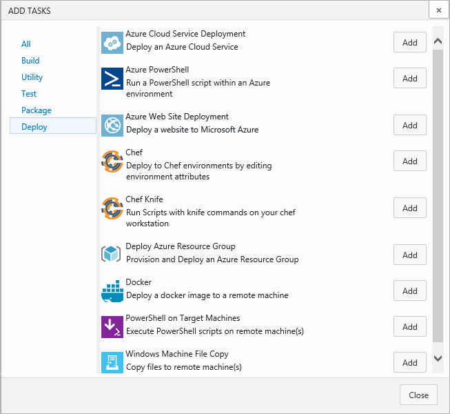

Title: How to deploy? Understanding tasks
Description: How to deploy? Understanding tasks in Microsoft Release Management for VSO and TFS 2015
ms.TocTitle: How to deploy? Understanding tasks
ms.ContentId: D98C45D8-BE73-4E0B-BE4C-07495E487B1A

# How to deploy? Understanding tasks

[!INCLUDE [preview-header-shared](../_shared/preview-header-shared.md)]

<!-- intro - about tasks -->

**In this topic:**

 * [Out-of-the-box tasks](#outofboxtasks)
 * [Service connections](#serviceconnections)
 * [Pre-defined variables](#predefvariables)
 * [Rollback upon failure](#rollback)
 
[!INCLUDE [back-to-index-shared](../_shared/back-to-index-shared.md)]

## Out-of-the-box tasks

To see a list of all available tasks, create a release definition and add an 
environment. Choose the plus icon (**+**) to add a task. The task selector shows 
tasks that are suitable for use in a release definition. 

The tasks available in the 
**Deploy** section of the ADD TASKS dialog are shown in the following table.

| Task name | Description |
| --------- | ----------- |
| Azure Cloud Service Deployment | Deploys the application as a package to an Azure Cloud Services (Web and Worker role) website. The build step must create an Azure Cloud Services deployment package and corresponding CSCFG configuration file. The Azure subscription must already contain a storage account. The task creates a new Cloud Services (web and worker roles) instance using the name in the configuration file if it does not already exist. |
| Azure PowerShell | Deploys the application using Windows Azure PowerShell commands in a script you provide. The script must contain all the commands required to configure the Azure target instance and deploy the application package created by the build step. Paths and other information can be passed to the script as arguments using the built-in properties such as **$(Agent.ReleaseDirectory)**. |
| Azure Web Site Deployment | Deploys the application to an Azure _Web Apps in App Service_ website. The build step must create a single file deployment package suitable for an Azure Web Apps in App Service instance. The task creates a new website with the specified name if it does not already exist. |
| Chef | Deploys an application using the Chef Infrastructure management tool. The specified Chef Environment and leaf node must already exist. |
| Chef Knife | Deploys an application using a Knife script that executes Chef Infrastructure commands. |
| Deploy Azure Resource Group | Deploys an application and associated resources to an Azure Resources Group. The task creates a new Azure Resources Group with the specified name if it does not already exist. |
| Docker | Deploys the application to a Docker container. |
| PowerShell on Target Machines | Deploys the application by executing a Windows PowerShell script on the target server(s). The group of machines must have been previously defined. |
| Windows Machine File Copy | Deploys an application using standard Windows file copy commands. |

For information about using the different types of tasks, see 
**[VSO DevOps Tasks](https://github.com/Microsoft/vso-agent-tasks)**. 
For more details of a specific task, see this list of all build, test, and deploy 
tasks on **[GitHub](https://github.com/Microsoft/vso-agent-tasks/tree/master/Tasks)**. 

## Service connections

You will typically need to connect to external and remote services to execute tasks 
for a release pipeline. For example, you may need to connect to your Microsoft Azure 
subscription, to a different build server or file server, to an online continuous 
integration environment, or to services you install on remote computers.

You can define connections in Release Management that are available for use in all 
your release definitions, tasks, and artifacts. For example, you can create a 
connection to your Azure subscription and use this connection name in an Azure Web 
Site Deployment task in a release definition. 

To define and edit service connections, open the administration pages for a project 
and choose the **Services** tab. Select the type of connection you want from the 
**New Service Endpoint** drop-down list.

 
_Note that sensitive values you enter for a connection, such as the credentials, 
cannot be seen or edited after you finish defining the connection. To change these 
values you must delete and recreate the connection definition._

### Azure connection
Defines and secures a connection to a Microsoft Azure subscription.

| Parameter | Description |
| --------- | ----------- |
| Subscription ID | Required. The GUID-like identifier for your Azure subscription (not the subscription name). You can copy this from the Azure portal. |
| Subscription name | Required. The name you will use to refer to this connection in task properties. This is not the name of your Azure account or subscription. |
| Authentication | Required. Select **Certificate** or **Credentials**. |
| Certificate | Required for certificate authentication. Copy the value of the ManagementCertificate key from your publishsettings xml file. |
| User name | Required for credentials authentication. User name of a work or school account (for example @fabrikam.com). Microsoft accounts (for example @live or @hotmail) are not supported. |
| Password | Required for credentials authentication. Password for the user specified above. |
| Re-enter password | Required for credentials authentication. Password for the user specified above. |

### Chef connection
Defines and secures a connection to a Chef Infrastructure management tool instance.

| Parameter | Description |
| --------- | ----------- |
| Connection Name | Required. The name you will use to refer to this connection in task properties. This is not the name of your Chef account or subscription. |
| Chef Server URL | Required. The URL of your Chef service instance. |
| Node Name (Username) | Required. The username to connect to the service. |
| Client Key | Required. Copy the value from your Chef **.pem** file. |

### Generic connection
Defines and secures a connection to any other type of service or application.

| Parameter | Description |
| --------- | ----------- |
| Connection Name | Required. The name you will use to refer to this connection in task properties. This is not the name of your account or subscription with the service. |
| Server URL | Required. The URL of the service. |
| User name | Required. The username to connect to the service. |
| Password/Token Key | Required. The password for the specified username. |

### GitHub connection
Defines a connection to a GitHub repository.

| Parameter | Description |
| --------- | ----------- |
| Choose authorization | Required. Either **Grant authorization** or **Personal access token**. See notes below. |
| Token | Optional. See notes below. |
| Connection name | Required. The name you will use to refer to this connection in task properties. This is not the name of your GitHub account or subscription. |

Notes: If you select **Grant authorization** for the **Choose authorization** option, 
the dialog shows an **Authorize** button that opens the GitHub login page.
If you select **Personal access token** you must obtain a suitable token
and paste it into the **Token** textbox. The dialog shows the recommended scopes
for the token: **repo, user, admin:repo_hook**. To obtain a token, register your GitHub account in
your profile:
 * Open your profile from your account name at the right of the Visual Studio Online page heading.
 * At the top of the right column, under **DETAILS**, choose **Security**.
 * In the **Security** tab, in the right column, choose **Personal access token**.
 * Choose the **Add** link and enter the required information to cerate the token.

## Pre-defined variables
 
The settings and parameter values you use in your release definitions can include 
the following pre-defined variables that are built-in properties.

### System variables (common across VSO and TFS)

| Variable name | Description |
| ------------- | ----------- |
| System.TeamProject | The name of the team project to which this build belongs. |
| System.TeamFoundationServerUri | The URL of the Team Foundation Server or Visual Studio Online server. |
| System.TeamFoundationCollectionUri | The URL of the Team Foundation collection or Visual Studio Online collection. |

 
### Global release variables 

| Variable name | Description |
| ------------- | ----------- |
| Release.DefinitionName | The name of the release definition to which the current release belongs. |
| Release.ReleaseName | The name of the current release. |
| Release.ReleaseId | The identifier of the current release record. |
| Release.RequestedFor | The user for whom the release was requested. In a continuous integration (trigger from build) scenario, this will be the user who performed the check-in that triggered the build - which in turn initiated creation of the current release. |
 
### Agent variables 

| Variable name | Description |
| ------------- | ----------- |
| Agent.Name | The name of the agent as registered with the agent pool. This is likely to be different from the machine name. |
| Agent.HomeDirectory | The folder where the agent is installed. This folder contains the code and resources for the agent. |
| Agent.RootDirectory | The root directory for this agent, used to synchronize with the source. |
| Agent.WorkingDirectory | The working directory for this agent. By default this is $(Agent.RootDirectory)\_work. |
 
### Agent release variables 

| Variable name | Description |
| ------------- | ----------- |
| Agent.ReleaseDirectory | The local path configured for the agent, where all folders for a specific release definition are created. It will be $(Agent.RootDirectory\{hash of collection of definition identifier and repository URL}. |

## Rollback upon failure

_Content not yet available._

## Related topics

 * [What to deploy? Understanding Artifacts](understanding-artifacts.md)
 * [Where to deploy? Understanding Environments](understanding-environments.md)
 * [More about release definitions](more-release-definition.md)

[!INCLUDE [back-to-index-shared](../_shared/back-to-index-shared.md)]
 
[!INCLUDE [help-support-shared](../_shared/help-support-shared.md)]

