Title: Configuring agents
Description: Configuring agents for Microsoft Release Management in VSO and TFS 2015
ms.TocTitle: Configuring agents
ms.ContentId: 8FF868D2-5A45-4847-96E7-CABCE16880B7

# Configuring agents

[!INCLUDE [preview-header-shared](../_shared/preview-header-shared.md)]

Release Management (RM) uses an agent running on the server where the 
app will be deployed. The agent:

 * Carries out the deployment of the artifacts that make up the application. 
 * Runs inside an agent pool that you can configure.
 * Runs in a queue that allows operations to be carried out sequentially. 
 * Exposes a set of built-in properties, and a set of properties that you 
   can configure. 
 
**In this topic**:

 * [Hosted pool of agents](#hostedpool)
 * [Security of agent pools and queues](#security)
 * [Installing an agent](#installing)
 * [Configuring and selecting an agent](#configuring)
 * [Deploying to on-premises servers from VSO](#deploying)
 * [Notes and troubleshooting](#notesandtrouble)

[!INCLUDE [back-to-index-shared](../_shared/back-to-index-shared.md)]

<a name="hostedpool"></a>
## Hosted pool of agents

Agent pools are the execution containers that specify the security context 
and runtime environment for a release agent. Release Management agents run 
in the same types of pools as the build agents. A pool can provide queues 
for agent operations so that more than one operation can be queued for 
execution. By default, queues are provisioned automatically for each pool.

To view and administer pools, queues, and agents, open the administration 
page from the main VSO or TFS server page (outside of any projects).

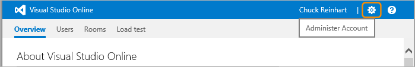
 
By default, there are two agent pools:

 * The **Default** pool, which is used to communicate with agents that 
you install on remote servers. 
 * The **Hosted** pool, which contains the default hosted agent used to 
deploy to Azure websites and Windows servers that have the appropriate 
software installed.
 
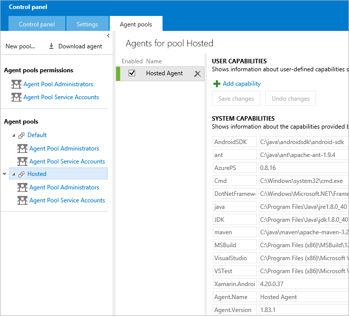
 
Each agent has a set of capabilities that define the features of the agent. 
The system capabilities cannot be changed. However, you can add user-defined 
capabilities to help you identify a specific agent. These capabilities can 
be demanded in a release definition, so that Release Management automatically 
chooses the appropriate agent when executing a deployment. For more details, 
see [Configuring and selecting an agent](#configuring). 

You can create additional pools in which to run other instances of agents if 
required. 
 
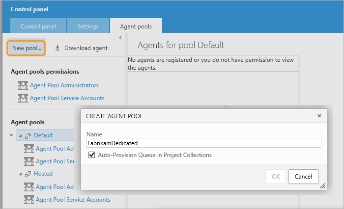

When you create the pool, you can specify if queues will be provisioned 
automatically for that pool. You can also change this afterwards, for this 
or for the built-in pools, using the shortcut menu for the pool.
  
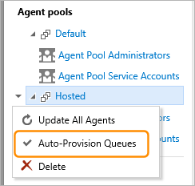

<a name="security"></a>
## Security of agent pools and queues

Agent pools and queues run in the content of a service or user account. By 
default, the two built-in security groups **Agent Pool Administrators** and 
**Agent Pool Service Accounts** have permission to manage and execute the agents. 
You can add and remove security groups independently for each agent pool.  

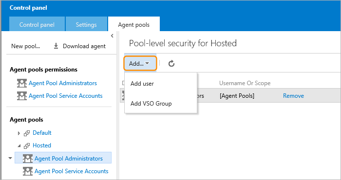
 
<a name="installing"></a>
## Installing an agent

You must install a release agent on any computer where you will deploy your 
application when using Release Management. The only exception is if you 
intend to deploy from Visual Studio Online or Team Foundation Server 2015 
to Microsoft Azure. Deployments to Azure can use the hosted agent that is 
installed and available inside Visual Studio Online and Team Foundation 
Server. 

*Even if a hosted agent is available, you may decide to install the 
downloadable agent instead. This is typically when the hosted agent does 
not have the capabilities you need, or the deployment target computer does 
not have the software required to execute the hosted agent.*

Follow these steps to install a release agent.

### Create a Default pool if required

 1. Use your web browser to log on to your team project collection:  
   ```https://{your-account}.visualstudio.com```

 2.	Go to the control panel.  

   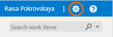

 3.	Check if a pool named **Default** already exists. If not, create a new 
    pool and name it **Default**.  

   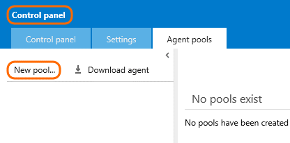

   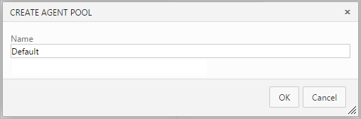

### Download and configure the agent 

 1. On the machine where you are going to run the agent, download the agent 
    from the collection administration page:  
    ```https://{your-account}.visualstudio.com/DefaultCollection/_admin```  
 
   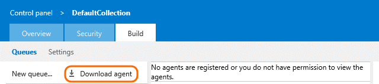

 2. Open the Properties dialog for the zip file and choose **Unblock**. Then
    unzip the .zip file into a folder on disk. Use a folder near the root to
    avoid long path names; for example: ```C:\agent\```

 3. Start Windows PowerShell as an Administrator.

 4. Enable PowerShell to run downloaded scripts signed by trusted publishers:  
    ```Set-ExecutionPolicy RemoteSigned```

 5. Disable strong name signing. Make sure to run both versions. (Applies 
    only if you downloaded the agent software. We expect to eliminate this 
    step when we ship the RTM version.). Change the path to __sn.exe__ 
    depending on the versions of the .NET Framework you have installed:  
    ```cd "C:\Program Files (x86)\Microsoft SDKs\Windows\v8.2A\bin\NETFX 4.5.3 Tools"```  
    ```sn.exe -Vr *,*```  
    ```cd x64```  
    ```sn.exe -Vr *,*```

 6. Change to the directory where you unzipped the agent:  
    ```cd C:\agent```

 7. Unblock the PowerShell scripts:  
    ```Get-ChildItem -Recurse * | Unblock-File```  
    (You can skip this step the next time you configure the agent.)

 8. Run the configuration script for the agent:  
    ```.\ConfigureAgent.ps1```
 9. Enter the name for the agent. The default name is `Agent-machine-name`. 
    Press _RETURN_ to use the default agent name.

 10. Enter the URL the Visual Studio Online server:  
     ```https://{your-account}.visualstudio.com```

 11. Enter the name of the pool for which you want to configure this agent. 
     The default pool name is __Default__. Assuming you created or checked 
     for this existence of this pool earlier, press _RETURN_ to use the default
     pool.

 12. Enter the path of the work folder for this agent. The default is the 
     root folder of the agent. Press _RETURN_ to accept the default.

 13. Decide if you want to run the agent as a service or interactively when 
     prompted to install the agent as a Windows Service. In most cases, press
     __Y__ to run the agent as a service. Press __N__ if you want to run the 
     agent in interactive mode, where you will start the agent manually. 
 
     _Typically, you will choose interactive mode when you want to run coded 
     UI tests, or to see what the agent is doing in real time - for example, to 
    debug a problem in your process._

 14. If you are running the agent as a service, enter the name of the user 
     account to use for the service. The default is 
     __NT AUTHORITY\NetworkService__ and, in most cases, you should accept 
     this by pressing _RETURN_. If you specify a user account instead of using 
     network service, you are prompted for a user name and password. 

 15. When prompted, sign in as the user that owns the Visual Studio Online 
     account, or as an agent pool administrator.

 16. You can verify that the agent is ready in the Visual Studio Online 
     control panel:  

    

<a name="configuring"></a>
## Configuring and selecting an agent

By default, a release you create from a release definition will automatically
select the appropriate agent pool and release agent for each environment 
where the app is deployed. You can change this behavior if required by 
specifying the agent pool to use, and/or demands that the agent must meet. 

Each environment in a definition can be configured for agent options using 
the shortcut menu for that environment. In the CONFIGURE dialog specify the 
agent pool to be used (or leave it as **Auto Select**), and add demands that 
specify user capabilities you define for an agent. 

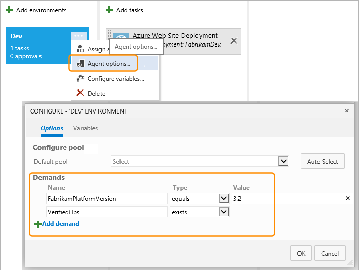
 
You can specify a particular value for a user capability demand, or just 
specify that the capability must exist for the agent.

Define the user capabilities for each agent in the **Agent pools** administration
page. See [Hosted pool of agents](#hostedagent) for more details of how to 
access this page.

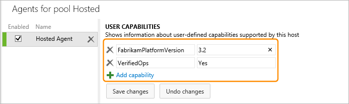
 
<a name="deploying"></a>
## Deploying to on-premises servers from VSO

_Content not yet available._

<a name="notesandtrouble"></a>
## Notes and troubleshooting 

**Q: Why do a get this message when I try to queue my release?**  
_No agent could be found with the following capabilities: visualstudio, 
vstest."_  

**A:** One common cause of this problem is that you need to install 
prerequisite software such as Visual Studio on the machine where the agent 
is running.

**Q: How do I use pools to organize agents and maintain permission 
boundaries?**  

**A:** You use a pool to group and to define permission boundaries around 
your agents. Pools are scoped to your Visual Studio Online account. You can 
share your pool across multiple team project collections. Create pools and 
specify who can add agents to them from your account administration page at 
`https://{your-account}.visualstudio.com/_admin`.

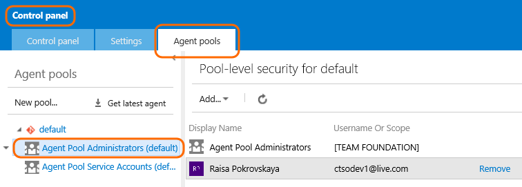
 
**Q: Where can I get a newer version of PowerShell?** 
 
**A:** The Windows Agent requires PowerShell version 3 or later. To check 
your PowerShell version: ```$PSVersionTable.PSVersion```  
If you need a newer version of PowerShell, you can download it:

 * PowerShell 3: [Windows Management Framework 3.0](https://www.microsoft.com/en-us/download/details.aspx?id=34595)
 * PowerShell 4: [Windows Management Framework 4.0](https://www.microsoft.com/en-us/download/details.aspx?id=40855)

**Q: What's the name of the service?**

**A:** If you run the agent as a service, the service name is 
`VSO Agent {name of your agent}`.

**Q: How do system capabilities work?**

**A:** System capabilities (demands) are name/value pairs that you can use 
to ensure that your definition is run only by agents that meet criteria 
specified by you. Environment variables automatically appear in the list. 
Some capabilities (such as .Net frameworks) are also added automatically. 
You can also manually add capabilities to the list.

**Q: How do I reconfigure or uninstall the agent?**

**A:** Run the PowerShell configuration script ConfigureAgent.ps1 located in 
the folder when you unzipped the agent to change the configuration. To 
uninstall the agent when running as a service, run the configuration script 
and specify interactive mode. Then simply delete the downloaded agent files.

## Related topics

 * [Understanding Release Management](understand-rm.md)
 * [Release notes](release-notes.md)
 * [Deploying your .Net apps to Azure](deploy-dotnet-to-azure.md)
 * [Deploying your .Net apps to any cloud](deploy-dotnet-to-other-cloud.md)
 * [Deploying your Java apps to any cloud](deploy-java-to-any-cloud.md)

[!INCLUDE [back-to-index-shared](../_shared/back-to-index-shared.md)]
 
[!INCLUDE [help-support-shared](../_shared/help-support-shared.md)]


