Title: Deploying your .Net apps to Azure
Description: Deploying your .Net apps to Microsoft Azure using Release Management in VSO and TFS 2015
ms.TocTitle: Deploying your .Net apps to Azure
ms.ContentId: 54C9451D-107B-4A5C-9106-EB666456487C

# Deploying your .Net apps to Azure

[!INCLUDE [preview-header-shared](../_shared/preview-header-shared.md)]

Control how you deploy your app from Visual Studio Online or Team Foundation 
Server to Microsoft Azure. 

**In this topic:**

* [Deploying to Azure websites](#website)
* [Deploying to Azure cloud services](#cloudservice)
* [Deploying to Azure resource groups](#resourcegroup)
 
[!INCLUDE [back-to-index-shared](../_shared/back-to-index-shared.md)]

_For a full list of the ways you can use Release Management to manage and 
monitor app deployments, and more examples of using Release Management, see 
**[this topic](../overview.md#linklist)**._ 

<a name="website"></a>
## Deploying to Azure websites
This example shows how you can deploy your app quickly and easily from Visual 
Studio Online as an Azure WebApp.

<a name="createbuilddef"></a>
### Start with a build definition

If you haven't already created a build definition, you'll need to create one first. 
This example uses the public website from the _Fabrikam Fiber_ sample obtainable from 
[CodePlex](http://fabrikam.codeplex.com/). The build definition uses a **Visual Studio 
Build** task to execute MSBuild with the arguments:

```/p:DeployOnBuild=true /p:WebPublishMethod=Package /p:PackageAsSingleFile=true /p:SkipInvalidConfigurations=true```

This ensures that MSBuild creates a single zip file package that can be deployed 
to an Azure website. 


The build definition also contains a **Publish Build Artifacts** task to create the 
artifact that Release Management can deploy.

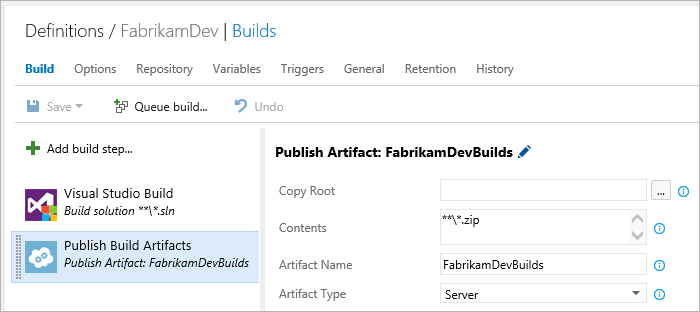
 
_For more details of how to build your apps in Visual Studio Online and Team 
Foundation Server, see **[Build your Visual Studio project](https://www.visualstudio.com/get-started/build/build-your-apps-vs)**_.

<a name="createazurecon"></a>
### Create an Azure connection

Before you create a new release definition, configure any connections you will need 
so that they are available as you add tasks to your release definition. In this 
example, you need a connection to your Azure subscription.

In Release Management, you must define connections for these two services. With your 
project open in Visual Studio Online or Team Foundation Server, choose the 
**RELEASE** tab and then click the "Administer Account" icon at the top right of the 
widow to open the Control Panel.

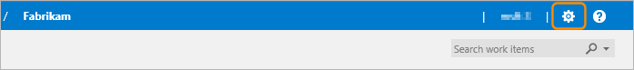
 
Open the **Services** tab, open the **New Service Endpoint** drop-down list, and 
select **Azure**. 
 
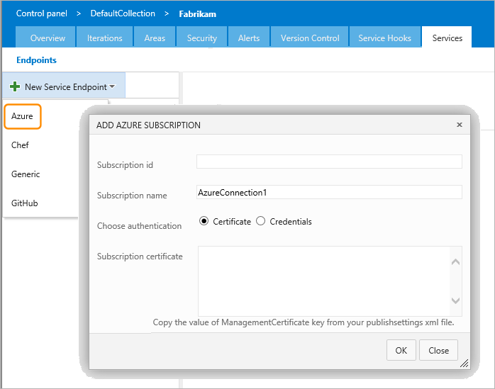
 
Enter the GUID identifier for your Azure account as 
the **Subscription id**, a name you will use to refer to the connection, and the 
credentials required to connect to your Azure subscription. You can download 
your publishsettings file and copy the management key from it into the 
**Subscription certificate** textbox. Then choose **OK** to save the connection.

While you are in the administration page, choose the **Control panel** link at the 
top of the page and open the **Agent pools** tab. Expand the **Hosted** pool and 
check that there is a hosted agent installed in the pool. Then close the **Control 
panel** tab in your browser.

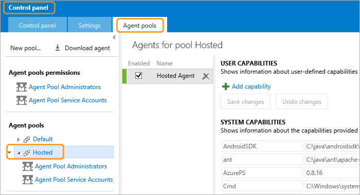

_An agent is required to deploy the app. When deploying from Visual Studio Online to 
Azure you can usually use the built-in Hosted Agent. However, it is possible to 
install other agents, including a release agent that you can download from this page.
For more information, see **[Configuring agents](configure-agents.md)**._

<a name="createreleasedef"></a>
### Create the release definition

In Visual Studio Online choose the **RELEASE** tab and then, in the **Explorer** page,
click the **+** icon to create a new release definition.
 
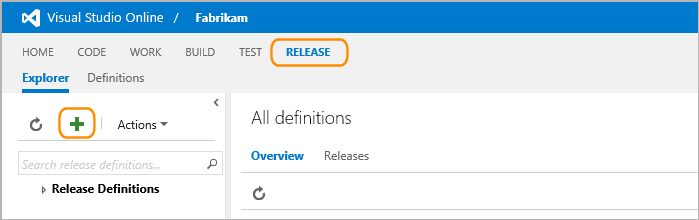

In the page for a new release definition, enter the name for the definition. A 
default release environment is created automatically. Select this and enter the name 
for this environment.
 
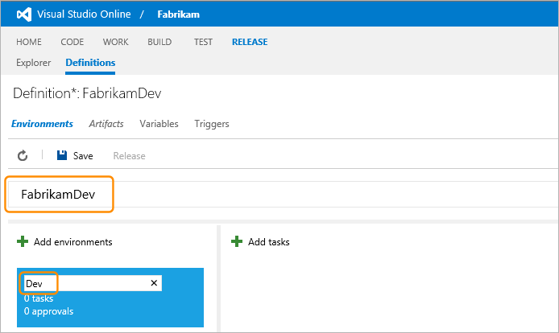

_In this example, you use a single environment to represent the target Azure website.
You can add more environments to create a release pipeline; perhaps for QA, test, and 
pre-production. You can also edit the default environment settings to specify the 
names of people who must approve each stage of the pipeline, the demands that 
identify the agent pool and the release agent the environments will use, the 
conditions for locating target computers, and variables that are used in the release 
process. For more details, see 
**[Authoring release definitions](../author-release-definition/understanding-environments.md)**._

#### Check for a release agent

Before you continue, it's a good idea to check that you have a suitable release agent
configured and available. Open the shortcut menu for the environment using the 
ellipses (...) that appear when you hover over the environment. 
Choose **Agent options**.
 
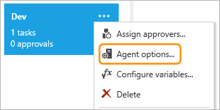

In the CONFIGURE dialog, ensure that the **Default pool** is set to **Hosted** so 
that the release will use the built-in release agent. 
 
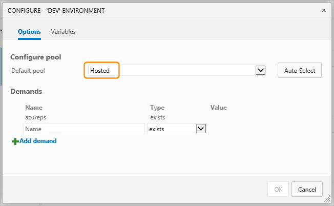

_Notice the list of demands that specify how Release Management selects a suitable 
agent based on properties defined for the agent. For example, in this case, the 
agent must have the property named **azureps** defined. For more information, see 
**[Configuring and selecting an agent](configure-agents.md#configuring)**._

#### Add an artifact to build the source files

Next, you will add an artifact to the release definition that represents the build 
you already defined and executed in the **BUILD** page. Open the **Artifacts** tab of
the release definition, expand the **Add artifacts** menu, and choose **Create New**. 
 
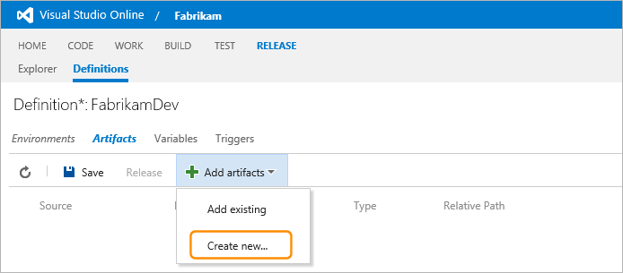

In the dialog that opens, set the **Type** to **Build** to indicate this artifact 
represents the result of a previous build (such as a task in the Visual Studio Online
**BUILD** page). A Build artifact effectively defines the location of files that will
be deployed. The **Project** is automatically set to the name of the current project,
so you can easily select the build definition whose results you want to deploy. Then 
you specify the name of the artifact, the relative path of the build drop location 
(where the distribution files for deployment are located), and optionally add a 
description for this artifact. 
 
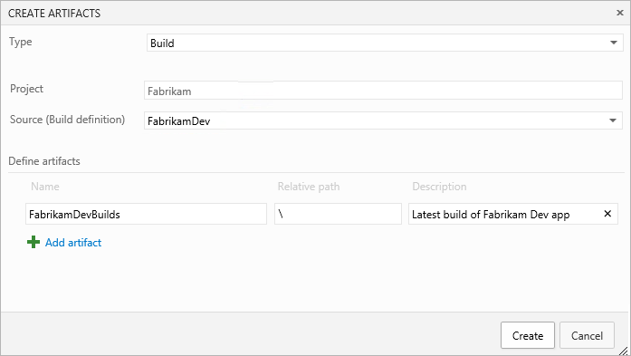

Then choose **Create** to link the artifact to the release definition. You will see 
this artifact in the list in the **Artifacts** tab of the release definition. 
 
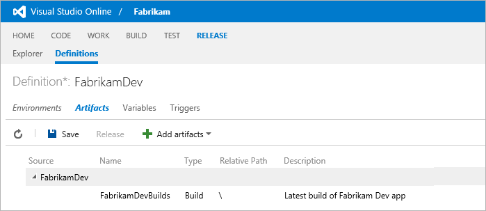

You can add more than one artifact to a release definition if your build process is 
more complex, or you need to perform other tasks before you begin a release. 

_Artifacts are global to Release Management and so you **must use a unique 
name** for each one. No two artifacts can have the same name - even if they are 
referenced in different release definitions, or not referenced in any existing 
definition._

Notice the **Triggers** option near the top of the definition. You can use this page 
to specify that a new build (which updates the artifact) will automatically trigger a 
new release. For more details, see
**[Creating a release automatically on completion of a build](../managing-releases/create-release.md#automaticbuild)**.

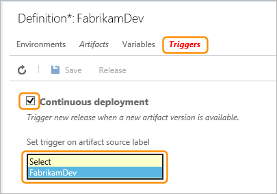
 
#### Add a deployment task

Now choose the **Environments** tab to go back to the list of environments for this 
release definition. Then click the **+ Add tasks** icon.
 
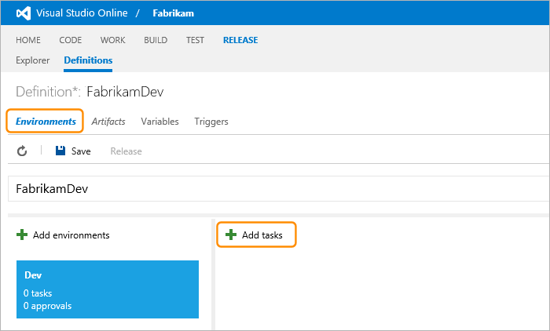

In the ADD TASKS dialog, select the **Azure Web Site Deployment** task from the 
**Deploy** list and choose **Add**. Then choose **Close**.
 
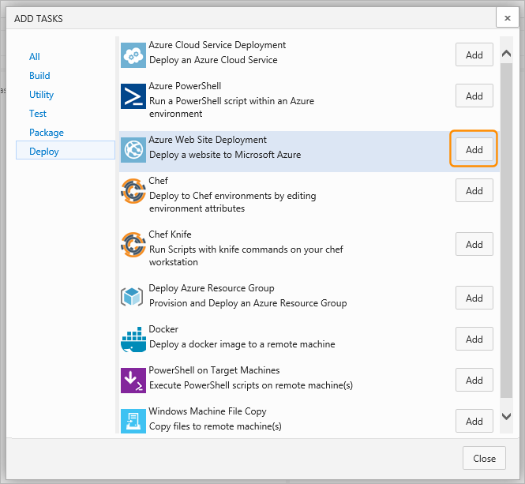

Enter the information required to deploy the output from the build artifact to Azure 
Web Sites. Select the name of the Azure subscription connection you defined earlier, 
enter the name for the website instance, and select an Azure datacenter location. 
Then type the path of the files you want to deploy in the **Package** textbox. 
 
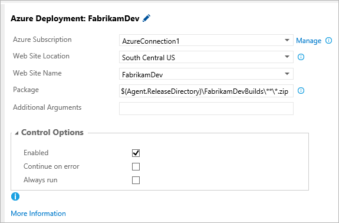

_Notice that you can take advantage of the built-in properties of Release Management 
such as **Agent.ReleaseDirectory**. In this example, the deployment package consists of 
all the zip files in the **FabrikamDevBuilds** subfolder (which you specified in the 
build artifact) and any subfolders within the default folder used by Release 
Management. For details of all the built-in properties, and the other options for 
deployment tasks, see 
**[Pre-defined variables](../author-release-definition/understanding-tasks.md#predefvariables)**._

After you have specified the information for the deployment task, click the **Save**
icon to save your release definition.

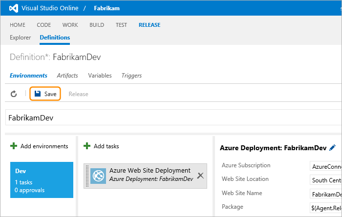

<a name="startrelease"></a>
### Start the release

You are now ready to start a release of the app to Azure Web Sites. Choose **Release**. 

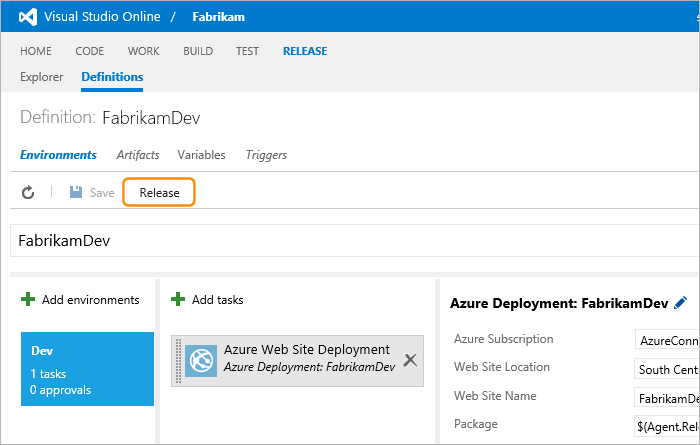
 
In the dialog that opens, enter the title for the release and optionally enter a 
description. Notice that the build artifacts are displayed (in this example, there is
only one), and the build version is automatically set to the latest build. You can 
use the drop-down list to select a different build if you wish. When you are finished
editing the values in the dialog, choose **Create**. 
 
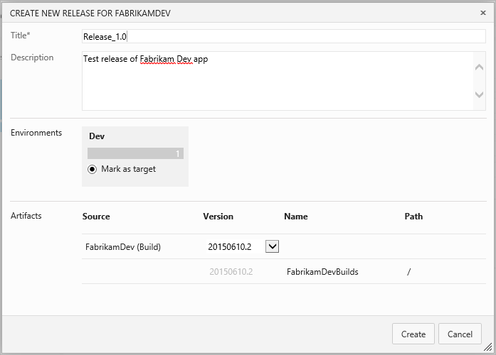

_This dialog also shows all the environments in the release definition and, by 
default, marks the last as the target stage. If you have more than one environment, 
you can specify a different as the final target if you wish. For example, you may 
want to stop a release at an intermediate stage such as QA rather than it 
automatically continuing to a live environment. However, you can also use approvals 
at intermediate stages to pause a release and allow it to be cancelled before it 
reaches the target or final stage. For more details, see 
**[Approvals and approvers](../author-release-definition/understanding-environments.md#approvers)**._

If there are no errors, the release will be queued. You can see this in the message 
bar. To view details of the release, click the release name hyperlink. 

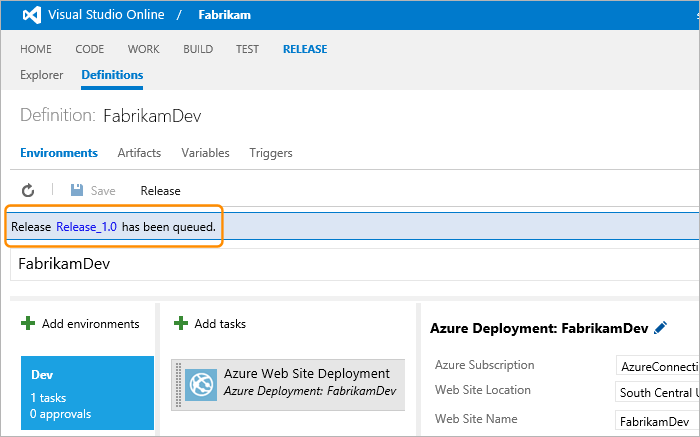

This displays the **Summary** page showing information about the release. It shows 
that it is in progress, and the environment that it is currently executing within 
(in this example, there is just the single Dev environment). 
 
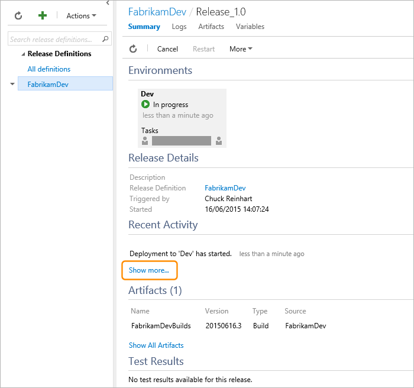

Choose the **Show more** link in the **Summary** page to open the Logs section (or 
choose the **Logs** tab at the top of the page) to show details for each task and step 
of this and any previous releases. For example, in the following screenshot, you can 
see that the release as a whole is in progress, and the default pre-deployment 
approval has been granted automatically (you didn't specify approval for a release 
from a specific person was required). 
 
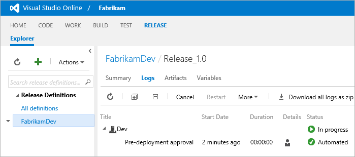

_The links in this page allow you to cancel a release that is in progress, restart a 
release, or (using the **More** drop-down list) abandon a release so that no more actions
will be performed - even if it is set to continue when an error occurs. For details, see
**[Understanding the overview and list of releases](../managing-releases/track-release.md#overview)**._

Click the "refresh" icon in the toolbar to update the page until it shows the release
has succeeded. In this screenshot you can see the Azure deployment task and it's 
duration, followed by the default post-deployment approval action. Use the icons in 
the **Details** column to download the log files for each step, or the link in the 
toolbar to download all the log files as a single zip file.
  
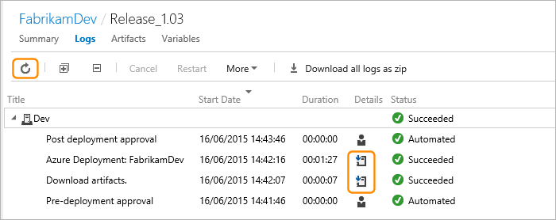

_If you have more than one environment, you'll see a list of these environments and 
the status for each task for each environment. The post-deployment approval facility 
is provided so that you can specify people who can approve the release after a stage 
has completed and before the next stage begins. This could be useful if, for example,
you wanted to allow some users to approve release to a live environment while others 
could approve release only to a staging environment. For more details, see 
**[Approvals and approvers](../author-release-definition/understanding-environments.md#approvers)**._

After the release has succeeded, you will see the web app you just deployed in the 
Azure portal.  
 
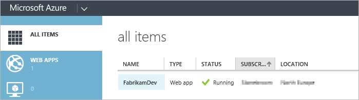

You can browse to your newly deployed website using the URL 
`http://{website-name}/azurewebsites.net`. 

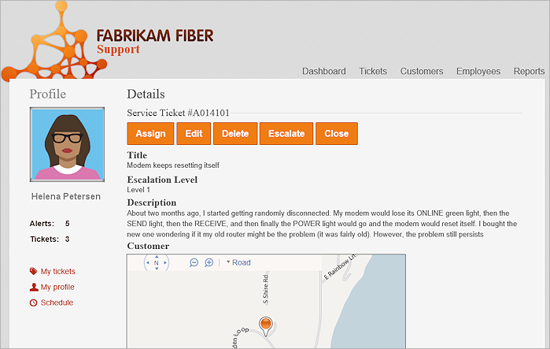

_If you have deployed the Fabrikam Fiber example, you will need to set up the 
database before you can see the results._


<a name="cloudservice"></a>
## Deploying to Azure cloud services

Deploying to Azure cloud services requires you to build your app as a cloud services 
package and provide the appropriate configuration file. This section summarizes the
differences between deploying as an Azure website instance and as a cloud service
instance.

* Follow the process described in [Start with a build definition](#createbuilddef)
  to create a build definition, but use the appropriate parameters for the 
  **Visual Studio Build** task step so that it will create an Azure cloud services 
  package based on the **.ccproj** solution file. Also specify the appropriate
  MSBuild arguments so that the build step creates the required artifacts for 
  deployment; for example:  
  `/t:Publish /p:TargetProfile=$(targetProfile) /p:DebugType=None`   
  `/p:SkipInvalidConfigurations=true /p:OutputPath=bin\ /p:PublishDir="$(build.stagingDirectory)\\"`

 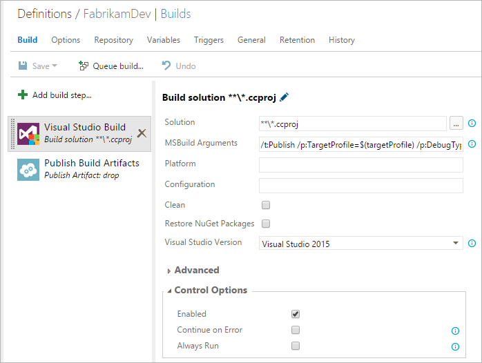

* Configure the **Publish Build Artifacts** task step to publish the contents of the 
  `**\bin` folder.
 
 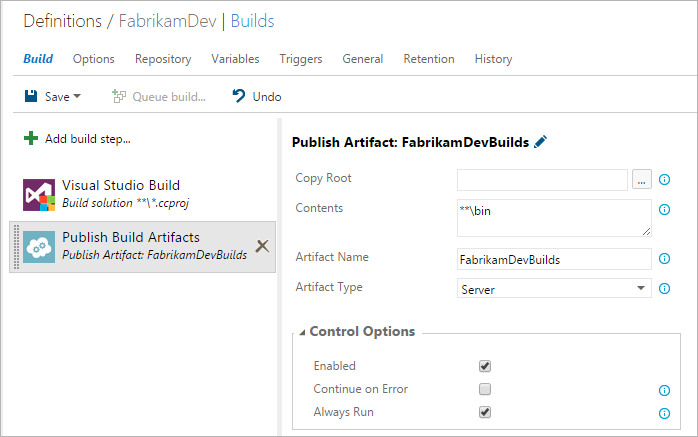

* Follow the process described in [Create an Azure connection](#createazurecon) 
  to create a connection to your Azure subscription if you have not already done this.

* Follow the process described in [Create the release definition](#createreleasedef)
  to create a release definition, but choose the **Azure Cloud Service Deployment** 
  template. This adds a task to deploy the package and configuration file to Azure. 
  The values you will need for the parameters of the deployment task are:
  - **Azure Subscription**. Required. The name of an Azure Connection already defined
    in the Services tab of the Control Panel page for the project. 
  - **Storage Account**. Required. The name of an existing Azure storage account in 
    the Azure Subscription specified for this task.
  - **Service Name**. Required. The name of the Azure Cloud Service instance in the 
    Azure Subscription specified for this task.
  - **Service Location**. Required. The geographical region or location of the Azure 
    service specified for this task.
  - **CsPkg**. Required. The physical path to the Azure cloud services deployment 
    package created in the artifacts folder by your build step. Can include built-in 
    properties such as `$(Agent.ReleaseDirectory)`. 
  - **CsCfg**. Required. The physical path to the Azure cloud services configuration 
    file created in the artifacts folder by your build step. Can include built-in 
    properties such as `$(Agent.ReleaseDirectory)`.
  - **Environment (Slot)**. Required. The cloud services environment for the 
    deployment. Must be either **Production** or **Staging**.
  - **Allow Upgrade**. Optional. When true (ticked), the deployment will overwrite 
    an existing deployment. When false, it will deploy the application only if a 
    cloud service with the same name does not already exist.

   **Note**: The Azure subscription must already contain a storage account. The task 
   creates a new cloud services (web and worker roles) instance using the name in 
   the configuration file if it does not already exist. 

* Continue by creating a release from the definition to deploy the app to Azure.

* View the deployed app using a URL of the form:  
  `http://{cloud-service-name}/cloudapp.net`

<a name="resourcegroup"></a>
## Deploying to Azure resource groups

_Content not yet available._

## Related topics

 * [Understanding Release Management](understand-rm.md)
 * [Release notes](release-notes.md)
 * [Deploying your .Net apps to any cloud](deploy-dotnet-to-other-cloud.md)
 * [Deploying your Java apps to any cloud](deploy-java-to-any-cloud.md)
 * [Configuring agents](configure-agents.md)

[!INCLUDE [back-to-index-shared](../_shared/back-to-index-shared.md)]
 
[!INCLUDE [help-support-shared](../_shared/help-support-shared.md)]
