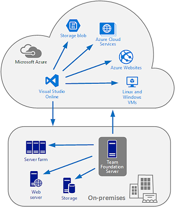

Title: Understanding Release Management
Description: Understanding Microsoft Release Management for VSO and TFS 2015
ms.TocTitle: Understanding Release Management
ms.ContentId: 126C3E1C-9DB3-4E46-918D-FF5600BF8FC9

# Understanding Release Management

[!INCLUDE [preview-header-shared](../_shared/preview-header-shared.md)]

Visual Studio Online (VSO) and Team Foundation Server (TFS) 
are **highly scalable, high quality, proven systems** that are 
suitable for enterprise and larger organizations, yet still 
offers seamless continuous integration opportunities to 
smaller customers.

The **BUILD** feature in VSO and TFS allows you to create a 
pipeline of tasks that run on the build server, and can 
deploy the application to another location. It also allows 
you to execute tasks as part of the pipeline that run tests 
and create deployment packages.

However, in most cases, you will want to implement a more 
comprehensive release management process that encompasses 
multiple locations. This is the function of Release Management 
(the **RELEASE** feature) in VSO and TFS. It makes it easy to
manage the release of your app by deploying it to a specific 
environment for each separate release step, and by controlling 
the process through approvals for each step.

**In this topic:**

 * [When should I use Release Management?](#whentouse)
 * [Where do I start?](#wheretostart)
 * [Where can I deploy?](#wheretodeploy)
 * [What about continuous integration?](#contintegration)
 * [What is a release pipeline?](#pipeline)
 * [Where do I go next?](#wherenext)

## When should I use Release Management?

Use Release Management when you need:

 * **Automated multi-stage deployment across multiple locations** 
   irrespective of the type of environment using reusable definitions 
   and artifacts to reduce the overhead of configuring releases. 
   One-click release that supports Window and Linux servers and 
   cloud environments; using PowerShell, Desired State Configuration, 
   Chef, and many other third-party mechanisms.

 * **Support for continuous integration and automated tests**. 
   Release Management can be configured for automatic deployment 
   after a successful build, and automated pre- and post-deployment 
   testing, as part of the release definition. 

 * **Support for a highly granular approvals process**. Approvers 
   can be defined for each step and task in the overall process. 
   Deployments can be paused and approvals can be scheduled and 
   automated. Failed deployments can be rolled back.

 * **Full integration with Visual Studio Online and Team Foundation 
   Server**, though an intuitive web-based interface to maximize user 
   productivity. No additional installation or licensing are required, 
   and no extra costs are incurred. 

 * **Comprehensive security and traceability**. Logging provides a 
   record of all actions and events, including approval details. 
   Roles and responsibilities can be assigned to groups of users to 
   maximize security and manage release processes. 

 * **Customization and a REST API to enable automation**. You can 
   add custom tools and components to a release pipeline, and manage 
   and trigger releases through the API it exposes.

## Where do I start?

Think about what you want to achieve with your release management 
process. Your implementation can benefit from many features of 
Release Management. Consider the following questions: 
 
 * **Do you want to use an on-premises server or the cloud to 
   manage your releases?** You can:
  - maintain your own on-premises Release Management server by installing 
    **[Microsoft Team Foundation Server](https://www.visualstudio.com/products/tfs-overview-vs)** 
    (TFS), or 
  - avoid buying and maintaining a server by using the 
    **[Visual Studio Online](https://www.visualstudio.com/products/what-is-visual-studio-online-vs)** 
    (VSO) Release Management service. 
 * **How many environments do you need?** You might need only 
   test and production. However, you may want a different environment 
   for a pre-production stage that needs, or a dev stage if it's 
   important to track who approves that the dev work is ready to test.
 * **What are the necessary steps to deploy your app?** Do you need 
   to reconfigure the app each time? Do you need to stop and start 
   services? Do you need to run a script from the command line? 
   Think through all of these steps. You'll add actions to your 
   release definition that perform these steps.
 * **Are a set of these actions common to servers?** If so, you can 
   set up these actions once for each of these servers.
 * **Do you already have a deployment process?** Perhaps you want 
   to use PowerShell, DSC, or Chef to deploy your app? Do you 
   already have scripts that you can use? Do you want to use Microsoft 
   Azure as your environments?
 * **Have you set up a build definition for your app using Team Build?** 
   Go **[here](https://www.visualstudio.com/get-started/build/build-your-app-vs)** to learn how.
 * **Who needs to approve each stage?** You can have multiple approvers 
   for each stage. You must add each approver as a user and assign 
   them permissions.

## Where can I deploy?

Release Management allows you to deploy from and to a range of types of 
environment from the cloud-based Visual Studio Online service or from
on-premises Team Foundation Server. Typical deployment targets include:

 * Microsoft Azure Web Apps, Cloud Services, and Virtual 
   Machines running Windows or Linux.
 * On-premises servers, or servers hosted in another location or cloud.
 * Docker containers and Chef environments.
 

For most of these scenarios, you can choose how the deployment is driven. 
For example, you can choose to use PowerShell, DSC, or Chef to deploy 
from an on-premises TFS server to your own on-premises or hosted servers. 
You can also use Jenkins as a build environment. 

For getting started examples of the common deployment scenarios, see the 
following walkthroughs:

 * [Deploying your .Net apps to Azure](deploy-dotnet-to-azure.md)
 * [Deploying your .Net apps to any other cloud](deploy-dotnet-to-other-cloud.md)
 * [Deploying your Java apps to any cloud](deploy-java-to-any-cloud.md)

## What about continuous integration?

The traditional approach of updating and deploying major version increments 
of applications at infrequent intervals, such as once or twice each year,
no longer meets the modern requirements to minimize "time to market" and 
meet the demands of an increasingly competitive environment. Developers 
and managers typically need to perform regular releases and updates of 
applications, sometimes daily or weekly, to provide the best service to 
customers.

The solution is ***continuous integration***, where each update to the application 
is checked in, built, and then automatically deployed to test and 
pre-production servers. Tests are run on the application to verify readiness 
for release, and the deployment process - after the appropriate final 
approval - deploys the application to the production environment. The result 
is that customers and users always have the most recent tested and approved 
build of the application.

 
Release Management integrates with Visual Studio Online and Team Foundation 
Server to support continuous integration. A successful build can trigger 
execution of a release definition and release pipeline that includes tasks 
to execute tests and approval rules that pause deployment through the 
pipeline at the appropriate steps. For more information, see 
**[this topic](../managing-releases/create-release.md)**. The blog post 
**[Testing in Continuous Integration and Continuous Deployment Workflows ](http://blogs.msdn.com/b/visualstudioalm/archive/2015/05/29/testing-in-continuous-integration-and-continuous-deployment-workflows.aspx)**
describes setting up a continuous integration in Visual Studio Online.

## What is a release pipeline?

One of the major advantages of using Release Management is the capability 
to create multi-stage release pipelines that can span different physical 
and virtual locations. While a pipeline should comprise the same operating 
systems and deployment methods for each environment, Release Management 
allows you to build pipelines on a wide range of types of hardware and 
operating systems, and using many different methods of deployment. 
In addition, you can manage the process end-to-end by assigning approvers 
for each operation. For example, you may need to use a release pipeline that 
provides some or all of the following capabilities:

 1. Automatically deploy each new build to a test server on your local network.
 2. Execute a series of tests on this server.
 3. Wait for a test operative to review the test results and approve the next 
    deployment stage.
 4. Deploy the application to a set of QA servers connected to an Azure Virtual 
    Network.
 5. Run distributed UI and load tests across the QA servers.
 6. Wait for a QA operative to review the results and approve the next 
    deployment stage.
 7. Deploy the application to a set of publicly available servers in one 
    datacenter for user acceptance testing.
 8. Wait for final sign-off to approve the next deployment stage.
 9. Deploy the application globally to all production instances in all 
    datacenters.  

Release Management allows you to easily create a release definition that 
encompasses all of these capabilities by using multiple environments, 
tasks, artifacts, and approvers - as you'll see in the next section. 

## Where do I go next?

The typical approach to using Release Management includes the following steps:

 * **Define any global connections you need to remote services and other 
   applications or data stores**. Using global connections allows you to 
   quickly and easily update these when required, and hide sensitive 
   information about the connection such as keys and passwords. 
   For more information, see 
   **[Service connections](../author-release-definition/understanding-tasks.md#serviceconnections)**. 
 * **Create one or more release environments for the sets of tasks and deployment 
   locations you need**. For example, create environments for test, quality 
   assurance, staging, and production in your release pipeline. Each environment 
   can be one or more servers, and these can be located on your own network, 
   in the cloud, or in any other hosted environment. For more information, see
   **[Where to deploy? Understanding Environments](../author-release-definition/understanding-environments.md)**.
 * **Consider if you need to specify pools or demands for the release agent**. 
   In some cases, such as deployments to on-premises locations or to different 
   security domains, you may need more than one release agent to perform the 
   deployment. This means that you must specify non-default application pools 
   and install the release agent. You can define custom properties for each 
   release agent you configure, and use demands to select an appropriate agent 
   at runtime. For more information, see 
   **[Configuring agents](configure-agents.md)**.    
 * **Add tasks to each environment to deploy the code and run tests**. There 
   is a wide range of tasks you can use. These tasks can take advantage of shared 
   custom variables and built-in properties in their configuration. For more 
   information, see 
   **[How to deploy? Understanding Tasks](../author-release-definition/understanding-tasks.md)**. 
 * **Define artifacts that your release definition uses**. For example, create 
   an artifact that represents the location and files that are the output from 
   your build process. Use these artifacts in your tasks and environments as 
   required. For more information, see 
   **[What to deploy? Understanding Artifacts](../author-release-definition/understanding-artifacts.md)**.    
 * **Configure the approvals and approvers required for each stage**. Edit the 
   environments to specify the lists of users that must approve each operation 
   or step of the release process where this is appropriate. If you do not need 
   a specific step to be approved manually, it can be auto-approved when a release 
   is created for the definition. For more information, see 
   **[Approvals and approvers](../author-release-definition/understanding-environments.md#approvers)**. 

## Related topics

 * [Release notes](release-notes.md)
 * [Deploying your .Net apps to Azure](deploy-dotnet-to-azure.md)
 * [Deploying your .Net apps to any cloud](deploy-dotnet-to-other-cloud.md)
 * [Deploying your Java apps to any cloud](deploy-java-to-any-cloud.md)
 * [Configuring agents](configure-agents.md)

[!INCLUDE [back-to-index-shared](../_shared/back-to-index-shared.md)]
 
[!INCLUDE [help-support-shared](../_shared/help-support-shared.md)]

