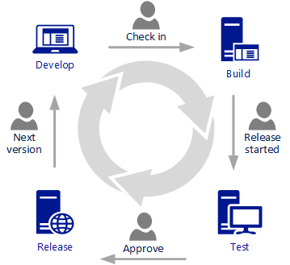
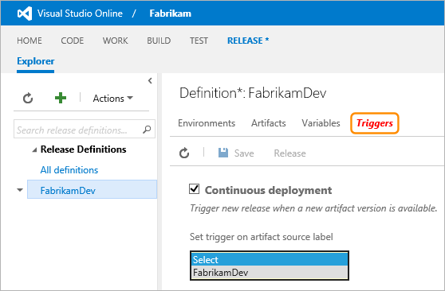
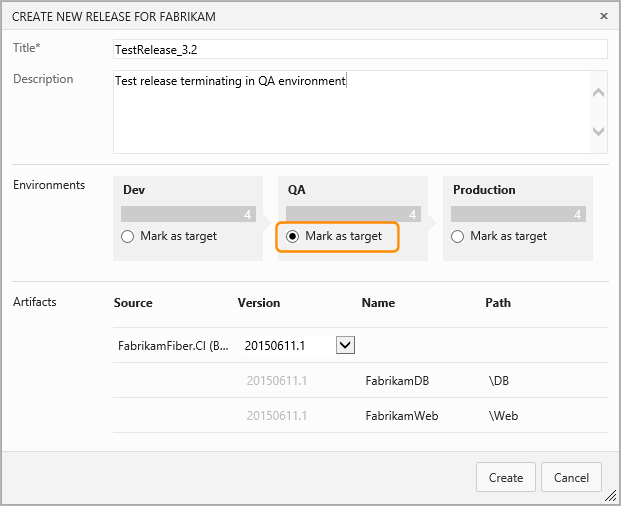

Title: Creating a release or a release-in-draft
Description: Creating a release or a release-in-draft in Microsoft Release Management for VSO and TFS 2015
ms.TocTitle: Creating a release or a release-in-draft
ms.ContentId: 188DD7EF-3D24-4F88-A937-51550372FE55

# Creating a release or a release-in-draft

[!INCLUDE [preview-header-shared](../_shared/preview-header-shared.md)]

<!-- TBD - intro -->

**In this topic:**

 * [Creating a release manually from the Release hub](#manualrelease)
 * [Creating a release manually from the Build hub](#manualbuild)
 * [Creating a release automatically on completion of a build](#automaticbuild)
 * [Creating a release by using the REST API](#restapi)
 * [Pausing or terminating a release at specific stages](#pauseterminate)
 
[!INCLUDE [back-to-index-shared](../_shared/back-to-index-shared.md)]

## Creating a release manually from the Release hub

_Content not yet available._

## Creating a release manually from the Build hub

_Content not yet available._

## Creating a release automatically on completion of a build

A release definition can be invoked automatically by some build servers or continuous
integration systems on completion of a build, so that the Release Management pipeline
of environments and tasks deploys the application whenever a new build occurs. This
allows new builds to be automatically deployed all the way to production. 

 
Many version control systems can invoke a new build whenever a source file is changed. 
This means that you can implement both partial and continuous integration to deploy 
an application. For an example of using Visual Studio Online for continuous 
integration, see 
**[Build your Visual Studio project](https://www.visualstudio.com/en-us/get-started/build/build-your-apps-vs)**. 

### Configure automatic release triggering
 
Configure a release definition to deploy your application, and include in the 
definition an artifact that represents the output of your build process. Then open 
the **Triggers** page of the definition and set the **Continuous deployment** option. 
Select the name of the artifact for which you want to trigger the release when a new 
version is available.   

  

## Creating a release by using the REST API

_Content not yet available._

## Pausing or terminating a release at specific stages 

Even though a release can contain more than one environment in its pipeline, it 
doesn't necessarily mean that the application will be automatically deployed to all 
of the environments in the release definition. If you configure approvers for the 
environments in the release pipeline, the release will pause and wait for approval 
at these stages. For more details, see 
**[Approvals and approvers](../author-release-definition/understanding-environments.md#approvers)**. 

In addition, when you create a release from a release definition (in other words, 
when you initiate a release), you can specify the target - or final - environment where 
the deployment will stop. This does not have to be the last environment in the 
definition. 

 
This allows you to test the initial steps and tasks in a release, safe in the 
knowledge that it will stop before, for example, deployment to a live production 
environment.

## Related topics

 * [Tracking a release](track-release.md)

[!INCLUDE [back-to-index-shared](../_shared/back-to-index-shared.md)]
 
[!INCLUDE [help-support-shared](../_shared/help-support-shared.md)]

