Title: Tracking a release
Description: Tracking a release in Microsoft Release Management for VSO and TFS 2015
ms.TocTitle: Tracking a release
ms.ContentId: 9E2E1763-FB01-4272-8A8B-D4C803B8C754

# Tracking a release

[!INCLUDE [preview-header-shared](../_shared/preview-header-shared.md)]

<!-- TBD - intro -->

**In this topic:**

 * [Understanding the overview and list of releases](#overview)
 * [Approving a release](#approve)
 * [Viewing release logs](#viewlogs)
 * [Notifications](#notifications)
 * [Redeploying after failure](#redeploy)
 
[!INCLUDE [back-to-index-shared](../_shared/back-to-index-shared.md)]

## Understanding the overview and list of releases

The default **Overview** page displayed in Release Management shows a list of release definitions.
Each one is shown as a series of environments, with information about the definition
such as the creator, number of artifacts, release history, and current status.  

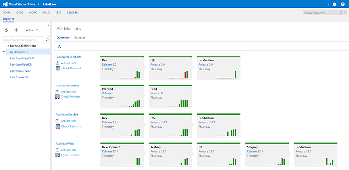

The environment images, shown below for a release named **FabrikamFiber Demo**, 
indicate that the definition contains two environments named **QA** and **Prod**.
The colored bar at the top of each environment indicates the current status of
releases to the environment. The colors are red for failed, green for succeeded, 
and blue for in-progress or paused. 

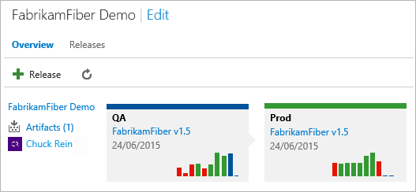

The vertical bars in each environment display a snapshot of the most recent 
previous releases. The height of the vertical bars represents the relative time 
taken for that release to execute. 

_In the **Overview** page, you can click the name of the release (to the left of the environments)
to open the release definition in edit mode, click the **Artifacts (**x**)** link to open the list 
of artifacts for this release definition, or click the release name with an environment to open
the release information page._ 
 
The **Releases** page shows a different view of the releases for a selected release
definition. In this view, each environment is shown as a horizontal bar using the same
color scheme as the **Overview** page. A gray bar indicates an environment not yet
reached by a release.  

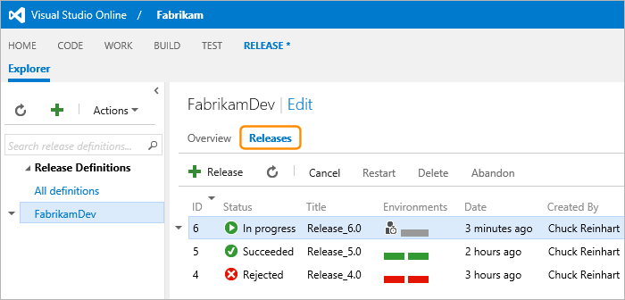

Notice the "approval" icon in the release at the top of the list. This indicates that
an approver was specified and the release is paused waiting for this approval to be 
granted. See **[Approvals and approvers](../author-release-definition/understanding-environments.md#approvers)**
for more information.

Use the commands on the toolbar of the **Releases** pane, or on the shortcut menu, to
**Cancel** an in-progress release, **Restart** a cancelled or a failed release, 
**Delete** the details of a release, or **Abandon** a cancelled or a failed release.   
 
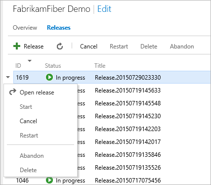

Use the drop-down lists at the top right of the **Releases** pane to filter the list 
by state, date, and user.
 
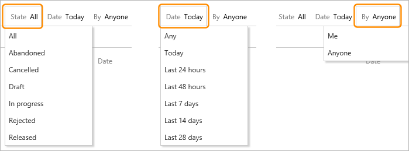

As a release progresses, you can view the status. Open the shortcut menu for a release
in the **Releases** page and choose **Open release**, or double-click the release, to 
display the release information page. The default **Summary** tab shows details of the 
release. 

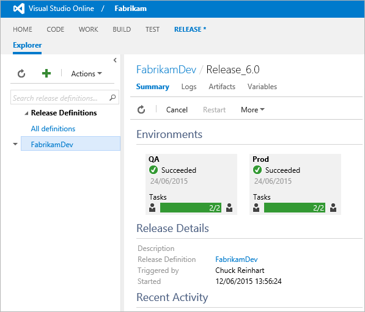

## Approving a release

During a release, the pipeline will stop at any stage that requires approval, and 
will display an indicator icon in the **Releases**, **Summary**, and **Logs** pages
and lists. For example, this screenshot shows the **Releases** and **Summary** pages
when the release is waiting for pre-deployment approval. The **Summary** page 
indicates that the release is paused in the **Dev** environment awaiting approval.
Alternatively, the approver can reassign the approval to another user. 

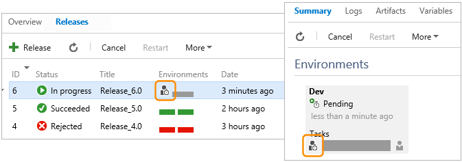

Release Management notifies the listed approver(s) by email that a release is 
waiting for approval. Each approver can click the "approval" icon in any of the pages
where it is displayed, enter a comment, and either approve or reject the release. 
Alternatively, an approver can reassign the approval to somebody else if this is more
appropriate.   

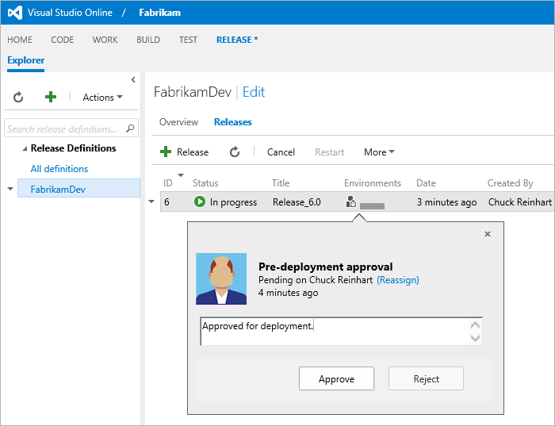

If more than one approver is defined for a step or task, each one must approve the 
release separately. If all approvers grant approval, release pipeline execution 
continues up to the next point where approval is required, or the release is 
completed (or it fails). If any one approver rejects the release, it stops at that 
point and displays a **Rejected** message in the status lists. 

## Viewing release logs

The **Summary** tab of the release information page shows a comprehensive list of all
the details of a release, including the environments (with the status), the activity, 
the artifacts it uses, and the test results (if any).   

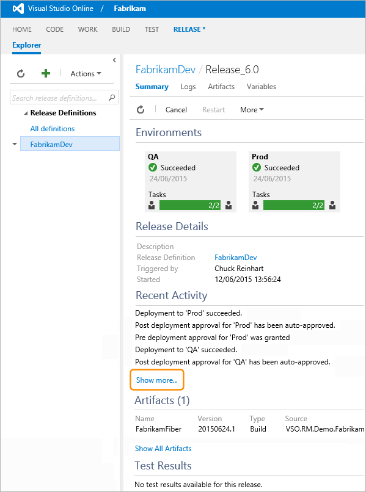
  
The **Show more** link opens the **Logs** page, which shows the status for each step 
or task of the release, for each of the environments in the release definition. After
a release has completed, irrespective of whether it succeeded, failed, or was 
abandoned, you can view the details of each step or task in this page.
 
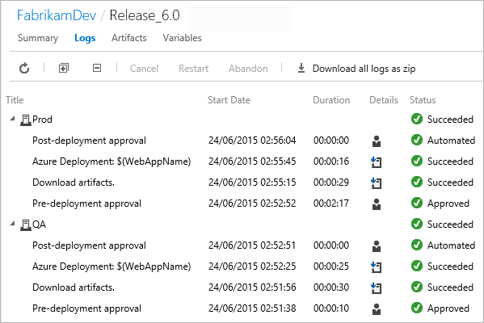

The **Details** column contains links to download the detailed log file for each 
step (or to display the comment entered by the approver for an approval step). 
You can also download all of the log files as a zip file from the link on the toolbar.

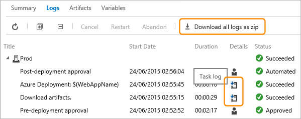

## Notifications

_Content not yet available._

## Redeploying after failure

If a release fails or is canceled, you can restart the release. For example, if an
approver canceled the release because an environment was temporary offline, you can 
restart it when the environment is available again. If a release fails, you can 
restarted it after you fix the problem that caused the failure - perhaps there was
a connectivity failure or a server was temporary offline. 

To restart a release, use the **Restart** command in the toolbar of the **Releases**
pane, or open the shortcut menu for the release and choose **Restart**.
 
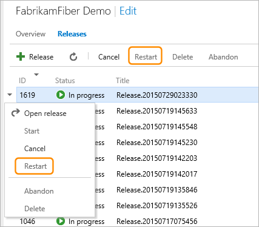

If you need to change the release definition before you redeploy, you must create 
a new release from the updated release definition.

## Related topics

 * [Creating a release](create-release.md)

[!INCLUDE [back-to-index-shared](../_shared/back-to-index-shared.md)]
 
[!INCLUDE [help-support-shared](../_shared/help-support-shared.md)]
