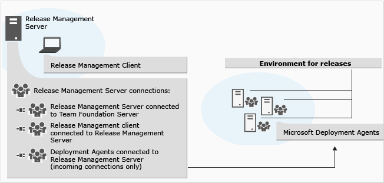
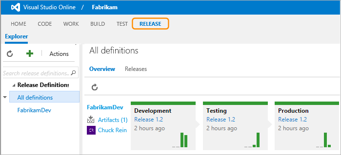

Title: Release Management
Description: Create managed continuous deployment pipelines to release quickly, easily, and often
ms.TocTitle: Release
ms.ContentId: 008EE4E4-26E4-4A18-B60D-CD74106834DC

# Release Management

Manage the release of your app by deploying it to a specific 
environment for each separate release step, and by controlling 
the process through approvals for each step.

 
**Important**: _The topics below cover three different versions of Release Management._
  
 * _If you are using the server and client version of Release 
   Management in Visual Studio 2015 and Team Foundation Server 2015, see 
   **[this section](#ver2015)** for more information._  
 * _If you are using the server and client version of Release 
   Management in Visual Studio 2013 and Team Foundation Server 2013, see 
   **[this section](https://msdn.microsoft.com/library/dn217874%28v%3Dvs.120%29.aspx)**
   for more information._
 * _If you are using the "vNext" version of Release Management as a 
   service in Visual Studio Online and in Team Foundation Server 2015,
   see **[this section](#linklist)** for more information._

## Release Management 2015 (server and client version)

 * **[Overview](previous-version/release-management-overview.md)**
  - [Install Release Management](previous-version/install-release-management.md)
     * [System requirements for Release Management](previous-version/install-release-management/system-requirements.md)
     * [Install Release Management server and client](previous-version/install-release-management/install-server-and-client.md)
     * [Install deployment agents](previous-version/install-release-management/install-deployment-agent.md)
     * [Connect Release Management to TFS](previous-version/install-release-management/connect-to-tfs.md)
  - [Manage users, groups, and permissions](previous-version/add-users-and-groups.md)
 * **[Manage your release](previous-version/manage-your-release.md)**
  - [Release without deployment agents](previous-version/release-without-agents.md)
  - [Release with deployment agents](previous-version/release-with-agents.md)
  - [Trigger a release from a build](previous-version/trigger-a-release.md)
  - [Deploy continuously to Azure](previous-version/deploy-continuously-to-azure.md)
  - [Release actions to deploy an app](previous-version/release-actions.md)
     * [Tools for release actions](previous-version/release-actions/release-action-tools.md)
  - [Configuration variables and system variables](previous-version/config-and-system-variables.md)

## Release Management 2013 (server and client version)

* See [Automate deployments with Release Management](https://msdn.microsoft.com/library/dn217874%28v%3Dvs.120%29.aspx)

## Release Management "vNext" preview version

The following sections contain guidance for using Release Management in
Visual Studio Online, and in Team Foundation Server 2015 when you have 
installed the Release Management service. 
Release Management is currently in preview, and you must apply
to join the **[preview program](getting-started/join-preview.md)** in 
order to use it.

 
_This version of Release Management is available only to users who have 
joined the preview program. Some topics and features may not yet be available._

### Getting started

 * **[Understanding Release Management](getting-started/understand-rm.md)**
  - [When should I use Release Management?](getting-started/understand-rm.md#whentouse)
  - [Where do I start?](getting-started/understand-rm.md#wheretostart)
  - [Where can I deploy?](getting-started/understand-rm.md#wheretodeploy)
  - [What about continuous integration?](getting-started/understand-rm.md#contintegration)
  - [What is a release pipeline?](getting-started/understand-rm.md#pipeline)
  - [Where do I go next?](getting-started/understand-rm.md#wherenext)
 * **[Release notes](getting-started/release-notes.md)**
  - [What's new?](getting-started/release-notes.md#whatsnew)
  - [Known issues](getting-started/release-notes.md#knownissues)
  - [Getting support](getting-started/release-notes.md#help)
 * **[Deploying your .Net apps to Azure](getting-started/deploy-dotnet-to-azure.md)**
  - [To Azure websites](getting-started/deploy-dotnet-to-azure.md#website)
  - [To Azure cloud services](getting-started/deploy-dotnet-to-azure.md#cloudservice)
  - To Azure resource groups
 * **Deploying your .Net apps to any cloud**
  - To IIS web servers using MSDeploy
  - To IIS web servers using DSC push
  - To Docker containers
 * **Deploying your Java apps to any cloud**
  - To Linux servers using SSH
  - To Chef environments
 * **[Configuring agents](getting-started/configure-agents.md)**
  - [Hosted pool of agents](getting-started/configure-agents.md#hostedpool)
  - [Security of agent pools and queues](getting-started/configure-agents.md#security)
  - [Installing an agent](getting-started/configure-agents.md#installing)
  - [Configuring and selecting an agent](getting-started/configure-agents.md#configuring)
  - Deploying to on-premises servers from VSO
  - [Notes and troubleshooting](getting-started/configure-agents.md#notesandtrouble)

### Authoring release definitions

 * **What to deploy? Understanding Artifacts**
  - Artifacts from Team Build
  - Artifacts from Jenkins
  - Artifacts from on-premise Team Foundation Server
  - Artifacts from Nuget repository
 * **[Where to deploy? Understanding Environments](author-release-definition/understanding-environments.md)**
  - [Environment options](author-release-definition/understanding-environments.md#enviromentoptions)
  - Configuring environments
  - [Environment templates](author-release-definition/understanding-environments.md#templates)
  - [Cloning environments](author-release-definition/understanding-environments.md#cloneenvironment)
  - [Approvals and approvers](author-release-definition/understanding-environments.md#approvers)
  - [Configuration properties](author-release-definition/understanding-environments.md#configproperties)
 * **[How to deploy? Understanding Tasks](author-release-definition/understanding-tasks.md)**
  - [Out-of-the-box tasks](author-release-definition/understanding-tasks.md#outofboxtasks)
  - [Service connections](author-release-definition/understanding-tasks.md#serviceconnections)
  - [Pre-defined variables](author-release-definition/understanding-tasks.md#predefvariables)
  - Rollback upon failure
 * **[More about release definitions](author-release-definition/more-release-definition.md)**
  - [Viewing and editing release definitions](author-release-definition/more-release-definition.md#viewedit)
  - [Running tests during a release](author-release-definition/more-release-definition.md#runtests)
  - [Securing releases and managing users](author-release-definition/more-release-definition.md#security)
  - [Global configuration properties](author-release-definition/more-release-definition.md#globalconfig)
  - Release versioning
  - [Triggers](author-release-definition/more-release-definition.md#triggers)

### Managing releases

 * **[Creating a release or a release-in-draft](managing-releases/create-release.md)**
  - Manually from Release hub
  - Manually from Build hub
  - [Automatically on completion of a build](managing-releases/create-release.md#automaticbuild)
  - By using REST API
  - [Pausing or terminating a release](managing-releases/create-release.md#pauseterminate)
 * **[Tracking a release](managing-releases/track-release.md)**
  - [Understanding the overview and list of releases](managing-releases/track-release.md#overview)
  - [Approving a release](managing-releases/track-release.md#approve)
  - [Viewing release logs](managing-releases/track-release.md#viewlogs)
  - Notifications
  - [Redeploying after failure](managing-releases/track-release.md#redeploy)

[!INCLUDE [wpfver-support-shared](_shared/wpfver-support-shared.md)]
