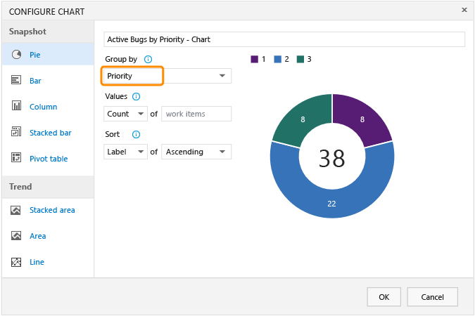
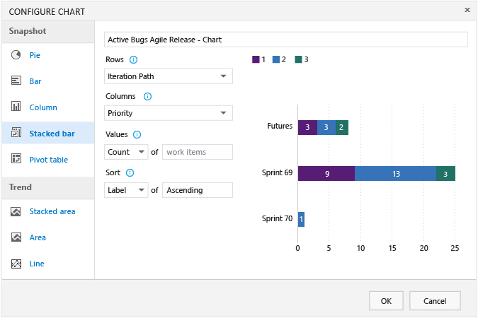
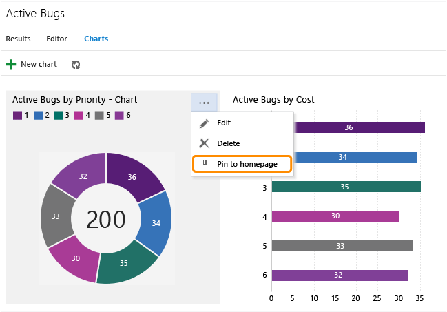

Title: Charts | Visual Studio Online and TFS
Description: Work item charts- Chart query results in Visual Studio Online and Team Foundation Server (TFS)
ms.TocTitle: Charts
ms.ContentId: EFAD32DB-8B19-4ACC-8F72-87CC5A513798


#Charts, visualize progress
You can quickly view the status of work in progress by charting the results of a [flat-list query](../work/track/using-queries.md). You can create several types of charts&#8212;such as pie, column, or trend&#8212;for the same query. 

Charts support viewing a count of work items or a sum of values for select numeric fields, such as Remaining Work or Original Estimate.  


##Add a chart  

1.	From the Queries page, open the chart editor for a flat list query.  

	  

2.	Select the chart type and field for grouping values. When you use pie, bar, and column charts, select a single field to view a count of work items.  

	 

	If you don’t see the field you want in the **Group by** drop-down list, add the field as a column to the query and save the query. You can group by any field except date-time and free-form text fields.

	If you receive an error message when you close the chart editor, you need to request [Basic or Advanced access](../Work/connect/change-access-levels.md).

3.	To change a color, simply click a color n the chart and pick a new color from the color picker.  
 
Charts automatically update when you edit the query or refesh the query results.  


##Create a stacked bar chart  

A stacked bar chart lets you track progress against two field values.  

  

Also, you can sort the rows in the chart by value or label.


##Create a trend chart  
Trend charts let you view progress for the last one, two, or four weeks. 

 


##Burndown chart  

Choose the Sum operator for Remaining Work to view a burndown chart of tasks. 

  
 

##Edit, delete or pin a chart  

Select your option from the chart's context menu. 

  

To pin a chart to your team's home page, you must be a [team administrator](../Work/scale/manage-team-assets.md#add-team-admin). You can only pin charts defined for shared queries.

Your team home page acts as a [dashboard](dashboards.md) for your team. 


##Q &amp; A  

<!-- BEGINSECTION class="m-qanda" -->

###Q: I can view charts, but I can’t create one. What’s missing?
**A: **If you have Stakeholder access or license, you can only view charts. See [Change access levels](../Work/connect/change-access-levels.md) for a mapping of features and access levels. 

###Q: Why doesn’t my chart show all the field values in the results?
**A: **When a chart contains more than seven items within the data series, values in the eight-plus items are consolidated into a set labeled “other.”   

  


###Q: Why doesn’t the field I want to select show up in the chart editor?
**A: **Add the field to either the query filter criteria or a displayed column. 

You can’t select fields for groupings that aren't supported, such as ID, Title, Tags, date-time fields, Description, Repro Steps, and other HTML and long text fields.  

###Q: How does the chart display areas and iterations?
**A: **When you select **Area Path** or **Iteration Path**, only the leaf node appears in the chart. The leaf node is the last node of the full path. For example, ```Phone``` is the leaf node of ```FabrikamFiber/Fabrikam Website/Phone```. If your query contains a mixed level of leaf nodes, your chart might not reflect expected results.  

Use ```Node Name```, the area path leaf node, to see if that improves your results. 

###Q: Can I share the charts I create with my team?
**A: **Yes. Charts you create for queries that are saved under Shared Queries are viewable by all team members. Charts that you create for queries under your My Queries folder are visible only to you. 

Also, you can copy the URL of the chart page and email that to a team member.


###Q: How do query-based charts differ from Excel-generated PivotCharts?  
**A: **The chart editor generates data from the work item tracking data store and therefore displays the most recent data. [Excel PivotCharts](./excel/create-status-and-trend-excel-reports.md) access data published to the Analysis Services cube, which is refreshed every two hours by default.      

###Q: Which browsers support charts?  
**A: **Charts display in browsers that support Scalable Vector Graphics (SGV). This includes Internet Explorer 9 and Internet Explorer 10, Chrome, Firefox and Safari on Mac. Charts have not been optimized for mobile or touch displays. 

###Q: What other charts can I access?
**A: **You can access the following charts:  
- From the web portal you can access the [cumulative flow diagram](../Work/kanban/kanban-basics.md), [team velocity](https://msdn.microsoft.com/library/dn283465%28v=vs.140%29.aspx), and [sprint burndown charts](../work/scrum/sprint-burndown.md) from the sprint backlogs. In addition, you can create charts that [track test progress and test results](https://www.visualstudio.com/get-started/track-test-status-vs). 
- If your on-premises TFS deployment and team project have a project portal and SharePoint site configured, you can access several [Excel charts](https://msdn.microsoft.com/library/dd997876%28v=vs.140%29.aspx">). These include charts to monitor code quality, testing, and bug tracking activity.
- If your on-premises TFS deployment and team project have [SQL Server reports](https://msdn.microsoft.com/library/dd380714%28v=vs.140%29.aspx) added, you can access several reports that include status and trend activities. If you need to add reporting, see [Add reports to a team project](./admin/add-reports-to-a-team-project.md).
- If your on-premises TFS deployment has reporting services added, you can [create an Excel chart from a work item query](./excel/create-status-and-trend-excel-reports.md).


<!-- ENDSECTION -->
