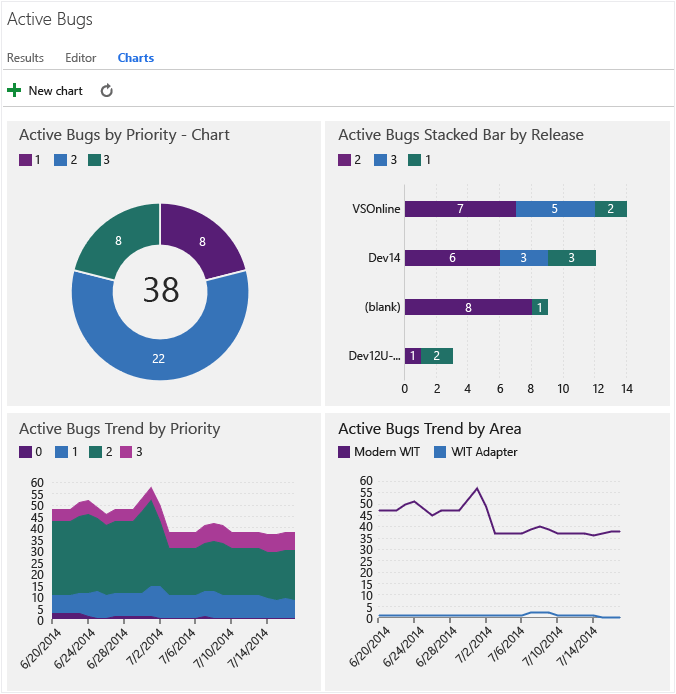

Title: Dashboards and reports | Visual Studio Online and TFS
Description: Your guide to dashboards and reports in Visual Studio Online and Team Foundation Server
ms.TocTitle: Report
ms.ContentId: 7BAD53A1-080E-40E8-8866-24EC00395D39

# Dashboards and reports
Gain insight into the progress you're making and the quality of your software development projects. 
You can collect status and trend charts into dashboards that you share with your team and stakeholders.  

For more complex reporting requirements, you can open or customize a dashboard or report. 
Your choices depend on whether you're working in the cloud or on-premises:      
*   **Visual Studio Online**: PowerBI dashboards and reports:
    *    Source control data from Git repos (including pull requests) and Team Foundation Version Control
*   **On-premises Team Foundation Server (TFS)**: Out-of-the-box (OOB) or custom dashboards and reports:  
    *   SharePoint dashboards
    *   Excel reports
    *   SQL Server Reporting Services reports    

###Index
<table>
<tbody>
<tr valign="top">
<td width="22%"><h4>Charts</h4>
*Query-based charts*
<ul>
<li>[Work item charts](charts.md)</li>
<li>[Test tracking charts](http://msdn.microsoft.com/library/dn282443%28v=vs.140%29.aspx)</li>
</ul>
*Agile tools charts*
<ul>
<li>[Cumulative flow chart](../work/kanban/kanban-basics.md)</li>
<li>[Velocity chart](http://msdn.microsoft.com/library/dn283465.aspx) </li>
<li>[Sprint burndown chart](../work/scrum/sprint-burndown.md)</li>
<li>[Team capacity chart](../work/scrum/sprint-planning.md) </li>
</ul>
</td>
<td width="22%"><h4>Dashboards</h4>
*Web portal*
<ul>
<li>[Team](dashboards.md) (3)</li>
            </ul>
*Visual Studio Online*
            <ul>
                <li><a href="http://support.powerbi.com/knowledgebase/articles/543394-visual-studio-online-content-pack-for-power-bi">Source control</a></li>
            </ul>
*SharePoint dashboards (4)*
<ul>
<li><b>Scrum</b></li>
<ul>
    <li><a href="http://msdn.microsoft.com/library/dn641201.aspx">Release</a></li>
</ul>
<li><b><a href="http://msdn.microsoft.com/library/dd380719.aspx">Agile</a></b></li>
<ul>
    <li><a href="http://msdn.microsoft.com/library/dd420561.aspx">My</a></li>
    <li><a href="http://msdn.microsoft.com/library/ee828504.aspx">Project </a></li>
    <li><a href="http://msdn.microsoft.com/library/dd420557.aspx">Progress </a></li>
    <li><a href="http://msdn.microsoft.com/library/dd420562.aspx">Quality </a></li>
    <li><a href="http://msdn.microsoft.com/library/dd420548.aspx">Test </a>  </li>
    <li><a href="http://msdn.microsoft.com/library/dd560860.aspx">Bugs</a></li>
    <li><a href="http://msdn.microsoft.com/library/dd420556.aspx">Build</a>  </li>
</ul>
<li><b><a href="http://msdn.microsoft.com/library/ee461578.aspx">CMMI</a></b></li>
<ul>
    <li><a href="http://msdn.microsoft.com/library/ee461543.aspx">My</a></li>
    <li><a href="http://msdn.microsoft.com/library/ee828505.aspx">Project </a></li>
    <li><a href="http://msdn.microsoft.com/library/ee461535.aspx">Progress </a></li>
    <li><a href="http://msdn.microsoft.com/library/ee461590.aspx">Quality </a></li>
    <li><a href="http://msdn.microsoft.com/library/ee461566.aspx">Test </a>  </li>
    <li><a href="http://msdn.microsoft.com/library/ee461600.aspx">Bugs</a></li>
    <li><a href="http://msdn.microsoft.com/library/ee461596.aspx">Build</a>  </li>
</ul>
</ul>
</td>
<td width="28%"><h4>Excel reports (1)</h4>
*Adhoc status and trend reports*
            <ul>
                <li>[Create Excel reports from a query](./excel/create-status-and-trend-excel-reports.md)</li>
            </ul>
*Build and code quality*
            <ul>
                <li><a href="http://msdn.microsoft.com/library/ee730418.aspx">Build Quality </a></li>
                <li><a href="http://msdn.microsoft.com/library/dd695782.aspx">Code Churn</a></li>
                <li><a href="http://msdn.microsoft.com/library/dd695790.aspx">Code Coverage</a></li>
            </ul>
*Progress*
            <ul>
                <li><a href="http://msdn.microsoft.com/library/dd695785.aspx">Burn down</a></li>
                <li><a href="http://msdn.microsoft.com/library/ee461573.aspx">Issue Trends</a></li>
                <li><a href="http://msdn.microsoft.com/library/ee461558.aspx">Task Progress</a></li>
                <li><a href="http://msdn.microsoft.com/library/dd695789.aspx">User Story Progress (Agile)</a></li>
                <li><a href="http://msdn.microsoft.com/library/ee461532.aspx">Requirements Progress (CMMI)</a></li>
            </ul>
*Bug tracking*
            <ul>
                <li><a href="http://msdn.microsoft.com/library/dd695792.aspx">Bugs by Assignment</a></li>
                <li><a href="http://msdn.microsoft.com/library/dd695791.aspx">Bugs by Priority</a></li>
                <li><a href="http://msdn.microsoft.com/library/dd695778.aspx">Bug Progress</a></li>
                <li><a href="http://msdn.microsoft.com/library/ee461580.aspx">Bug Reactivations</a></li>
                <li><a href="http://msdn.microsoft.com/library/ee461603.aspx">Bug Trends</a></li>
            </ul>
*Test tracking*
            <ul>
                <li><a href="http://msdn.microsoft.com/library/ee795293.aspx">Test Management Reports</a></li>
                <li><a href="http://msdn.microsoft.com/library/ee461601.aspx">Test Case Readiness</a></li>
                <li><a href="http://msdn.microsoft.com/library/dd695780.aspx">Test Plan Progress</a></li>
                <li><a href="http://msdn.microsoft.com/library/ee461586.aspx">Manual Test Activity</a></li>
                <li><a href="http://msdn.microsoft.com/library/ee461520.aspx">Failure Analysis</a></li>
                <li><a href="http://msdn.microsoft.com/library/dd695788.aspx">User Story Test Status (Agile)</a></li>
                <li><a href="http://msdn.microsoft.com/library/ee461538.aspx">Requirements Test Status (CMMI)</a></li>
            </ul>
        </td>
        <td width="28%"><h4>SQL Server reports (2)</h4>
*Build and code quality*
            <ul>
                <li><a href="http://msdn.microsoft.com/library/dd380683.aspx">Build Quality Indicators (Agile, CMMI)</a></li>
                <li><a href="http://msdn.microsoft.com/library/dd380643.aspx">Build Success Over Time</a></li>
                <li><a href="http://msdn.microsoft.com/library/dd380708.aspx">Build Summary</a></li>
            </ul>
*Progress (Scrum-specific)*
            <ul>
                <li><a href="http://msdn.microsoft.com/library/dn641200.aspx">Backlog Overview</a></li>
                <li><a href="http://msdn.microsoft.com/library/ff731579.aspx">Release Burndown</a></li>
                <li><a href="http://msdn.microsoft.com/library/ff731588.aspx">Sprint Burndown</a></li>
                <li><a href="http://msdn.microsoft.com/library/ff731575.aspx">Velocity (Scrum)</a></li>
            </ul>
*Progress (Agile and CMMI)*
            <ul>
                <li><a href="http://msdn.microsoft.com/library/dd380678.aspx">Burn down and Burn rate</a></li>
                <li><a href="http://msdn.microsoft.com/library/dd380673.aspx">Remaining Work</a></li>
                <li><a href="http://msdn.microsoft.com/library/ee707132.aspx">Unplanned Work</a></li>
                <li><a href="http://msdn.microsoft.com/library/dd380706.aspx">Status of All Iterations (Agile)</a></li>
                <li><a href="http://msdn.microsoft.com/library/dd380648.aspx">Stories Overview (Agile)</a></li>
                <li><a href="http://msdn.microsoft.com/library/dd380641.aspx">Stories Progress (Agile)</a></li>
                <li><a href="http://msdn.microsoft.com/library/ee461517.aspx">Requirements Overview (CMMI)</a></li>
                <li><a href="http://msdn.microsoft.com/library/ee461582.aspx">Requirements Progress (CMMI)</a></li>
            </ul>
*Bug and test tracking*
            <ul>
                <li><a href="http://msdn.microsoft.com/library/dd380736.aspx">Bug Status</a></li>
                <li><a href="http://msdn.microsoft.com/library/dd380731.aspx">Bug Reactivations</a></li>
                <li><a href="http://msdn.microsoft.com/library/dd380674.aspx">Bug Trends</a></li>
                <li><a href="http://msdn.microsoft.com/library/dd380713.aspx">Test Case Readiness</a></li>
                <li><a href="http://msdn.microsoft.com/library/dd380702.aspx">Test Plan Progress</a></li>
            </ul>
        </td>
    </tr>
</tbody>
</table>

#### Notes:
1.  OOB Excel reports require that your team project is configured with SharePoint Products, SQL Server Analysis Services, and SQL Server Reporting Services.  
    If these reports aren't available to you, you can create ad-hoc reports in Excel from a work item query or by connecting to the Analysis Services cube. 

2.  Each [default process](../Work/guidance/choose-process.md) provides several OOB Reporting Services reports.  
    These reports require that your on-premises TFS was configured with SQL Server Analysis Services and Reporting Services Reports. 

    If you didn't add these services previously and want to add them now, go [here](./admin/add-a-report-server.md)

3.  In the web portal, each team's home page acts as a customizable dashboard to quickly view progress and access information. 

4.  SharePoint dashboards collect a number of Excel reports and team project data within a single view hosted on the project portal. 
    For example, the Quality dashboard provides an overview of progress occurring in the test, development, and build areas as they 
    relate to the quality of the software under development. 

    [Dashboards available to you depend on the version of SharePoint Products configured to integrate with TFS](http://msdn.microsoft.com/library/dd380719.aspx).  

## Charts
The quickest way to view progress is to create work item or test result charts. 
These charts are always up-to-date because they get data directly from the TFS data stores.

### Status or trend charts 

You can create several types of charts -- such as pie, column, or trend -- for the [same flat-list query](charts.md). 
   

### Test results and test status charts  

See the [test status](http://msdn.microsoft.com/library/dn282443%28v=vs.140%29.aspx) for a specific test suite or progress made in testing a user story.

   

You can also see how many tests each tester has left to run.
 
   

## Dashboards
Each team's home page acts as a customizable dashboard to quickly view progress and access information. 
Team administrators can [add and rearrange tiles](dashboards.md) to show recent changes made to source control folders,
build status, and charts created from work item queries, such as Product Backlog, Active Bugs, and Resolved Bugs.

   

## Excel Reports
You can track your team project's burn rate, bug backlog, software quality, test progress, and other metrics by viewing an [OOB Excel report](http://msdn.microsoft.com/library/dd997876.aspx).  

Here are examples of two of the Excel reports.

   

## SQL Server Reporting Services Reports
Several [OOB reports](http://msdn.microsoft.com/library/dd380714.aspx) gather several data points into a single report. For example, 
the [Stories Overview (Agile)](http://msdn.microsoft.com/library/dd380648.aspx) report presents a snapshot of the work that has been performed for the filtered set of user stories to the current date.

## Customize reports
To create or customize Reporting Services reports, see [Create and manage Reporting Services reports](http://msdn.microsoft.com/library/bb649552.aspx).

### Add custom fields
You can add data to support reporting requirements in the following ways:

*   Add work item fields to the data store, relational database, or data warehouse. See [Add or modify work item fields to support reporting](http://msdn.microsoft.com/library/ee921481.aspx).

*   Incorporate data from other resources to an Excel report using PowerPivot.
    PowerPivot for Excel 2010 is a data analysis add-in for Microsoft Excel 2010. By using this add-in, you can generate reports that combine data from other data stores or databases with data from Team Foundation Server. For more information, see [Microsoft PowerPivot](http://msdn.microsoft.com/library/gg399131%28v=sql.110%29.aspx). 

*   Create an adapter to add new data types to the data warehouse.
    An adapter is a managed assembly that implements [IWarehouseAdapter](http://msdn.microsoft.com/library/microsoft.teamfoundation.adapter.iwarehouseadapter.aspx). An adapter uses the warehouse object model to interact with the TFS data warehouse. When an adapter adds data fields to the warehouse, it programmatically extends the schema that defines data that is moved to the warehouse. For more information, see [Data Warehouse Extensibility](http://msdn.microsoft.com/library/bb130342.aspx) and [How to: Create an Adapter](http://msdn.microsoft.com/library/bb286956.aspx). 

## Related notes
[Components of the TFS data warehouse](http://msdn.microsoft.com/library/ms244687.aspx) provides more information on the structure and relationship of the warehouse and reports.

You can post a question in the [Team Foundation Server Reporting & Warehouse (forum)](http://social.msdn.microsoft.com/Forums/vstudio/home?forum=tfsreporting).

### Refresh rate of data warehouse and cube

 The WIT data store is updated in real-time as team members create and modify work items. All reportable data from all team projects that are defined in all project collections are written to a single relational data warehouse which is incrementally updated every two minutes. Data from that warehouse is then processed and written to the OLAP cube, which is updated every two hours. To learn more about process control settings, see [Change a process control setting for the data warehouse or Analysis Services cube](./admin/change-a-process-control-setting.md).

### Resolving schema conflicts and managing the data warehouse

Schema conflicts occur when a set of attributes for reportable fields differs across team project collections. Schema conflicts might block processing of the data warehouse and the Analysis Services cube. You must correct conflicts to unblock processing of the warehouse and for reports to work correctly. See [Resolve schema conflicts that are occurring in the data warehouse](./admin/resolve-schema-conflicts.md).

To manage the data warehouse or troubleshoot problems that occur, you use the Warehouse Control Web Service. See [Manage TFS reports, data warehouse, and analysis services cube](./admin/manage-reports-data-warehouse-cube.md). 
