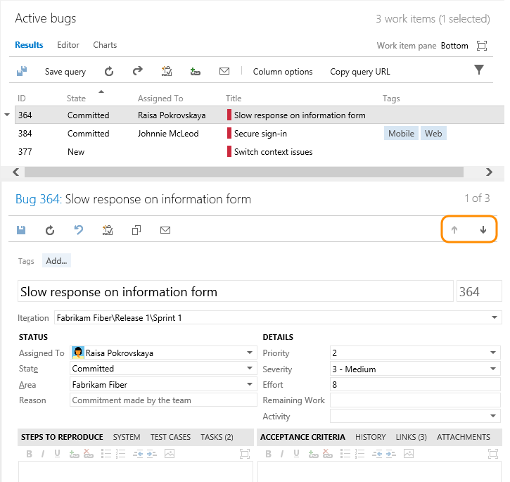
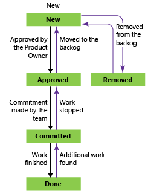
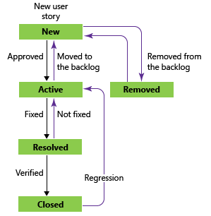

Title: Manage bugs | Visual Studio Online and TFS
Description: Manage technical debt and triage bugs using Agile tools and Scrum methods when working in Visual Studio Online and Team Foundation Server (TFS) 
ms.TocTitle: Manage bugs
ms.ContentId: 6E5710EE-21C8-4264-AD65-A827D186F134


#Manage bugs

How do you track and manage defects in your code? How do you make sure software problems and customer feedback get addressed in a timely manner to support high-quality software deployments? And, how do you do this while making good progress on new features? 

At a minimum, you need a way to capture your software issues, prioritize them, assign them, and track progress. Moreover, you'll want to manage your bugs in ways that align with your Agile practices. 

##Capture bugs  
You can track bugs in much the same way that you track product backlog items (PBIs) or user stories. Using the bug work item form, you capture the code defect in the Title, Steps to Reproduce, and other fields.  

You can create bugs from the [web portal](https://msdn.microsoft.com/library/hh409275.aspx), Visual Studio/Team Explorer, a [work item template](https://msdn.microsoft.com/library/ff407162.aspx), or when [testing with Test Manager](https://msdn.microsoft.com/library/dd286731.aspx).  

No matter the tool you use, the form remains the same, similar to this one shown for the Scrum process.


 
When defining a bug, use these fields to capture both the initial issue and ongoing discoveries made when triaging, investigating, fixing, and closing the bug.  

<table>
<tbody valign="top">
<tr>
<th>
<p>Field/tab</p>
</th>
<th>
<p>Usage</p>
</th>
</tr>
<tr>
<td>
[Steps to Reproduce](https://msdn.microsoft.com/library/dd997786.aspx) (friendly name=Repro Steps)
</td>
<td>
<p>Capture enough information so that other team members can understand the full impact of the problem as well as whether they have fixed the bug. This includes actions taken to find or reproduce the bug and expected behavior. </p>
<p>Describe the criteria that the team should use to verify whether the code defect is fixed. </p>
</td>
</tr>
<tr>
<td>
[Priority](https://msdn.microsoft.com/library/dd983994.aspx) <sup>1</sup>
</td>
<td>
<p>A subjective rating of the bug as it relates to the business or customer requirements. Priority indicates the order in which code defects should be fixed. You can specify the following values:</p>
<ul>
  <li>
      **1**: Product cannot ship without the successful resolution of the work item, and it should be addressed as soon as possible.
  </li>
  <li>
      **2**: Product cannot ship without the successful resolution of the work item, but it does not need to be addressed immediately.
  </li>
  <li>
      **3**: Resolution of the work item is optional based on resources, time, and risk.
  </li>
</ul>
</td>
</tr>

<tr>
<td>
[Severity](https://msdn.microsoft.com/library/dd983994.aspx) <sup>1</sup>
</td>
<td>
A subjective rating of the impact of a bug on the project or software system. For example: If clicking a remote link (a rare event) causes an application or web page to crash (a severe customer experience), you might specify Severity = 2 - High and Priority = 3.  Allowed values and suggested guidelines are:
<ul>
  <li>
      **1 - Critical**: Must fix. A defect that causes termination of one or more system components or the complete system, or causes extensive data corruption. And, there are no acceptable alternative methods to achieve required results.
  </li>
  <li>
      **2 - High**: Consider fix. A defect that causes termination of one or more system components or the complete system, or causes extensive data corruption. However, an acceptable alternative method exists to achieve required results.
  </li>
  <li>
      **3 - Medium**: (Default) A defect that causes the system to produce incorrect, incomplete or inconsistent results.
  </li>
  <li>
      **4 - Low**: A minor or cosmetic defect that has acceptable workarounds to achieve required results. 
  </li>
</ul>
</td>
</tr>
<tr>
<td>
<p>[System Info](https://msdn.microsoft.com/library/dd997786.aspx)</p>
<p>[Found In Build](https://msdn.microsoft.com/library/dd997786.aspx)</p>
<p>[Integrated in  Build](https://msdn.microsoft.com/library/dd997786.aspx)</p>
</td>
<td>
<p>When Test Manager creates bugs, it automatically populates **System Info** and **Found in Build** with information about the software environment and build where the bug occurred. To learn more about defining the software environments, see [Set up test machines to run tests or collect data](https://msdn.microsoft.com/library/dd293551.aspx).</p>
<p>When you resolve the bug, use **Integrated in Build** to indicate the name of the build that incorporates the code that fixes the bug. </p>
<p>**On-premises TFS only:** To access a drop-down menu of all builds that have been run, you can update the ```FIELD``` definitions for Found in Build and Integrated in Build to reference a global list. The global list is automatically updated with each build that is run. To learn more, see [Fields that support integration with test, build, and version control](https://msdn.microsoft.com/library/ms194965.aspx). </p>
<p>For information about how to define build names, see [Use build numbers to give meaningful names to completed builds](https://msdn.microsoft.com/elibrary/hh190719.aspx). </p>
</td>
</tr>
</tbody>
</table>  
 
<sup>1</sup>  To change the menu selection, see [Customize a pick list](https://msdn.microsoft.com/library/dd695793.aspx).  

<a id="track"> </a>
##Track bugs as requirements or tasks 

Many Scrum teams treat bugs the same as any backlog item or user story. Others see bugs as work that belongs to implementing a story, and therefore treat them as a task.  

Bugs, like PBIs and user stories, represent work that needs doing. So, should you track your bugs along with other items in the product backlog items or as tasks linked to those backlog items? How does your team estimate work?  

Based on how your team answers these questions, they can choose how they want to track bugs from one of these three choices:  

<table>
<tbody valign="top">
<tr>
<th>Bug tracking options</th>
<th>Choose this option </th>
</tr>
<tr>
<td>
<p>**Bugs appear as part of the product backlog**</p>
<p>Bugs appear on backlogs and boards with requirements </p> 
</td>
<td>
<p>When your team or product owner wants to manage bugs similar to requirements. Bugs can be added and prioritize along with PBIs or user stories on the [product backlog](create-your-backlog.md). </p>
<p>With this option, the team can estimate the effort or story points for bugs which are then included against team velocity and cumulative flow. </p> 
</td>
</tr>
<tr>
<td>
<p>**Bug backlog is separate from the product backlog** </p>
<p>Bugs appear on backlogs and boards with tasks </p>
</td>
<td>
<p>When your team links bugs to PBIs or user stories, and manages them similar to tasks.</p> 
<p>With this option, the team can estimate remaining work for bugs and track progress against the sprint capacity and sprint burndown.</p>
</td>
</tr>
<tr>
<td>
<p>**Bugs don't appear on backlogs and boards** </p>
</td>
<td>
<p>When your team manages bugs separate from requirements or tasks, or a different team is tasked with addressing bugs. </p> 
</td>
</tr>
</tbody>
</table>  

To change the team setting, see [Show bugs on backlogs and boards ](../customize/show-bugs-on-backlog.md) 

<a id="triage"> </a>
##Triage bugs  
 
Once you've started coding and testing, you'll want to hold periodic triage meetings to review and prioritize your bugs. How frequently you meet and for how long depends on your situation. Typically, the project owner runs the bug triage meetings, and team leads, business analysts and other stakeholders who can speak about specific project risks attend them.  

The project owner can create or open a shared query for new and reopened bugs to generate a list of bugs to be triaged.  

###Bug queries
Open a shared query or [use the query editor](../track/using-queries.md) to create useful bug queries, such as the following:
- Active bugs by priority (```State <> Done``` or ```State <> Closed```)
- In Progress bugs (```State = Committed``` or ```State = Active```)
- Bugs to fix for a target release (```Tags Contains RTM```)
- Recent bugs - bugs opened within the last 3 weeks (```Created Date > @Today-21```) 

Once you have the queries of interest to your team, you can [create status or trend charts](../../Report/charts.md) that you can also pin to a [team dashboard](../../Report/dashboards.md).  

###Triage mode in query results

From the query results page, you can quickly move up and down within the list of bug work items using the up and down arrows. As you review each bug, you can assign it, add details, or set priority. 



###Tips for successful triage meetings:  
Fixing bugs represents a trade-off with regards to other work. Use your triage meeting to determine how important fixing each bug is against other priorities related to meeting the project scope, budget, and schedule.  

- Establish the team's criteria for evaluating which bugs to fix and how to assign priority and severity. Bugs associated with features of significant value (or significant opportunity cost of delay), or other project risks, should be assigned higher priority and severity. Store your triage criteria with other team documents and update as needed.
- Use your triage criteria to determine which bugs to fix and how to set their State, Priority, Severity, and other fields. 
- Adjust your triage criteria based on where you are in your development cycle. Early on, you may decide to fix most of the bugs that you triage. However, later in the cycle, you may raise the triage criteria (or bug bar) to reduce the number of bugs that you need to fix.  
- Once you've triaged and prioritized a bug, assign it to a developer for further investigation and to determine how to implement a fix. 

<a id="fix-resolve-close">  </a>

###Pay down your bug debt

Once bugs have been triaged, it's time to assign them to a sprint to get fixed. By addressing a set of bugs to get fixed every sprint, your team can keep the total number of bugs to a reasonable size.  

When bugs appear on the product backlog, you can [assign bugs to sprints in the same way you do PBIs and user stories](../scrum/sprint-planning.md) during your sprint planning sessions. 

When bugs are treated as tasks, they're often automatically linked to a PBI or user story. So, assigning their parent PBI or user story to a sprint will [assign the linked bugs to the same sprint as the parent PBI or user story](../scrum/task-board.md) during your sprint planning sessions. 
 
Your team should consider fixing all bugs found during a sprint when testing a feature in development.  


<blockquote style="font-size: 13px">**Tips from the trenches:  [Agile Bug Management: Not an Oxymoron](https://visualstudiomagazine.com/articles/2012/10/12/agile-bug-management.aspx) **by Gregg Boer, Principal Program Manager, Visual Studio Cloud Services at Microsoft   
<h4>Every Sprint, Address any Known Bug Debt</h4>
<p>Every sprint, the team looks at any bugs remaining in the bug backlog and allocates capacity to get that known set of bugs down to zero, or near-zero. Whether this is one day, one week or the entire sprint, they fix the bugs first. Bugs found later, within the sprint, are not considered part of that initial commitment. Unless they're very high priority, they're put on the bug backlog for the next sprint.</p>
<p>Many teams work in a commitment-based organization, where management places a high value on a team's ability to meet their commitments. Doing capacity planning against a known set of bugs makes sprint planning more deterministic, increasing their chance to meet commitments. Any new bugs discovered during the sprint are not a part of the initial commitment, and will be tackled next sprint.</p>
 
<h4>Managing Bug Debt across an Enterprise</h4>
<p>An organization transitioning to a culture where debt is continually eliminated likely is dealing with the following question: How do you get teams to reduce their bug count without telling them exactly what to do? Leadership wants the team to change, yet gives the team autonomy to determine how they change. One option is to use a bug cap.</p>
<p>For example, consider a bug cap of three bugs per engineer. This means a team of 10 people should not have more than 30 bugs in its bug backlog. If the team is over its cap, it's expected to stop work on new features and get under the bug cap. A team is expected to be under its cap at all times, but the team decides how it wants to do that. The bug cap ensures that bug debt is never carried for too long, and the team can learn from the mistakes that causes the bugs to be injected in the first place.</p>
<p>Remember that the bug cap represents the bugs in the bug backlog. It does not include bugs found and fixed within the sprint in which a feature is developed. Those bugs are considered undone work, not debt.</p>
</blockquote>  


##Fix, resolve and close bugs

Bug fixes that involve more than a single section of code may require significant regression testing and may involve other team members. Record any conversations that relate to assessing the risk of bug fixes in the bug work item history.

Once you fix a bug, you should update its State. State choices vary depending on the process you use--[Scrum](https://msdn.microsoft.com/library/ff731587.aspx), 
[Agile](https://msdn.microsoft.com/library/dd380647.aspx), or [CMMI](https://msdn.microsoft.com/library/dd997574.aspx). For Scrum bugs, you simply change the State to Done. For Agile and CMMI, you first resolve the bug. Typically, the person who created the bug then verifies the fix and sets the State to Closed. 


| Scrum | Agile | CMMI | 
|------------|------------|-----------| 
|  |  |   |  

If more work has been found after a bug has been resolved or closed, it can be reactivated by setting the State to Committed or Active. 

###Verify a fix 
To verify a fix, a developer or tester should attempt to reproduce the bug and look for additional unexpected behavior. If necessary, they should reactivate the bug.

When verifying a bug resolution, you may find that the bug was not completely fixed or you may disagree with the resolution. In this case, discuss the bug with the person who resolved it, come to an agreement, and possibly reactivate the bug. If you reactivate a bug, include the reasons for reactivating the bug in the bug description.

<a id="close">  </a>
###Close a bug  
You close a bug once it's verified as fixed. However, you may also close a bug for one of these reasons (supported with the Agile and CMMI processes):

- Deferred - deferring a fix until the next product release
- Duplicate - bug has already been reported, provide a link to the bug which remains open 
- As Designed - feature works as designed
- Cannot Reproduce - tests prove that the bug can't be reproduced
- Obsolete - the bug's feature is no longer in the product
- Copied to Backlog - a PBI or user story has been opened to track the bug

It's always a good idea to describe any additional details for closing a bug in the History field to avoid future confusion as to why the bug was closed. 

##Related notes

Consider managing your bug bar and technical debt as part of your team's overall set of continuous improvement activities. You may find these additional resources of interest: 

- [Unit test your code](https://msdn.microsoft.com/library/dd264975.aspx)  
- [IntelliTrace and Tracking software quality](https://msdn.microsoft.com/library/dd286599.aspx)  
- [Good and Bad Technical Debt (and how TDD helps)](http://blog.crisp.se/2013/10/11/henrikkniberg/good-and-bad-technical-debt) by Henrik Kniberg  
- [Managing Technical Debt](http://www.infoq.com/articles/managing-technical-debt) posted by Sven Johann & Eberhard Wolff  


###Bug reports

If you work from Visual Studio Online, you can use Power BI to access [bug reports and dashboards](https://www.visualstudio.com/en-us/get-started/report/report-on-vso-with-power-bi-vs).

If you work from an on-premises TFS and you have SQL Server Analysis Services and SQL Server Reporting Services configured for your team project, you have access to these reports (Agile and CMMI processes only):

- [Bug Status](https://msdn.microsoft.com/library/dd380736.aspx)  
- [Bug Trends](https://msdn.microsoft.com/library/dd380674.aspx)  
- [Reactivations](https://msdn.microsoft.com/library/dd380731.aspx)  


###Manage your technical debt 

While bugs contribute to technical debt, they may not represent all debt. 

Poor software design, poorly written code, or short-term fixes in place of best, well-designed solutions can all contribute to technical debt. Technical debt reflects extra development work that arises from all these problems. 

You need to track work to address technical debt as PBIs, user stories, or bugs. To track a team's progress in incurring and addressing technical debt, you'll want to consider how to categorize the work item and the details you want to track. You can [add tags to any work item to group it into a category of your choosing](https://msdn.microsoft.com/library/dn132606.aspx). 

####Use SonarQube to help manage technical debt

SonarQube provides a way of automatically measuring some technical debt. SonarQube finds important violations of best coding practices. You implement Sonar to ensure that developers follow important code metrics like appropriate class and method size or low cyclomatic complexity (a quantitative measure of the number of linearly independent paths through a program's source code).  

By integrating your on-premises TFS with a SonarQube server, you can get the following data:  
- Results of .Net and JavaScript code analysis  
- Code clone analysis  
- Code coverage data from tests  
- Metrics for .Net and JavaScript  

See [Technical Debt Management: Announcing SonarQube integration with MSBuild and Team Build](http://blogs.msdn.com/b/visualstudioalm/archive/2015/05/05/technical-debt-management-announcing-sonarqube-integration-with-msbuild-and-team-build.aspx) for details.
 


