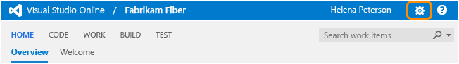

Title: Organize your backlog | Visual Studio Online  
Description:  Organize your backlog by mapping backlog items to features, and features to epics in Visual Studio Online or the web portal for Team Foundation Server (TFS)
ms.TocTitle:  Organize your backlog
ms.ContentId: C294ACBD-00A3-4FCF-8777-B354BC0CC1EF

# Organize your backlog  

While many teams can work with a flat list of items, sometimes it helps to group related items into a hierarchical structure. 
Perhaps you like to start with a big picture and break it down into smaller deliverables. 
Or, you've got an existing backlog and now need to organize it.   

No matter your starting point, you can use portfolio backlogs to bring more order to your backlog. 
Use your backlogs to plan your project and to:  
*	Manage a portfolio of features that are supported by different development and management teams  
*	Group items into a release train  
*	Minimize size variability of deliverables by breaking down a large feature into smaller backlog items     

With portfolio backlogs you can quickly add and group items into a hierarchy, drill up or down within the hierarchy, reorder and reparent items, and filter hierarchical views.    

Use the expand  and collapse  icons to expand or collapse one level of the hierarchy. 
To drill up or down within the hierarchy, set Parents to Show.  

<a id="view-portfolio-backlog" />
## View a backlog or portfolio backlog 
To focus on one level of a backlog at a time, click the name of the backlog you want to view.  

For example, when you click Epics, you'll see a list of all Epics in your team's active area paths. 
From there, you can drill down to see child features and backlog items. 

Click Features to see a list of all features in your team's active area paths.  

If you don't see all three backlog levels-Epics, Features, and Backlog items, [add the ones your team will use](#activate-backlogs).    

## Add features and epics 
Just as you can [add items to your product backlog](create-your-backlog.md), you can add items to your features and epics backlogs. 
Here, we've added six features. 

  

You can add epics in the same way. Simply open the Epics backlog.  

Open each item (double-click, or press Enter to open the selected item) and add all the info you want to track. Enter as much detail as the team needs to understand the scope, estimate the work required, develop tests, and ensure that the end product meets acceptance criteria.

 
<table>
<tbody valign="top">
<tr>
<th>Field</th>
<th>Usage</th>
</tr>
<tr>
<td>
[Effort](https://msdn.microsoft.com/library/dd997792.aspx)
</td>
<td>
Provide a relative estimate of the amount of work required to complete a Feature or Epic. Use any unit of measurement your team prefers. Some options are [t-shirt size, story points, or other relative unit](create-your-backlog.md#estimates). For user stories and requirements, you capture estimates in the Story Points and Size fields. These fields support usage of the [velocity and forecast](../scrum/velocity-and-forecasting.md) tools. 
</td>
</tr>

<tr>
<td>

[Business Value](https://msdn.microsoft.com/library/dd983994.aspx)
</td>
<td>
Specify a priority that captures the relative value of an Epic, Feature, or backlog item compared to other items of the same type. The higher the number, the greater the business value. Use this field when you want to capture a priority separate from the changeable backlog stack ranking.

</td>
</tr>

<tr>
<td>
[Time Criticality](https://msdn.microsoft.com/library/dd983994.aspx) 
</td>
<td>
A subjective unit of measure that captures the how the business value decreases over time. Higher values indicate that the Epic or Feature is inherently more time critical than those items with lower values. 
</td>
</tr>

<tr>
<td>
[Value Area](https://msdn.microsoft.com/library/dd983994.aspx)
</td>
<td>The area of customer value addressed by the epic, feature, or backlog item. Values include:  
<ul>
<li><b>Architectural</b> – technical services to implement business features that deliver solution </li> 
<li><b>Business</b> (Default) – services that fulfill customers or stakeholder needs that directly deliver customer value to support the business </li>
</ul>
</td>
</tr>
</tbody>
</table>

## Add child items
With your features defined, you're ready to add child items to them. From any backlog, you can add child items. 
You can add features to epics, and backlog items to features. 
 
Here we add a product backlog item as a child to the Customer Web - Phase 1 feature. 

Whenever you see the plus  , you can add a child item. 
The work item always corresponds to the hierarchy of work item types that are defined for your team project.   

For Scrum team projects, your hierarchy is as shown: 

 

Because [teams can also set bugs as tasks](../customize/show-bugs-on-backlog.md), bugs can be added as children of PBIs. 

The work item types you'll see depends on the [process you selected to create your team project](../guidance/choose-process.md). 

If you want bugs to show up on your backlog and you're not seeing them, [enable them for your team](../customize/show-bugs-on-backlog.md). 

## Map items to group them under a feature or epic 
If you've already created your backlog, and now you want to organize it, you can do that most easily by mapping them.   

To map a backlog item under a feature, you first choose Backlog items and turn mapping on. Next, find the Unparented backlog items group. 
Drag items that are currently unparented to the feature under which they belong. Also, you can drag a backlog item to a different feature to change its parent. 

It's the same process to map features to epics. From the Features backlog, drag features to an epic listed under the mapping pane.  

## Re-parent and reorder items
When you need to change the order or grouping, simply drag the item to its new location. 
You can re-parent an item using the mapping pane, or simply drag it within the hierarchy to change its parent.  

 
 
You can only re-parent backlog items under other features, and features under other epics. 

Also, to change an item's priority within a group, you can drag the item up or down within it's hierarchical group. 
This works the same as when you [moved items into priority order on your product backlog](create-your-backlog.md).   

## Filter your backlog
If you have many items on your backlog and want to focus on a subset of them, you can filter the list using either the filter or tag tools. 

Here, we filter the backlog to only show items that have 'Web' in their title. 

The filtered set is always a flat list, even if you've selected to show parents. 

If you've added tags to your backlog items, you can filter your backlog list using the  tag filter. [You can use tags to filter backlogs and queries](http://msdn.microsoft.com/library/dn132606.aspx). 

## Work with multi-team ownership of backlog items 
Until now, we've worked as if there's one team per team project. 
However, when you have several teams your hierarchical views may show items that belong to other teams.  

Your team's product backlog lists only those items whose area path match those your team has subscribed to. However, if you show parents, 
you'll see the parent epic of the features and backlog items, even if the epic or feature is owned by another team. 
Items that are owned by other teams appear with hollow-filled bars.  
  
 

Here's another example that shows the Epics backlog for the Fabrikam Fiber team. 
Drilling down, you can see all the backlog items and features, even though they 
belong to one of three different teams - Customer Service, Phone, and Web.  
 
 

From these views, you can reparent items, both those that you own and those owned by other teams. 
However, you can't reorder items that another team owns.  

This enables management teams to focus on high level features and epics, and development teams 
to focus on just those backlog items they're responsible to deliver. 

To make this work for you, you'll need to [add teams and set their area paths](../scale/multiple-teams.md). 
For example, you can create a team structure similar to this one with two management and three development teams.

 You'll find a worked example here: [Agile Portfolio Management: Using TFS to support backlogs across multiple teams](http://msdn.microsoft.com/library/dn306083.aspx).

## Activate backlog levels for your team
1.	From the web portal, click the gear icon  to open the administration page.  

	
 
2.	From the Overview tab, choose the team whose settings you want to configure.  

3.	Open Settings and check each backlog that you want to have active for your team.   

	 

	Because this setting affects all team members' view of the team backlogs and boards, 
	you must be a team admin to change the setting. Changing the setting is disabled 
	if you're not a team admin. [Go here to get added as a team administrator](../scale/manage-team-assets.md#add-team-admin). 

4.	To see the changes, open or refresh your team's backlog web page.  

## Related backlog notes
Portfolio backlogs are not only a great way to organize your project plan, but also a great way to provide visibility of project plans across enterprise teams. 
With portfolio backlogs, management teams can gain insight into project status across all their development teams. 

A few things to keep in mind...
*   Every team owns their own backlog, to create a new backlog you [create a new team](../scale/multiple-teams.md) 
*   Every backlog has a corresponding [Kanban board](../kanban/kanban-basics.md) you can use to track progress and update status  
*   Each team can control how [bugs show up on their backlogs ](../customize/show-bugs-on-backlog.md)   
*   To have work performed by several teams roll up in to a portfolio backlog, you'll want to [setup the team hierarchy](http://msdn.microsoft.com/library/hh500414.aspx)  
*   When you add child items they're linked to their parent using parent-child links which support hierarchical views and [tree queries](../track/using-queries.md#tree-query)    
*   If you need more than three backlog levels, you can [add up to two more](../customize/add-portfolio-backlogs.md).   

### Backlog controls

| Control           | Function     |
|------------------|-------------|
| Backlog          | Switch to backlog view   |
| Board          | [Switch to Kanban board view](../kanban/kanban-basics.md)  |
| Forecast: On/Off     | [Turn forecast tool on/off](http://msdn.microsoft.com/Library/Work/scrum/velocity-and-forecasting.md) (appears only when Parents is set to Hide, and only available for the product backlog) |
| Mapping: On/Off     | [Turn mapping Off/On](#mapping)    |
| Parents: Show/Hide         | Turn tree hierarchy on/off     |
| In progress items: Show/Hide    |Show or hide list of backlog items whose State is active or in progress       |
|   | Configure team settings: [Backlogs](https://msdn.microsoft.com/en-us/Library/vs/alm/Work/backlogs/organize-backlog#activate-backlogs), [Working days](https://msdn.microsoft.com/en-us/Library/vs/alm/Work/scale/capacity-planning#team_settings), [Working with bugs](https://msdn.microsoft.com/Library/vs/alm/work/customize/show-bugs-on-backlog)   |
| /   | Enter or exit full screen mode   |
|  /     | Expand or collapse one level of the tree hierarchy   |
|   | Email a copy of your backlog |
|     | [Turn tag filtering On/Off ](https://msdn.microsoft.com/en-us/library/dn132606.aspx)  |

Note that even if you have show parents turned on, the Create query and mail  controls will only list items at the currently selected level. 

