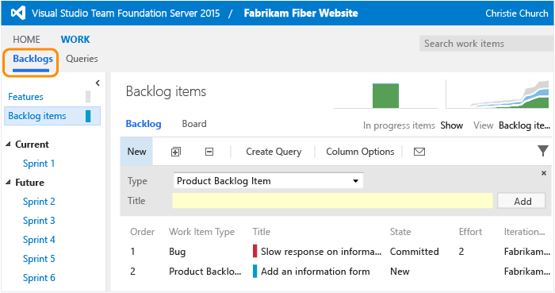

Title: Change access levels | Visual Studio Online
Description: Set standard or full access level to features provided through Visual Studio Online and the web portal for TFS (Team Foundation Server)
ms.TocTitle: Change access levels
ms.ContentId: 84B0D454-09A7-414B-A9E0-FE9A9ACD7E99

# Change access levels
Access levels allow groups of users to access features based on their license level when working in an on-premises deployment of Team Foundation Server (TFS). Certain web portal features─such as authoring charts, test case management and team rooms─require Advanced access.  

You only set access levels for on-premises TFS. For Visual Studio Online, [account licenses control access to premium features](https://www.visualstudio.com/get-started/assign-licenses-to-users-vs).  

As an administrator, you assign users or groups of users to one of the three levels of access—Basic, Advanced, and Stakeholder—based on the license that each user has. Also, it’s important to note that service accounts are added to the default access level. If you set Stakeholder as the default access level, you must add the TFS service accounts to the Basic or Advanced group.  


| Access      | License required                                                                                                                                                               |
|-------------|--------------------------------------------------------------------------------------------------------------------------------------------------------------------------------|
| **Basic**       | TFS client-access license (CAL) or Visual Studio Professional with MSDN subscription                                                                                           |
| **Advanced**    | One of these MSDN subscriptions: Visual Studio Enterprise with MSDN, MSDN Platforms, or Visual Studio Test Professional with MSDN.              |
| **Stakeholder** | No license required. Assign Stakeholder access to customers or stakeholders that you want to collaborate with but who aren’t on your team. |

Find out more about licensing from the [Visual Studio and MSDN Licensing White Paper](https://www.microsoft.com/download/details.aspx?id=13350).

<a id="add-user" >  </a>
## Add a user or group to an access level

If you’re managing access for a large group of users, a best practice is to first create either a [Windows group or TFS group](https://msdn.microsoft.com/library/hh561430.aspx) and add individual accounts to those groups.

1.	From the web portal home page (for example, ```http://MyServer:8080/tfs```), open the administration context.  

	
2.	Select the level and then add the user or group.  
	  
	If you don’t see the Access levels tab, you aren't a TFS administrator and don’t have permission. [Here’s how to get permissions](http://msdn.microsoft.com/library/bb552341.aspx).


<a id="feature-chart"  >  </a>
## Quick reference to access levels and features
Users that you added to an access level can use the features listed below. In addition to access levels, 
you also must [give them permissions to connect to TFS](#grant-permissions). 

Feature access levels depend on your product version and are subject to change. For a full comparison of products and features, 
go [here](https://www.visualstudio.com/products/compare-visual-studio-products-vs.aspx). 


| Feature                      | Stakeholder                                   | Basic                                     | Advanced                                  |
|------------------------------|-----------------------------------------------|-------------------------------------------|-------------------------------------------|
| View and edit all work items |  (1) |  |  |
| Standard Features (2)        |      |  |  |
| Agile boards (3)             |      |  |  |
| Basic backlog and sprint planning tools | (4) | 	|  |
| Chart Viewing | 	| 	|  |
| Chart Authoring | |  |  |
| Code |  | 	|  |
| Build |  |  |  |
| Request and manage feedback |  | |  | 
| Web-based Test execution  |  |   |  | 
| Web-based Test case management  |  | |  |
| Team rooms |  |  |  |
| Administer account  | | 	|  |
| Advanced home page  | | 	|  |
| Advanced backlog and sprint planning tools  | | 	|  |
| Advanced portfolio management |  |   |  |
| Analyze test results and manage machine groups |  |   |  |


### Notes:
1.	With Stakeholder access, users can create and modify all work items, and can create and save queries on all work items under their My Queries folder. (This is a change from Limited access in which users could create and modify only those work items that they created and query and view work items they created.)
Also, stakeholders can create and modify work items using Team Foundation clients such as Microsoft Excel, Microsoft Project, and Microsoft Feedback Client.
2.	Standard features include access to the Home and Work hubs.
3.	Can view backlog pages and Kanban boards. Can add work items through the quick add panel, which are appear at the bottom of the list. Can’t move items on the page or use other features.
4.	Can view sprint pages and task boards. Can add work items, but can’t use other sprint planning tool features.

<a id="basic"  >  </a>
## Basic access

With Basic access, you can manage work in a [product backlog](http://msdn.microsoft.com/library/jj1593.aspx) . . .   

  
. . .   [plan sprints](../scrum/sprint-planning.md) with each team accessing their sprint backlogs and task boards . . .  

  

. . .   and view work in progress on the [Kanban board](http://msdn.microsoft.com/library/jj1593.aspx).  

  

You also have access to team rooms.  

  

You can author charts to help your team visualize progress.  

  

<a id="advanced"  >  </a>
## Advanced access

Advanced access includes access to everything included with Basic access, plus additional features. For example, with Advanced access, you can organize work and manage  portfolio backlogs.  

  

And you can use web-based test case management tools.  

  

You can also request and manage feedback from customers.  
  

<a id="stakeholder"  >  </a>
## Stakeholder access
Users who have Stakeholder access can access [team home pages, backlogs, and portfolio backlogs](http://msdn.microsoft.com/library/jj1593.aspx). They can view, create, and modify work items such as stories, features, bugs, and feedback responses. They can also view, create, and save queries and receive alerts when changes are made to work items.  

Here’s what Stakeholder access looks like.  



<a id="stakeholder" >  </a>  

### To add a group of users to Stakeholder access
1.	Create either a [Windows group or TFS group](http://msdn.microsoft.com/library/hh561430.aspx).
2.	Add the user accounts to the group you just created.
3.	Add the group to Stakeholder access.
	

<a id="grant-permissions"  >  </a>  

## Permissions versus access levels  
Of course, none of these levels of access expose information that you don’t have permission to view. Make sure your users have both the permissions and the access levels they need. If they’re members of the team, then they probably have the right permissions to use Basic and Advanced access.
*	Do you want to add another team member? Add team members
*	Do you need to grant permissions to people who aren’t on the team? Give reviewers permissions to provide feedback
*	Do you need to restrict access to certain features based on permissions? Restrict access in TFS

## Related access notes

*	[Licensing and MSDN subscriptions white paper](http://www.microsoft.com/download/details.aspx?id=13350)
*	[Customize Agile tools](../customize/customize-work.md)  


### What features are accessible to users who belong to two different groups 
If a user belongs to a group that has Basic access and another group that has Advanced access, the user has access to all features available to Advanced access.

### Service account assignments to an access level group
[TFS service accounts](http://msdn.microsoft.com/library/ms253149.aspx) are added to the default access level. If you make Stakeholder the default access level, you must add the TFS service accounts to the Basic or Advanced group.  

Service accounts don’t require a separate license.

###Where can I learn about the new features added with a service or on-premises upgrade?
Learn all about what's new in TFS, Vsual Studio, and ALM [here](https://msdn.microsoft.com/library/bb385832%28v=vs.140%29.aspx).
