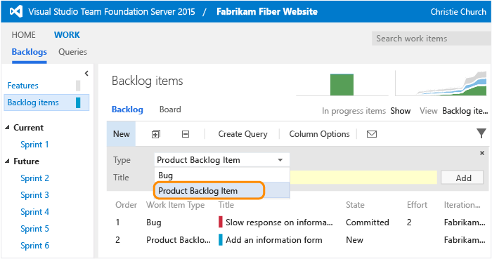
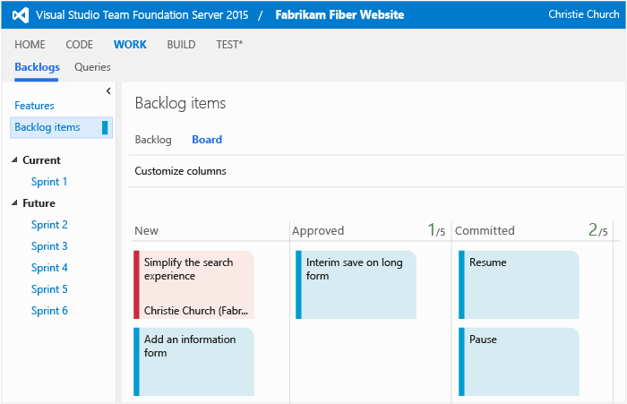
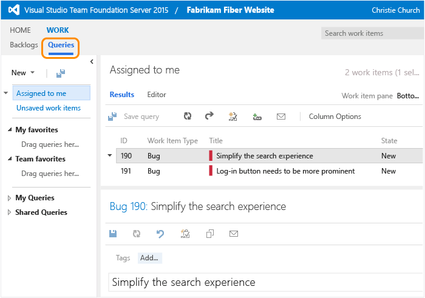
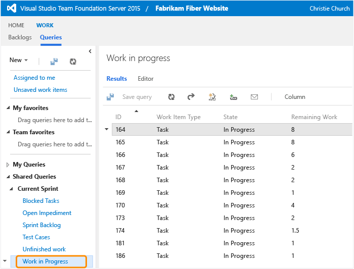
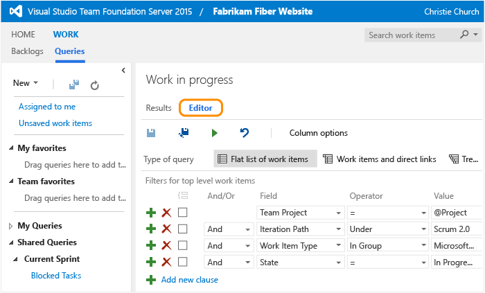
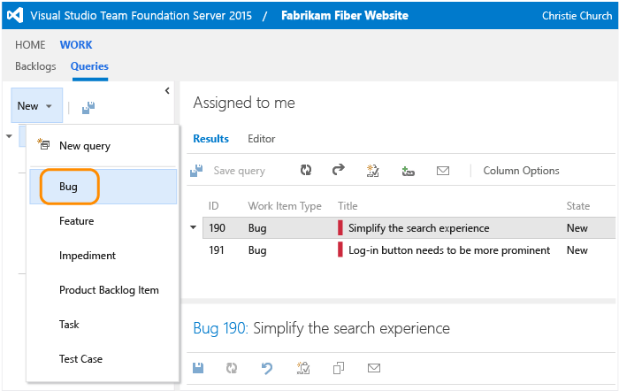
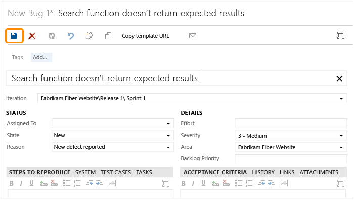
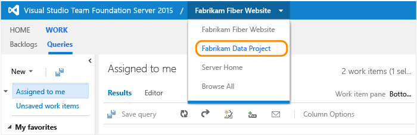

Title: Work as a stakeholder | Visual Studio Online and TFS  
Description: Features available to users granted a Stakeholder license or access level through Visual Studio Online or TFS (Team Foundation Server)  
ms.TocTitle: Work as a stakeholder  
ms.ContentId: D76507F1-3154-4EE5-A23A-9179C2F5A365  

#Work as a stakeholder
 
With Stakeholder access, anyone on your team can check project status and provide feedback. Stakeholders can track project priorities and provide direction, feature ideas, and business alignment to a team.  

As a stakeholder, you can:  
- View team dashboards and portfolio backlogs  
- [View, add, and modify items on the backlog](#check-backlog)  
- [View, create, and modify work items such as stories, features, and bugs](#create-work-item)
- [View, create, and save queries](#query)
- [Create and receive alerts when changes are made to work items](../track/alerts-and-notifications.md)  
- [Submit, view, and change your feedback responses](https://msdn.microsoft.com/library/hh362461.aspx).  

For information on adding stakeholder accounts:  

   **Visual Studio Online: **  [Add users and assign licenses in Visual Studio Online](https://www.visualstudio.com/get-started/setup/assign-licenses-to-users-vs)  
   **On-premises TFS: **  [Change access levels](change-access-levels.md#stakeholder)  

Only account owners or members of the Team Foundation Server Administration group can add accounts to get Stakeholder access. 


<blockquote style="font-size: 13px">**Note:  **If you connect to Visual Studio Online and your subscription expires, your license changes to the Stakeholder license. This means you have access to fewer features. Renew your subscription, then contact your account owner to restore your license.</blockquote>  
  

##First time signing in
1. If you're connecting to Visual Studio Online, click the link provided in the email invitation you should have received. 

	Or, open a browser window and enter the URL for the web portal.

	**Visual Studio Online: **```http://AccountName.visualstudio.com:8080/DefaultCollection/ProjectName```
 
	**On-premises TFS: **```http://ServerName:8080/tfs/```

	For example, to connect to the server named FabrikamPrime, type ```http://FabrikamPrime:8080/tfs/```.

2.	Enter your credentials. If you aren't able to sign in, you need to be added as a member to a team and added to Stakeholder access.

	

3.	To connect to a team project, choose Browse.

	

4.	If you don't see a project listed, contact the project administrator for your team and ask them to add you to the project.  

	From the Home page, you can open the backlog that tracks work. Or, you can create a work item to track new work. 

	

	You might see different work item types in your view based on the process selected for your team project: [Scrum](https://msdn.microsoft.com/library/ff731587.aspx), [Agile](https://msdn.microsoft.com/library/dd380647.aspx), or [CMMI](https://msdn.microsoft.com/library/dd997574.aspx).  


<a id="check-backlog">  </a> 

##Check the backlog or add new work  

Work appears in the backlog in priority order.

1. To view or edit a work item, select it and choose Enter.

	  

2. To add a new item, select the type and then name it. Your items are added to the bottom of the list.  

	  

##Check work in progress  

To view the team's work status, open the board. Choose an item to open or edit it.   



<a id="query">  </a> 
##Find work assigned to you, or query for other work items  

Open the Queries page to see the list of work items assigned to you.  

  

Or, open any of the queries defined in the Shared Queries folder.  

  

And, you can [create new queries or edit existing queries](../track/using-queries.md) and save them under My Queries folder.  

  

<a id="create-work-item">  </a> 
##Create a bug  

You can create any type of work item listed on the New menu. Types listed can differ among different projects.  

1. Open a bug.

	

2.	Fill out the form and save it. A field with a yellow background indicates you need to enter valid data.

	

	[Manage bugs](../backlogs/manage-bugs.md) provides more info on capturing bug information.

<blockquote style="font-size: 13px">**Note:  **A caution icon on a tab indicates values that violate validation rules. You must correct information on that tab in order to save the work item. To learn more about each of the default work item types, see one of these topics: [Scrum](https://msdn.microsoft.com/library/ff731587.aspx), [Agile](https://msdn.microsoft.com/library/dd380647.aspx), or [CMMI](https://msdn.microsoft.com/library/dd997574.aspx).</blockquote>  

##Related notes 

###Stakeholder access
Stakeholder access is designed to support team members who don't contribute to code, build, and test activities. It's for project managers or other personnel who don't use Visual Studio but want to contribute to work item tracking and monitor progress. 

Stakeholder access provides free access to Visual Studio Online and to on-premises TFS team projects for members in an organization who don't have a client access license (CAL). This view restricts functionality so that your organization complies with the end-user license agreement for Team Foundation Server. For more information, see [Visual Studio and MSDN Licensing white paper](http://go.microsoft.com/fwlink/?LinkId=255102).  


###Features you don’t have access to
If you need access to these features, you need to be added to either the Basic or Advanced access level group:  
- Change the priority of an item within a backlog  
- Create new tags to group work items  
- Create shared queries, view charts, and modify the home page  
- Access the full set of features of the Code, Build, and Test hubs  
- Participate in team rooms, which capture interactive, detailed conversations about the project  
- View administrative pages that support managing membership, permissions, area and iteration paths, and licensing.  

These features support the daily work of product owners, team leads, developers, testers, and project administrators.  

For Visual Studio Online, go [here for a comparison chart of features to all licenses](https://www.visualstudio.com/products/visual-studio-online-user-plans-vs).  

For on-premises TFS, go [here for a comparison chart of access levels](change-access-levels.md).  


###Switch context to a different project or team
To view or create work items for another team project or team, switch to that project. Choose Browse All if the name you want doesn't appear in the list.




###Work in Team Explorer
You can use [Team Explorer and other Team Foundation clients](https://msdn.microsoft.com/library/ms181304.aspx) to add, modify, and query for work items. Some features, such as the product backlog and Kanban board, you can only view through the web portal.   

In Team Explorer, if you choose a feature that's not available for stakeholders, you'll just get an error that you don't have access. [Download Visual Studio Community](https://www.visualstudio.com/downloads/download-visual-studio-vs) to get Team Explorer for free.


###Access to Visual Studio Online third-party tools  
You can access third-party tools that are connected to Visual Studio Online through APIs or service hooks. You'll only be able to access those tools that support work item tracking.  


