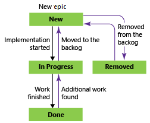
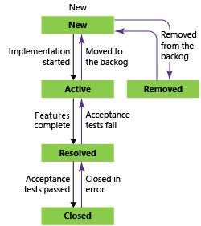
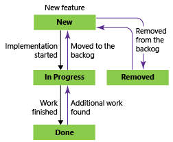
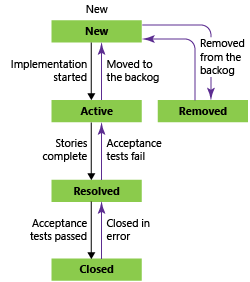
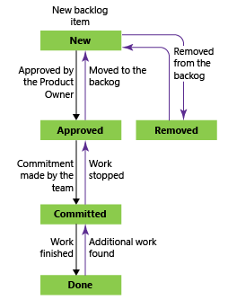
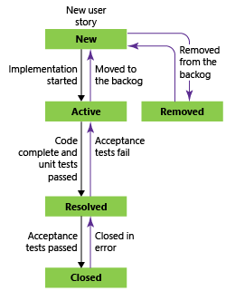
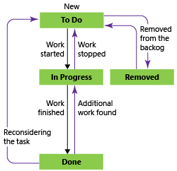
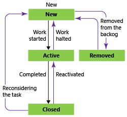

Title: Choose a process template | Visual Studio Online
Description: Choose a process or process template, work with team project artifacts in Visual Studio Online or Team Foundation Server (TFS)
ms.TocTitle: Choose a process template
ms.ContentId: 702EE9E5-7AEA-49B6-9DB0-B12A882979C8

# Choose a process 

Anytime you create a team project, you must choose a process ([formerly referred to as a process template](#term-note)). 
A process defines the building blocks of the work item tracking system 
as well as other sub-systems you access through Visual Studio Online or the web portal for an on-premises Team Foundation Server (TFS). 

## Agile, CMMI, and Scrum
The three default processes differ mainly in the work item types (WITs) they provide for planning and tracking work. 
Scrum is the most light-weight and CMMI, which stands for Capability Maturity Model Integration, 
provides the most support for formal processes and change management. 

Choose the process that provides the best fit for your your team.  

<table valign="top">
<tbody>
    <tr valign="top">
        <td width="40%">
            
<b>Scrum</b>

            

                Choose [Scrum](http://msdn.microsoft.com/library/ff731587.aspx) when your team practices Scrum. This process works great if you want to track product backlog items (PBIs) and
                bugs on the Kanban board, or break PBIs and bugs down into tasks on the task board.
            

            
This process supports the Scrum methodology as defined by the [Scrum organization](https://www.scrum.org/).

            
Tasks support tracking remaining work only.

        </td>

            <td width="60%">
            
            </td>
            </tr>
            <tr valign="top">
            <td>
            
<b>Agile</b>

            
Choose [Agile](http://msdn.microsoft.com/library/dd380647.aspx) when your team uses Agile planning methods, including Scrum,
            and tracks development and test activities separately. This process works great if you want to track user stories and
            (optionally) bugs on the Kanban board, or track bugs and tasks on the task board.

                
You can learn more about Agile methodologies at the
                <a href="http://www.agilealliance.org/">Agile Alliance</a>.
                

             
Tasks support tracking Original Estimate, Remaining Work, and Completed Work.

            </td>
        <td>
            
        </td>
        </tr>

    <tr valign="top"> 
        <td>
            
<b>CMMI</b>

            
Choose [CMMI](http://msdn.microsoft.com/library/dd997574.aspx) when your team follows more formal project methods
            that require a framework for process improvement and an auditable record of decisions. With this process,
            you can track requirements, change requests, risks, and reviews.
            

            

            This process supports [formal change management activities](https://msdn.microsoft.com/library/ee461556.aspx).
            Tasks support tracking Original Estimate, Remaining Work, and Completed Work.
            

            </td>
            <td>
            
            </td>
      </tr>
</tbody>
</table>

## Main distinctions among the default processes
The default processes are designed to meet the needs of most teams. 
If your team has unusual needs and connects to an on-premises TFS, 
you can customize a process and then create the team project. 
Or, you can create a team project from a process and then customize the project.  

The following table summarizes the main distinctions between the WITs and states 
used by the three default processes.  

<table valign="top">
<tbody>
    <tr>
        <td width="40%">
            <b>Tracking area</b>
        </td>
        <td width="20%">
            <b>Scrum</b>
        </td>
        <td width="20%">
            <b>Agile</b>
        </td>
        <td width="20%">
            <b>CMMI</b>
        </td>
    </tr>
    <tr>
        <td>
            Workflow states
        </td>
        <td>
    <ul>
        <li>New</li>
        <li>Approved</li>
        <li>Committed</li>
        <li>Done</li>
        <li>Removed</li>
    </ul>

    </td>
    <td>
    <ul>
    <li>New</li>
    <li>Active</li>
    <li>Resolved</li>
    <li>Closed</li>
    <li>Removed</li>
    </ul>

    </td>
    <td>
    <ul>
    <li>Proposed</li>
    <li>Active</li>
    <li>Resolved</li>
    <li>Closed</li>
    </ul>

    </td>
    </tr>
    <tr>
    <td>
    Product planning (see note 1)
    </td>
    <td>
    <ul>
    <li>Product backlog item</li>
    <li>Bug (configurable)</li>
    </ul>
    </td>
    <td>
    <ul>
    <li>User story</li>
    <li>Bug (configurable)</li>
    </ul>

    </td>
    <td>
    <ul>
    <li>Requirement</li>
    <li>Bug (configurable)</li>
    </ul>

    </td>
    </tr>
    <tr>
    <td>
    Portfolio backlogs (2)
    </td>
    <td>
    <ul>
    <li>Epic</li>
    <li>Feature</li>
    </ul>
    </td>
    <td>
     <ul>
    <li>Epic</li>
    <li>Feature</li>
    </ul>
    </td>
    <td>
    <ul>
    <li>Epic</li>
    <li>Feature</li>
    </ul>
    </td>
    </tr>
    <tr>
    <td>
    Task and sprint planning (3)

    </td>
    <td>
   <ul>
    <li>Task</li>
    </ul>
    </td>
               <td>
                   <ul>
                       <li>Task</li>
                   </ul>
               </td>
    <td>
      <ul>
    <li>Task</li>
    </ul>
    </td>
    </tr>
    <tr>
    <td>
    Bug backlog management (1)
    </td>
    <td>
      <ul>
    <li>Bug</li>
    </ul>
    </td>
    <td>
        <ul>
    <li>Bug</li>
    </ul>
    </td>
    <td>
        <ul>
    <li>Bug</li>
    </ul>
    </td>
    </tr>
    <tr>
    <td>
    Issue and risk management 
    </td>
        <td>
            <ul>
                <li>Impediment</li>
            </ul>
        </td>
    <td>
    <ul>
    <li>Issue</li>
    </ul>
    </td>
    <td>
    <ul>
    <li>Issue</li>
    <li>Risk</li>
            <li>Review</li>
    </ul>
    </td>
    </tr>
</tbody>
</table>

**Notes:**

1.  You can add these WITs from the [product backlog](../backlogs/create-your-backlog.md) or [Kanban board](../kanban/kanban-basics.md). 
    The product backlog shows a single view of the current backlog of work that can be dynamically re-ordered and grouped. 
    Product owners can quickly prioritize work and outline dependencies and relationships.

    Also, each team can configure how they want [bugs to show up on their backlogs and boards](http://msdn.microsoft.com/library/dn947440%28v=vs.140%29.aspx).

2.  With portfolio backlogs you can define a hierarchy of backlogs to understand the scope of work across several teams and see how that work rolls up into broader initiatives.
    Each team can configure which [portfolio backlogs appear for their use](../backlogs/organize-backlog.md).

3.  You can define tasks from the [sprint backlog and task board](../scrum/sprint-planning.md). 
    With capacity planning, teams can quickly determine if they are over or under capacity for a sprint.  
 

### Workflow states, transitions, and reasons

Workflow states support tracking the status of work as it moves from a new state to a closed or a done state. 

Each workflow consists of a set of states, the valid transitions between the states, and the reasons for transitioning the work item to the selected state. 

The following diagrams show the typical forward progression of 
those WITs used to track work and code defects for the three default processes. 
They also show some of the regressions to former states and transitions to removed states. 
Each image shows only the default reason associated with the transition. 

<table valign="top">
<tbody>
    <tr >
        <td width="33%">
           <b>Scrum</b>
        </td>
        <td width="33%">
            <b>Agile</b>
        </td>
        <td width="33%">
            <b>CMMI</b>
        </td>
    </tr>
    <tr valign="top">
        <td>
<h4>Epic</h4>
            
        </td>
        <td>
<h4>Epic</h4>
            

        </td>
        <td>
<h4>Epic</h4>
            

        </td>
    </tr>
    <tr valign="top">
        <td>
<h4>Feature</h4>
            
        </td>
        <td>
<h4>Feature</h4>
            

        </td>
        <td>
<h4>Feature</h4>
            

        </td>
    </tr>
    <tr valign="top">
        <td>
<h4>Product backlog item</h4>
            
        </td>
        <td>
<h4>User story</h4>
            

        </td>
        <td>
<h4>Requirement</h4>
            

        </td>
    </tr>
    <tr valign="top">
        <td>
<h4>Bug</h4>
            
        </td>
        <td>
<h4>Bug</h4>
            

        </td>
        <td>
<h4>Bug</h4>
            

        </td>
    </tr>
    <tr valign="top">
        <td>
<h4>Task</h4>
            
        </td>
        <td>
<h4>Task</h4>
            
        </td>
        <td>
<h4>Task</h4>
            
        </td>
     </tr>
</tbody>
</table>

Most WITs used by Agile tools, ones that appear on backlogs and boards, support any-to-any transitions. You can update the status of a work item using the Kanban board or the task board by dragging it to its corresponding state column.

You can [change the workflow to support additional states, transitions, and reasons](http://msdn.microsoft.com/library/ms194981.aspx). 

### Removed, Closed, and Done states  
When you change the state of a work item to Removed, Closed, or Done, the system responds like this: 

*   **Closed** or **Done**: Work items in this state don't appear on the portfolio backlog and backlog pages. However, they do appear on the sprint backlog pages, Kanban board, and task board. Also, when you change the portfolio backlog view to show backlog items, for example, to view Features to Product Backlog Items, items in the closed and done state will appear.   
*   **Removed**: Work items in this state don't appear on any backlog or board.   

Work items are maintained in a team project as long as the team project is active. 
Even if you set them to Closed, Done, or Removed, a record is kept in the data store. 
You can use a record to create queries or reports.  

If you need to permanently delete work items, you can use the [witadmin destroywi command-line tool](http://msdn.microsoft.com/library/dd236908.aspx). 

## Work item types added to all processes 
The following WITs are the same across all processes.

  

Teams create and work with these types using the corresponding tool: 

*   Test Plan, Test Suite, Test Case Shared Steps, and Shared Parameters: Microsoft Test Manger.
*   Feedback Request and Feedback Response: Request feedback.  
*   Code Review Request and Code Review Response: My Work (from Team Explorer) and Code Review Request.  

Work items from these type definitions are not meant to be created manually and therefore are added to the Hidden Types category. 
Work item types that are added to the Hidden Types category don't appear in the menus used to create new work items.   

**Note:** If you upgraded your team project from TFS 2013 or an earlier version to the current version 
of TFS, you might have to add WITs that didn't exist in the earlier versions. 
For more information, see [Configure features after a TFS upgrade](../customize/configure-features-after-upgrade.md).
 

### WITs that support the test experience  
WITs that support the test experience and work with Test Manager and the TFS web portal are linked together using the link types shown in the following picture. 

  

From the web portal or Test Manager, you can view which test cases are defined for a test suite, 
and which test suites are defined for a test plan. 
However, these objects aren't connected to each other through link types. 
You can customize these WITs as you would any other WIT. 
See [Customize work tracking objects to support your team's processes](../customize/customize-work.md). 

If you change the workflow for the test plan and test suite, you might need to update the process configuration as described here. For definitions of each test field, see Build and test integration field reference.

## Related process notes

<blockquote style="font-size: 13px"><b>Terminology note:  </b> Both "process" and "process template" refer to an interdependent set of files used to create a team project.
However, the features, rules, and behaviors associated with each differ slightly depending on whether you connect to Visual Studio Online or an on-premises TFS.   
For details, see [Differences between Visual Studio Online and TFS process customizations](http://msdn.microsoft.com/library/vs/alm/work/import-process/differences).</blockquote>  

Depending on whether you're working in the cloud or on-premises, you can learn more about 
how to manage your process or process template from these articles.    
<table valign="top" width="60%">
<tbody>
<tr>
<td width="35%">

<b>Visual Studio Online</b>

</td>
<td width="35%">

<b>On-premises TFS</b>

</td>
</tr>
<tr>
<td>
[Create a team project](http://www.visualstudio.com/get-started/set-up-vs)
</td>
<td>
[Create a team project](http://msdn.microsoft.com/library/ms181477%28v=vs.140%29.aspx)
</td>
</tr>
<tr>
<td>
[Add or update a process](../import-process/import-process.md)
</td>
<td>
[Upload or download a process template](manage-process-templates.md)

To access the latest versions of TFS process templates, first [install the latest version of Team Foundation Server](http://www.visualstudio.com/downloads/).

</td>
</tr>
<tr>
<td>
[Customize a process](../import-process/customize-process.md)
</td>
<td>
[Customize a process template](http://msdn.microsoft.com/library/ms243782%28v=vs.140%29.aspx)
</td>
</tr>
<tr>
<td>
N/A
</td>
<td>
[Configure an existing team project with new features](../customize/configure-features-after-upgrade.md)
</td>
</tr>
</tbody>
</table>

If you have additional questions, search for answers or post a question in the [Team Foundation Server - Team Project and Work Item forum](http://social.msdn.microsoft.com/Forums/tfsworkitemtracking/threads).