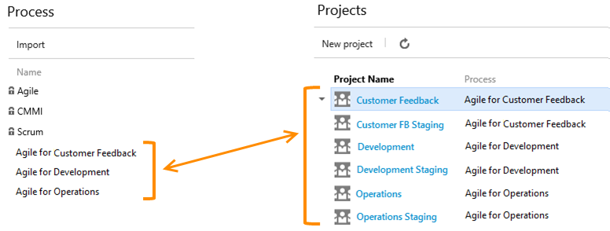
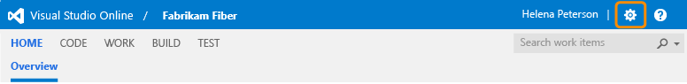
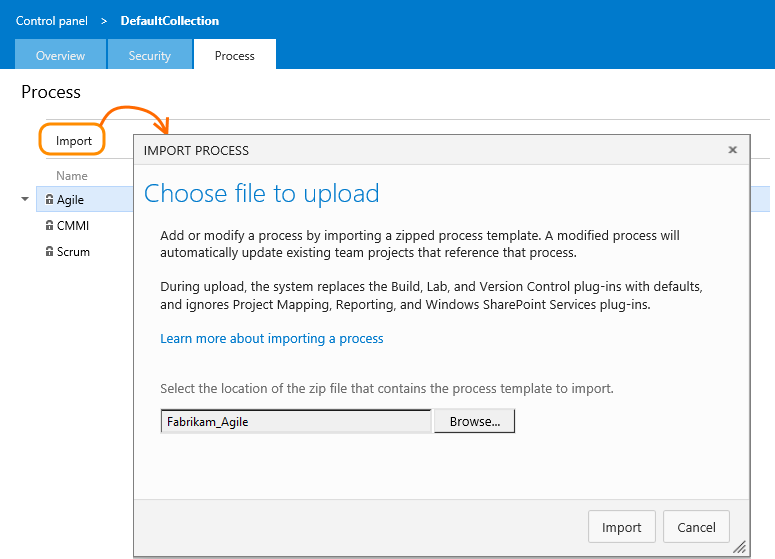
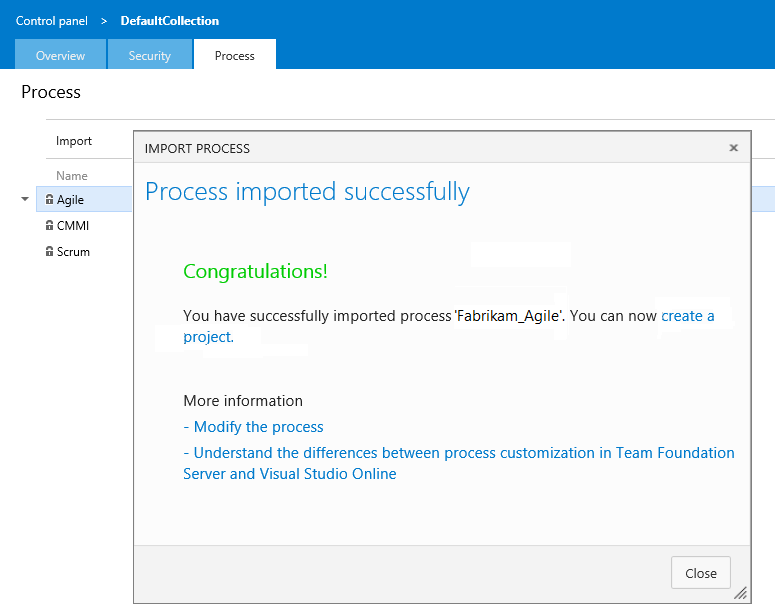
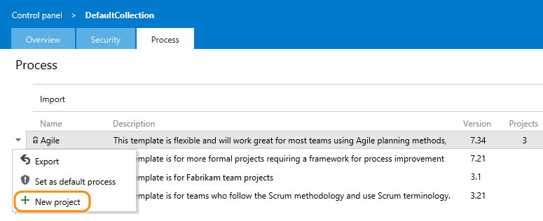
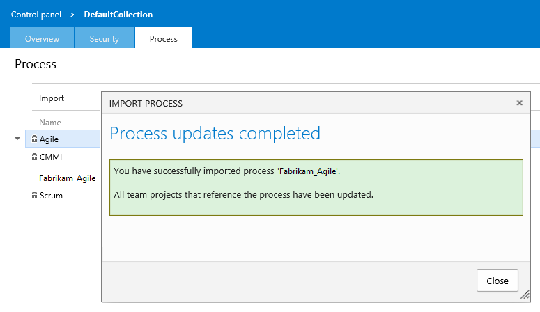
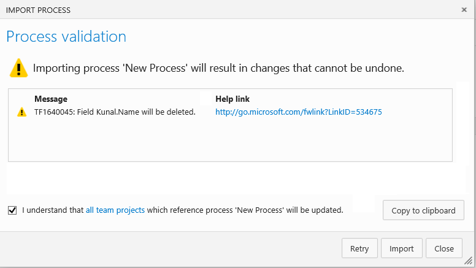
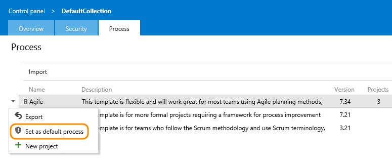

Title: Import a process | Visual Studio Online
Description: Add or update a process by importing a process to support customization of tracking work in Visual Studio Online.
ms.TocTitle: Import a process
ms.ContentId: AF7ABA0F-D3E8-48CA-9164-ABC966BAAA77

*[Import process](import-process.md) is in preview and available through request only. Contact [Visual Studio Online Process Customization](mailto:vsocustpt@microsoft.com) to request access.*  

# Process and team projects   

In Visual Studio Online, you manage customization of work tracking objects through a process.
Processes are imported and exported through a web based administration experience. 

When you import a new process, you're able to create new team projects using it.  
When you import an existing process, all team projects that use that process are updated to reflect the changes. 

For example, updates made to any of the custom processes listed below automatically update the two team projects that use the process.
 

As you discover additional customizations that you need to make, you can export the existing process, update the process XML files, 
zip the result and re-import the newly updated process.  Your changes will be applied to all your existing team projects that use that process.    

Import process supports the following scenarios:   
*   [Import an existing process from an on-premises Team Foundation Server (TFS)](#import-from-TFS)  
*   [Import a new process created from an existing exported process](#import-process)  
*   [Import an update to an existing process, and have all projects using that process be updated](#update-process)  

## Import a process from an on-premises TFS 

Your first step in migrating team projects that contain custom work tracking objects is to import the process to Visual Studio Online.
In Team Foundation Server, each project has its own copy of process so careful consideration needs to be made as to which processes should exist for your organization.
Migration to Visual Studio Online is a great time to think about process alignment across your organization and reducing the number of variants of that centralized process.  
 
1.  Run the [process export script](#process-export) to generate a process for a given team project.   

2.  (Optional) Edit the ProcessTemplate.xml file name and description. Ensure it conforms to the rules and constraints outlined in [Customize a process](customize-process.md).

3.  Create a zip file of the process folder and files.  

4.  [Import the zip file of your custom process by following the steps in the next section](#import-process).  

5.  Repeat the above process for each process you want to import to Visual Studio Online.

6.  Using the imported process(es), create team projects on Visual Studio Online for each you want to migrate. 

    With the project created, you can now migrate the project data to Visual Studio Online by following the steps provided in [Migrate your team projects using the OpsHub utility](http://www.visualstudio.com/get-started/setup/migrate-team-projects-vs).

## Import a process

Prior to importing a process, you'll want to [customize it to support your work tracking needs](customize-process.md). 
Name your process something other than Scrum, Agile, or CMMI. These system processes are locked and you're prevented from overwriting them. 

1.  Open your web portal and switch to administration mode by choosing the gear icon. 
    
    
    Only administrators can import process so if you aren't the account owner or a member of the Project Collection Administrator's group, [get added](http://msdn.microsoft.com/library/dd547204.aspx). 

2.  From the Process tab, choose import and then browse to the zip file of the process you've customized.
    

    Your [custom process must meet specific constraints](customize-process.md) in order to pass validation checks during import.  

3.  Upon successful import, you'll see the following messsage.  

    

    If the process doesn't pass the validation checks performed on import, you'll receive a list of error messages.  
    [Correct each error](resolve-errors.md) and then retry the import. 

4.  You can immediately create a team project using the newly imported process. 

     

## Update an existing process

Once you've added a process, you can update it by importing a zip file where you've modified one or more files within the process template.
**NOTE**: It's a best practice to [Export a process](#export-process) before making changes so that you don't accidentally overwrite changes made by other users.

1.  Start from the same Process tab where you added the process, and choose the file to upload.  

    

    You can't update one of the locked processes: Agile, CMMI, and Scrum.  

2.  Confirm that you want to update the existing process.  

    

3.  You'll see the following dialog while the system updates all team projects that were created using the updated process.  

    

4.  Upon successful import, you'll see the following messsage.  

    

     All team projects that were created with the process are updated with the modifications. 

5.  If you renamed or deleted fields or work item types, you will receive a confirmation message.  Go ahead and check the box and proceed with the import.  

    

    To learn more about each message, click the forward link provided. 
    [Information messages](resolve-errors.md#info-only) don't require any action on your part. 

## Set the default process

Set a process as the default to have it preselected for all new team projects you plan to create. 

 

## Export a process
Export a process when you want to update it or use it as the basis for creating another process. 

The system exports a zip file containing an XML representation of the process.  This can be modified and later imported.  

<!---

## Exporting process from an on-premises Team Foundation Server team project

TBD!!!

-->

