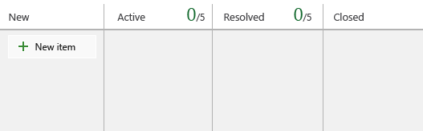
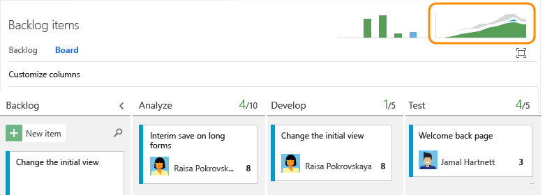
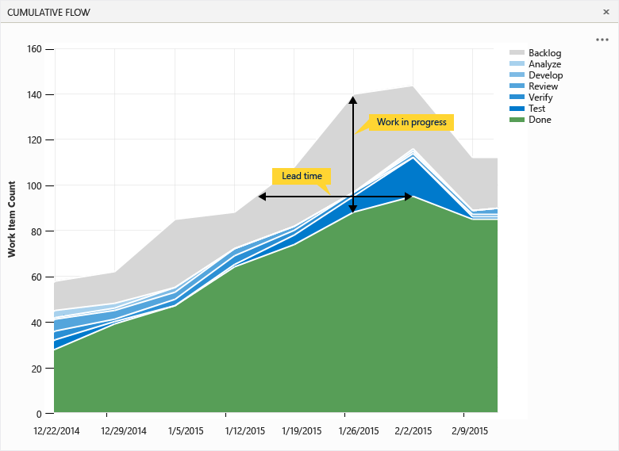

Title: Kanban basics | Visual Studio Online
Description: Kanban basics - Visual Studio Online and Team Foundation Server
ms.TocTitle: Kanban basics
ms.ContentId: 92395eeb-6372-49b3-935d-dab5feef1d54

# Kanban basics

To maximize a team’s ability to consistently deliver high quality software, Kanban emphasize two main practices. The first, visualize the flow of work, requires you to map your team’s workflow stages and configure your Kanban board to match. The second, constrain the amount of work in progress, requires you to set work-in-progress (WIP) limits. You’re then ready to track progress on your Kanban board and monitor key metrics to reduce lead or cycle time.  

Your Kanban board turns your backlog into an interactive signboard, providing a visual flow of work. As work progresses from idea to completion, you update the items on the board. Each column represents a work stage, and each card represents a user story (blue cards) or a bug (red cards) at that stage of work.


User stories and bugs correspond to types of [work items](http://msdn.microsoft.com/library/hh409275.aspx). You use work items to share information, assign work to team members, update status, track dependencies, and more.

You open your Kanban board using one of these URLs that connects you to your team project:   

**Visual Studio Online**:  ```http://AccountName/DefaultCollection/TeamProjectName/_backlogs/board/ ```

**On-premises Team Foundation Server (TFS)**:  ```http://ServerName:8080/tfs/DefaultCollection/TeamProjectName/_backlogs/board/```

If you don't have a team project yet, create one in [Visual Studio Online](http://www.visualstudio.com/get-started/setup/set-up-vs) or set one up in an [on-premises TFS](http://msdn.microsoft.com/library/ee518933.aspx). If you don’t have access to the team project, get [invited to the team](../scale/multiple-teams.md#add-team-members).

## 1. Map the flow of how your team works
Kanban literally means signboard or billboard. As a first step, you customize your board to map to how your team works.

When you first open your Kanban board, you’ll see one column for each [workflow state](../guidance/choose-process.md#workflow-states). Your actual columns vary based on the [process](../guidance/choose-process.md) used to create your team project.

For user stories, the New, Active, Resolved, and Closed states track progress from idea to completion.
<table>
<tbody>
<tr valign="top">
<td>


</td>
<td>



</td>
</tr>
</tbody>
</table>

However, your team’s workflow stages most likely don’t map to these default states. For your team to have a functional board they must identify the stages of their workflow process and then configure the board to match.

For example, you can change your Kanban columns to map to the following five workflow stages.


[Once you’ve identified your stages, simply add and rename columns](add-columns.md) to map to them. Keep the number of columns to a minimum while still representing the key handoffs that occur for your team.

## 2. Set WIP limits to constrain work in progress
In this next step, your team sets WIP limits for each workflow stage. While setting WIP limits is easy, adhering to them takes a team commitment. Teams new to Kanban may find WIP limits counterintuitive and uncomfortable. However, this single practice has helped teams identify bottlenecks, improve their process, and increase the quality of software they ship.

What limits should you set? Start with numbers that don’t exceed 2 or 3 items per team member working within a stage. Respecting WIP limits means teams don’t pull items into a column if doing so causes the number of items in the column to exceed the WIP limit.

When they do exceed the limit, the column count displays red. Teams can use this as a signal to focus immediately on activities to bring the number of items in the column down.


[Set WIP limits](wip-limits.md) based on team discussions and revisit as your team identifies ways to improve their processes. Use WIP limits to identify bottlenecks and eliminate waste from your work flow processes.

## 3. Track work in progress
Once you’ve configured your Kanban board to match how your team works, you’re ready to use it.

Here are a few things you can do. See at a glance the estimated size of work for each item which displays at the bottom right of each card. Add items to your backlog in the first column. When priorities change, move items up and down within a column. And, as work completes in one stage, update the status of an item by moving it to a downstream stage.


Also, you can quickly update a field or reassign ownership directly from the board.


Updating your Kanban board as work progresses helps keep you and your team in sync. Also, you’ll be able to see and share the value stream your team is delivering to customers.

## 4. Monitor metrics and fine tune
As with most Agile practices, Kanban encourages monitoring key metrics to fine tune your processes. After your team has used the Kanban board for several weeks, check out your Cumulative Flow Diagram (CFD).



The CFD shows the count of items in each Kanban column for the past 30 weeks or less. From this chart you can gain an idea of the amount of work in progress and lead time. Work in progress counts unfinished requirements. Lead time indicates the amount of time it takes to complete a requirement once work has started.



By monitoring these metrics, you can gain insight into how to optimize your processes and minimize lead time.

## Kanban core practices
Having worked through the above four steps, you’re well on your way to implementing most of Kanban’s six core practices.

1. **Visualize your workflow**. Teams track their work using a Kanban board that maps to how they work. Teams discuss how to best focus their resources to deliver the most important work.
2. **Limit work in progress**. Teams set and adhere to WIP limits they set for each stage of work. They use WIP limits to maintain focus on completing what they started and to identify bottlenecks occurring in their processes.
3. **Manage flow**. Teams monitor the overall work in progress and lead time, which gives them an idea of the speed of their delivery.
4. **Make policies explicit**. Teams spell out the standards and processes they agree to follow and make them readily accessible. For example, by making the team’s Definition of Done for each work stage explicit, they can avoid wasted time and effort.
5. **Create opportunities for feedback**. Teams meet periodically to reflect on what’s working and what needs improvement.
6. **Improve collaboratively, evolve experimentally**. Teams determine how to improve the continuous flow of delivery over time based of key metrics. They involve the entire team to gather insights and ideas. And, when persistent bottlenecks arise, they determine the changes that will alleviate them.

Over time, Kanban can provide your team insight as to how well their current processes work end-to-end and how to improve them. Incremental adoption of Kanban practices tends to yield greater success and builds on the sixth practice, to evolve experimentally. These practices arose from principles of Lean Manufacturing and Systems Thinking.

## Related Kanban notes

For more opportunities to adopt Kanban practices and customize your team’s Kanban board, check out the following articles:

###Customize the Kanban board 
- [Split columns](split-columns.md)
- [Add swimlanes to expedite work](expedite-work.md)
- [Definition of Done](definition-of-done.md)
- [Customize cards](../customize/customize-cards.md)
- [Show bugs on backlogs and boards](../customize/show-bugs-on-backlog.md)

Each team can manage their backlog and customize their Kanban board. [Add teams](../scale/multiple-teams.md) when you assign specific feature areas to different teams for development. Each team can then manage their backlog and focus on how they will develop their deliverables.

###Kanban industry resources
- [What is Kanban?](http://kanbanblog.com/explained/)
- [Kanban board](http://guide.agilealliance.org/guide/kanban.html)
- [Kanban: Successful Evolutionary Change for Your Technology Businessby David J. Anderson](http://www.amazon.com/Kanban-Successful-Evolutionary-Technology-Business/dp/0984521402/)
- [Agile Project Management with Kanban by Eric Brechner](http://www.amazon.com/Project-Management-Kanban-Developer-Practices/dp/0735698953/)

### Board controls

| Control                  | Function                      |
|--------------------------|-------------------------------|
| Backlog               | [Switch to backlog view](../backlogs/create-your-backlog.md)           |
| Board    | Switch to Kanban board view            |
|  | Enter a keyword to find items on the board   |
|     | Customize the board and configure team settings: [Backlogs](../backlogs/organize-backlog.md#activate-backlogs), [Working days](../scale/capacity-planning.md#team_settings), [Working with bugs](../customize/show-bugs-on-backlog.md)   |
|  /            | Enter or exit full screen mode      |

