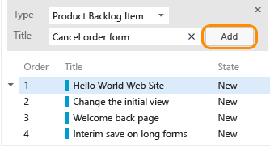
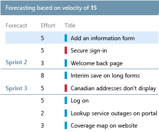
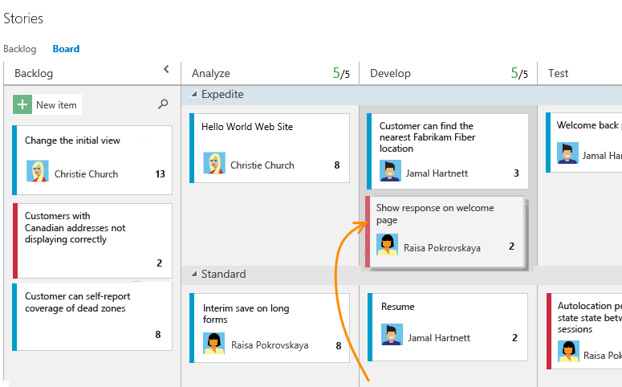
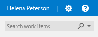
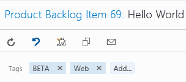

Title: Agile tools | Visual Studio Online and TFS
Description: Your guide to Agile tools, planning and tracking work using Visual Studio Online and Team Foundation Server
ms.TocTitle: Agile tools
ms.ContentId: 28C02AE8-CF8D-4B6E-8301-F46A5622E6C4

#Agile tools

As a project manager you can plan and track the work required to bring your applications from idea to completion. Agile tools provide you with the power, flexibility, and responsiveness you need to stay on top of changing priorities, deadlines, and requirements. 

To use these tools, you need to first create a team project. You can do that either in the cloud with 
[Visual Studio Online](http://www.visualstudio.com/get-started/setup/connect-to-visual-studio-online-vs), 
or by creating one on an [on-premises Team Foundation Server (TFS)](../TFS/setup/overview.md). 

<table>
<tbody valign="top">
<tr>
<td width="20%"><h4>Backlogs</h4>
<ul>
<li>[Create your backlog](./backlogs/create-your-backlog.md)</li>
<li>[Manage bugs](./backlogs/manage-bugs.md)</li>
<li>[Organize your backlog](./backlogs/organize-backlog.md)</li>
<li>[Storyboarding](https://msdn.microsoft.com/en-us/library/hh409276.aspx)</li>
<li>[Productivity tips](./productivity/productivity-tips.md)</li>
</ul>
</td>
<td width="20%"><h4>Scrum</h4>
<ul>
<li>[Define sprints](./scrum/define-sprints.md)</li>
<li>[Plan sprints](./scrum/sprint-planning.md)</li>
<li>[Capacity planning](./scale/capacity-planning.md)</li>
<li>[Task board](./scrum/task-board.md)</li>
<li>[Sprint burndown](./scrum/sprint-burndown.md)</li>
<li>[Velocity & forecasting](./scrum/velocity-and-forecasting.md)  </li>
<li>[Customize task board cards](./customize/customize-cards.md)</li>
</ul>
</td>
<td width="20%"><h4>Kanban</h4>
<ul>
<li>[Kanban basics](./kanban/kanban-basics.md)</li>
<li>[Add columns](./kanban/add-columns.md)</li>
<li>[WIP limits](./kanban/wip-limits.md)</li>
<li>[Split columns](./kanban/split-columns.md)</li>
<li>[Expedite work](./kanban/expedite-work.md)</li>
<li>[Definition of done](./kanban/definition-of-done.md)</li>
<li>[Customize cards](./customize/customize-cards.md)</li>
</ul>
</td>
<td width="20%">
<h4>Track</h4> 
<ul>
<li>[Queries (work items)](./track/using-queries.md)</li>
<li>[Charts](../Report/charts.md)</li>
<li>[Dashboards](../Report/dashboards.md) </li>
<li>[Alerts & notifications](./track/alerts-and-notifications.md)</li>
<li>[Tags](http://msdn.microsoft.com/library/dn132606%28v=vs.140%29.aspx)</li>
<li>[History & auditing](./track/history-and-auditing.md)</li>
<li>[Query by date or sprint](./track/query-by-date-or-current-iteration.md)</li>

</ul>
</td>
<td width="25%"><h4>Scale</h4> 
<ul>
<li>[Culture](./scale/culture.md)</li>
<li>[Multiple teams](./scale/multiple-teams.md)</li>
<li>[Manage team assets](./scale/manage-team-assets.md)</li>
<li>[Portfolio management](http://msdn.microsoft.com/library/dn306083.aspx)</li>
</ul>
</td></tr>
</tbody>
</table>

## Scrum
To manage work, you have access to three flavors of backlogs: product, sprints, and portfolio. Each backlog displays work items in list or board format. You use [work items](http://msdn.microsoft.com/library/hh409275%28v=vs.140%29.aspx) to share information, assign work to team members, track dependencies, organize work, and more.  

With list backlogs you can quickly develop your project plan and group and prioritize work. With boards, you can quickly update status and fields displayed for each work item. 

Your backlog corresponds to your road map for what your team plans to deliver. Once defined, you have a prioritized list of features and requirements to build. Your backlog also provides a storehouse of all the information you need to track and share with your team. 
<table>
<tbody>
<tr valign="top">
<td width="45%">
<h4>Create your backlog</h4>

Plan your project by [adding a work item for each user story or requirement](./backlogs/create-your-backlog.md) to develop  

<h4>Organize your backlog</h4>

[Group items into a hierarchical list using portfolio backlogs](./backlogs/organize-backlog.md) and quickly reorder and re-parent items to effectively manage your deliverables 

<h4>Define sprints</h4>
[Schedule your sprints](./scrum/define-sprints.md) to gain access to sprint backlogs and task boards

<h4>Plan sprints</h4>

Use sprint backlog and capacity planning tools to [plan a sprint](./scrum/sprint-planning.md)

<h4>Storyboard</h4>

Craft your stories using [Storyboarding with PowerPoint](http://msdn.microsoft.com/library/hh409276%28v=vs.140%29.aspx) and get valuable feedback from stakeholders 

</td>
<td width="45%">

<h4>Velocity & forecasting</h4>

Use [velocity & forecast tools](./scrum/velocity-and-forecasting.md) to estimate work that can be completed in future sprints 

  
<h4>Sprint burndown charts</h4>

Monitor progress and review team patterns from [sprint burndown charts](./scrum/sprint-burndown.md)

  

</td>
</tr>
</tbody>
</table>
Your [product backlog](./backlogs/create-your-backlog.md) tracks all the requirements and features your team has identified to support your project plan. While your sprint backlogs support your team to [plan sprints](./scrum/sprint-planning.md) and focus on just the set of work to accomplish during a sprint.  
 
 

 

<h2>Kanban</h2>

Your Kanban board turns your backlog into an interactive signboard, providing a visual flow of work. 
 
  
 
<table>
<tbody>
<tr valign="top">
<td width="33%">
<h4>Kanban basics</h4>

Use your Kanban board to [visualize and track the flow of work](./kanban/kanban-basics.md) from idea to completion as well as quickly update work item fields

  

<h4>Definition of done</h4>
Support your [team to be in sync about when to handoff items to a downstream work stage](./kanban/definition-of-done.md) 
</td>
<td width="33%">
  <h4>Add columns</h4>
[Customize columns to support your team's workflow](./kanban/add-columns.md) and track work from start to finish  
  
<h4>Set WIP limits</h4>

[Set constraints on the amount of work your team undertakes at each work stage](./kanban/wip-limits.md) to gain access to sprint backlogs and task boards

  
</td>
<td width="33%">
<h4>Split columns</h4>
Turn on split columns to [track the lag between when items are done in one state and work actually starts in a new state](./kanban/split-columns.md)

<h4>Expedite work</h4>
Use [swimlanes](./kanban/expedite-work.md) to track work at different service-level classes 
<h4>Customize cards</h4>
[Add fields to cards](./customize/customize-cards.md) that you can edit directly on your Kanban and task boards  
  
</td>
</tr>
</tbody>
</table>

Each Kanban column represents a work stage, and each card represents a work item. Using the [product backlog Kanban board](./kanban/kanban-basics.md), you can quickly update workflow status by moving items to a downstream column or different swimlane.

  

##Track  
Track and visualize progress using fit-for-purpose tools. 
You can search the code base, list work items, and set up alerts to get notified when changes that you care about occur. 

<table>
<tbody>
<tr valign="top">
<td width="33%">

<h4>Queries</h4>

Open shared queries or create your own query using the query editor [to list work items or show hierarchical or dependent items](./track/using-queries.md)  

<b>Work item search box</b>: find work items based on <a href="http://msdn.microsoft.com/library/cc668120%28v=vs.140%29.aspx">ID, assignment, changed date, or keyword</a> 

  

<b>Query by date or current iteration</b>: List work items based on <a href="http://msdn.microsoft.com/library/dn947439%28v=vs.140%29.aspx">when changes occurred or if they belong to the team's current sprint</a> 

<h4>History & Auditing</h4>
Review and query [work item change history](./track/history-and-auditing.md) to learn of past decisions and support future ones  

Use CodeLens to [find references and changes to your code, linked bugs, work items, code reviews, and unit tests](http://msdn.microsoft.com/library/dn269218%28v=vs.140%29.aspx)

</td>
<td width="33%">

<h4>Tags</h4>

[Add tags to work items](http://msdn.microsoft.com/library/dn132606%28v=vs.140%29.aspx) to filter backlogs and queries

  

<h4>Manage risks and dependencies</h4>
Link work items to [track related work, dependencies, and changes made over time](http://msdn.microsoft.com/library/dd293534%28v=vs.140%29.aspx)

<h4>Alerts & notifications</h4>
Get notified as [changes occur to work items, code reviews, source control files, and builds](./track/alerts-and-notifications.md) 
</td>
<td width="33%">
<h4>Charts</h4>

[Build charts that bring your data to life](../Report/charts.md) and share them with your team, organization, and stakeholders

  

<h4>Dashboards</h4>
[Create dashboards that show progress and trends](../Report/dashboards.md) and make them visible to your team and stakeholders
 
</td>
</tr>
</tbody>
</table>

[Team dashboards](http://msdn.microsoft.com/library/bb649552%28v=vs.140%29.aspx) provide a centralized location for keeping both the team and stakeholders in sync. 
Each dashboard tile provides quick access to the progress of builds, status of work items, or latest code changes. 

  

##Scale
How do you manage work across the enterprise using Agile tools?

As your organization grows, your tools can grow to meet your needs in the following ways: 

- You can [add and structure teams](./scale/multiple-teams.md) and organize work to 
gain the best of both worlds: team autonomy and organizational alignment. Teams can manage their work independently of one another. 
- You can manage a [portfolio of backlogs](./backlogs/organize-backlog.md) and gain insight into each team's progress as well as the progress of all programs.  
	  
	

- You can structure team projects to support [epics, release trains, and multiple backlogs to support the Scaled Agile Framework](http://msdn.microsoft.com/library/dn798712.aspx) 

## Related notes

You access tools provided by Visual Studio Online and TFS by connecting from a client to the server, either in the cloud or on-premises. Some tools require an Advanced license or Advanced access.  
- **Visual Studio Online**: [Add users and assign licenses in Visual Studio Onlin](https://www.visualstudio.com/en-us/get-started/setup/assign-licenses-to-users-vs)
- **On-premises TFS**: [Change access levels](./connect/change-access-levels.md)

###Team projects and process
*	[Get started with Visual Studio Online](https://www.visualstudio.com/get-started/overview-of-get-started-tasks-vs)   
*	[Connect to team projects](https://msdn.microsoft.com/library/ms181475.aspx)  
*	[Work as a stakeholder (no client access license required](./connect/work-as-a-stakeholder.md)  
*	[Create a team project](https://msdn.microsoft.com/library/ms181477.aspx)
*	[Choose a process](./guidance/choose-process.md)
*	Process guidance: [Agile](http://msdn.microsoft.com/library/dd380647.aspx), [CMMI](http://msdn.microsoft.com/library/dd997574.aspx), [Scrum](http://msdn.microsoft.com/library/ff731587.aspx) 

###Team Foundation clients and additional tools
*	[Choose the client to support your task](https://msdn.microsoft.com/library/ms181304.aspx)   
*	[Web portal](https://msdn.microsoft.com/library/ee523998.aspx)  |  [Team Explorer](https://msdn.microsoft.com/library/hh500420.aspx)  |  [Team Explorer Everywhere Eclipse plug-in](https://www.visualstudio.com/features/team-explorer-everywhere-and-eclipse-vs.aspx)  |  [Excel](https://msdn.microsoft.com/library/dd286627.aspx)  |  [Project](https://msdn.microsoft.com/library/ms181675.aspx)
*	[Storyboard your ideas](https://msdn.microsoft.com/en-us/library/hh409276.aspx)
*	[Request feedback](https://msdn.microsoft.com/library/hh301769.aspx)
*	[Manage dependencies, link work item](https://msdn.microsoft.com/library/dd293534.aspx)
*	[Compatibility and Team Foundation clients](https://msdn.microsoft.com/Library/vs/alm/TFS/administer/requirements#Clientcompatibility)   

###Customize
- Visual Studio Online: [Customize a process for import into Visual Studio Online](./import-process/customize-process.md)   
- On-premises TFS: [Configure and customize your work tracking experience](./customize/customize-work.md)    
- [Restrict access](https://msdn.microsoft.com/library/dn249791.aspx)

###Reference
- [Index of work item fields](https://msdn.microsoft.com/library/ms194971.aspx)
- [Reportable field reference](https://msdn.microsoft.com/library/jj153003.aspx)

