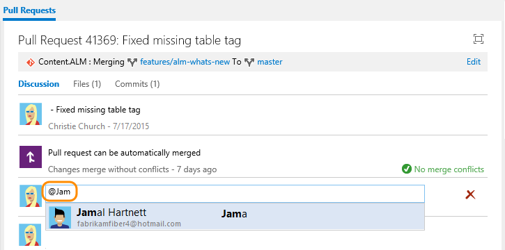
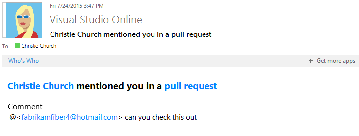
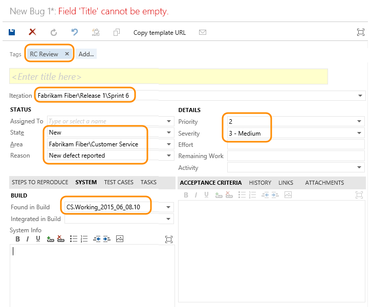

Title: Productivity tips | Visual Studio Online and TFS
Description: Increase productivity using shortcuts in Visual Studio Online and Team Foundation Server (TFS)
ms.TocTitle: Productivity tips
ms.ContentId: 3FAB9216-1D9A-442A-BEE7-5D1889B634B5

#Productivity tips

Productivity is all about producing more value in less time. You can use the tips below to work more quickly and efficiently as you work in Visual Studio Online or the web portal for Team Foundation Server (TFS).  

Here are some of the types of productivity tools you have access to:  

<table width="90%">
<tbody width="90%">
<tr valign="top">
<td width="30%"><h4>Keyboard shortcuts</h4> 
<ul>
<li><a href="http://msdn.microsoft.com/library/dd380652.aspx">Web portal </a></li>
<li><a href="http://msdn.microsoft.com/library/dd380652.aspx">Team Explorer</a></li>
<li><a href="https://msdn.microsoft.com/library/ff458183.aspx">Test Manager</a></li>

<li><a href="http://msdn.microsoft.com/library/dn600331.aspx">Frequently used commands - Visual Studio </a></li>
<li><a href="http://msdn.microsoft.com/library/da5kh0wa.aspx">Visual Studio defaults </a></li>
<li><a href="http://msdn.microsoft.com/library/5zwses53.aspx">Customize Visual Studio shortcuts </a></li>
</ul>
</td>
<td width="18%">
<h4>Special controls</h4>
<ul>
<li><a href="#mention-wit-id">#mention in a pull request</a></li>

</ul>

<h4>Track</h4>
<ul>
<li>[Set alerts, get notified of changes](../track/alerts-and-notifications.md)</li>
</ul>
<h4>Templates</h4>
<ul>
<li>[Work item templates](http://msdn.microsoft.com//library/ff407162.aspx)</li>
</ul>
</td>
<td width="30%">
<h4>Quick find or access</h4>

<ul>
<li>[Work item search box](#quick-find)</li>
<li>[Query by date or current sprint](../track/query-by-date-or-current-iteration.md)</li>
</ul>
<h4>Bulk additions or updates (work items)</h4>
<ul>
<li>[Bulk modify (backlog)](../backlogs/create-your-backlog.md#bulk-modify) </li>
<li>[Bulk modify (sprint backlog)](../scrum/sprint-planning.md#bulk-modify)</li>
<li><a href="http://msdn.microsoft.com/library/hh409280.aspx">Bulk modify (web portal)</a>  </li>
<li><a href="http://msdn.microsoft.com/library/dd286627.aspx">Bulk add or modify (Excel)</a></li>
<li><a href="http://msdn.microsoft.com/library/dd286701.aspx">Bulk add or modify (Project)</a></li>
</ul>
</td>
</tr>
</tbody>
</table>  

##Special controls

The **#mention** control quickly links the object you're working in to a work item based on its ID.

### #mentions control - link a work item by its ID  

<blockquote>*The **#mention** special control is currently supported only on Visual Studio Online.* </blockquote>

When leaving a code comment in a pull request, you can type **#** to trigger the **#mentions** control. The control displays a list of 50 work items that you have recently modified or that are assigned to you. 

You can narrow the list of suggested work items by entering keywords that match the work item you are looking for or you can enter the exact work item ID.

  

To further filter the list, continue entering keywords until you’ve found a match. You can enter up to five keywords.   

<!---

### @mentions control - notify a team member from a pull request  

Type **@** within a code comment or discussion feedback field. From the identity selector, you'll see a list of those people that you have you've recently mentioned. You can choose one of those names or filter the list some more. 

To filter the list, enter the user name or alias until you've found a match.  

To **@mention** a user you've never selected previously, just continue typing to perform your search against the full directory.  

Upon completion of your selection and text entry, your **@mention** user will receive an email alerting them about the mention.  

  

At mentioned user names in conversations are highlighted in orange text. 
 
  

Click the **@mention link name** to open the user's contact card, which can provide you additional context for why they were pulled into the conversation.  

You can also use the **#mentions** control within the Description and History fields of a work item form (web portal only). 
-->

<!---
##Alert a team member about a change
At mentions aren't going out until after Sprint 85
Use @mention and #mention to quickly add a

-->

##Pre-populate often used work items - create work item templates 
[Creating a work item template](http://msdn.microsoft.com/library/ff40716%28v=vs.140%29.aspx) saves your team time by pre-populating the work item with values that the team uses most often. For example, you can create a template that specifies various default values for a bug.    

Provide the team a hyperlink to this template and you save every team member from having to specify the circled fields in the form.  

##Quick find or access

###Quick find using search boxes  

####Find work items
Using the work items search box, you can quickly [find work items based on ID, assignment, changed date, or keyword](http://msdn.microsoft.com/library/cc668120%28v=vs.140%29.aspx).

<table>
<tbody valign="top">
<tr>
<td>

Enter or select one or more of the following shortcut identifiers:

&nbsp;&nbsp;&nbsp;**A** =for **A**ssigned To, (for example, A:Annie or A=@Me).

&nbsp;&nbsp;&nbsp;**C** for = **C**reated By, (for example, C:Peter or C=@Me).

&nbsp;&nbsp;&nbsp;**S** for = **S**tate, (for example, S=New). 

&nbsp;&nbsp;&nbsp;**T** for = Work Item **T**ype, (for example, T=Task or T=Bug).

Use the **@Me** macro to specify your username or account alias.

Use the **=**, **:**, and **–** operators to specify the operations **Equals**, **Contains**, and **Not**, respectively. 

</td>
<td>
  
</td>
</tr>
</tbody>
</table>

###Quick access using dashboards
You can quickly access code, builds, and work items when you [pin items to your team dashboard](../../Report/dashboards.md). 

If you use [Scrum](../scrum/sprint-planning.md), click  to open the current sprint [task board](../scrum/task-board.md). Click  to open the [sprint burndown chart](../scrum/sprint-burndown.md).

Also, you can click any of the pinned items to open the work item query (), build progress (), or version control path ().
 

In addition, you can quickly open a page, create work items, or access additional tools from one of the several links available on the team home page. 

 