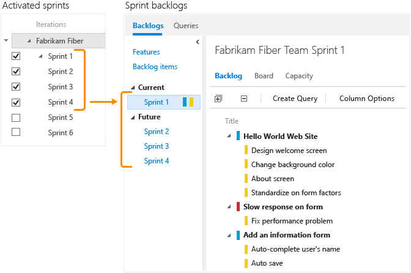
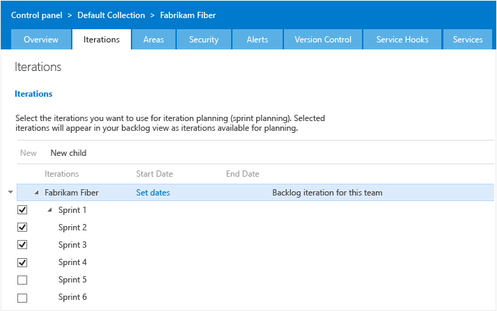

Title: Define sprints | Visual Studio Online and Team Foundation Server (TFS)
Description: Define sprints, releases, or iterations when working in Visual Studio Online or a team project connected to  Team Foundation Server (TFS)
ms.TocTitle: Define sprints 
ms.ContentId: 1DB81E71-36D7-43A5-9C9A-38AA1777715A

#Define sprints  
With Scrum, teams plan and track work at regular time intervals, referred to as a sprint cadence. 
You define sprints to correspond to the cadence your team uses.  

Many teams choose a two or three week cadence. However, you can specify shorter or longer sprint cycles.  
Scheduling sprints involves defining the sprints for a team project, and then activating the sprints for your team’s use. 
Each sprint that you activate for your team provides access to a sprint backlog, task board, and other Agile tools for planning and tracking work.   

For example, by activating Sprints 1 thru 4, the Fabrikam Fiber team gets access to four sprint backlogs. 
They also get access to capacity planning tools and a task board for each sprint.  

 

<blockquote style="font-size: 13px">**Terminology note: **Your set of Agile tools uses the Iteration Path field to track sprints and releases. When you define sprints, you define the pick list of values available for the [Iteration Path](http://msdn.microsoft.com/library/dd997576.aspx) field. You use iterations to group work into sprints, milestones, or releases in which they’ll be worked on or shipped.</blockquote>  

##Sprint planning tools 

At the start of each sprint, you’ll want to plan the work that your team can commit to. The three Agile tools that support this work include the sprint backlog, capacity planning, and capacity bars. The sprint backlog contains a filtered subset of backlog items whose iteration path corresponds to the current sprint. 

<table valign="top" > 
<tr valign="top" > 
<td width="35%">

<b>Team capacity planning tool</b>

By setting team capacity, the team knows exactly the total number of work hours or days the team has for each sprint. With this tool, you set individual team member capacity as well as days off. And, conveniently, you can set holidays or shared days off taken by the entire team. 

Setting capacity for each team member working during a sprint causes the capacity bar for that individual to appear. 

You <a href="#team_settings">set recurring days off</a>, such as weekends, through team settings.

</td>
<td>
 
</td>
</tr>
<tr valign="top" > 
<td>

<b>Individual and team capacity bars</b>

With capacity bars, you can quickly see who is over, at, or under capacity. Capacity bars update with each of these activities: 

<ul>
<li>

Tasks are assigned with non-zero remaining work

</li>
<li>

Change in remaining work

</li>
<li>

Date change within the sprint cycle. Individual and team capacity always reflects their capacity from the current day till the end of the sprint.  

</li>
</ul>

Here’s how to interpret the capacity colors:

</td>
<td width="455px">

</td>
</tr>
</table>

Once you’ve defined and activated the sprints for your team, [you can start using these tools to plan your sprint](https://msdn.microsoft.com/library/ee191595%28v=vs.140%29.aspx).  

##Sprint tracking tools 
During a sprint, your team can use the task board and sprint burndown chart to track their progress. 
Your sprint burndown chart provides you with an at-a-glance visual to determine if your team is on track to meet their sprint plan.  
 
<table valign="top">
<tr valign="top" > 
<td width="35%">

<b>Task board</b>

Your task board provides an interactive progress board for work required to complete the sprint backlog. During your sprint you’ll want to update the status of tasks and the remaining work for each task. 

Updating tasks daily or several times a week yields a smoother burndown chart. 

</td>
<td width="520px">

</td>
</tr>
<tr valign="top" > 
<td>

<b>Sprint burndown chart</b>

You use the burndown chart to mitigate risk and check for scope creep throughout your sprint cycle. The burndown chart reflects the progress made by your team in completing all the work they estimated during their sprint planning meeting. 

The ideal trend line always indicates a smooth and steady burndown. The blue area, however, represents what’s actually going on. It shows the buildup of work as team members add tasks and the reduction of work as team members complete those tasks.

</td>
<td>

</td>
</tr>
</table>

Once you’ve planned your sprint, use the [task board](task-board.md) during your daily scrum meetings and monitor your [sprint burndown chart](sprint-burndown.md).

##Velocity and forecast 

While you use sprint planning and tracking tools for each sprint, you use the velocity and forecast tools to estimate work that can be completed in future sprints. 

Velocity provides a useful metric for gaining insight into how much work your team can complete during a sprint cycle. And, the forecast tool provides a means for determining how much work your team can complete within a sprint based on a specified team velocity. 

<table valign="top" > 
<tr valign="top" > 
<td>

<b>Velocity chart</b>

Each team is associated with one and only one velocity chart. The green bar within the chart indicates the total estimated effort (story points or size) of backlog items (user stories or requirements) completed within the sprint. (Blue corresponds to the estimated effort of items not yet completed.)  

Velocity will vary depending on team capacity, sprint over sprint. However, over time, the velocity should indicate a reliable average that can be used to forecast the full backlog. 

By minimizing the variability of backlog item size─effort or story points─you gain more reliable velocity metrics.

</td>
<td width="500px">

</td>
</tr>
<tr valign="top" > 
<td>

<b>Forecast tool</b>

You can use the forecast tool to get an idea of how many and which items you can complete within a sprint. 

By plugging in a velocity, you can see which items are within scope for the set of sprints the team has activated. As shown here, a velocity of 15 indicates that it will take three sprints to complete the work shown. 

</td>
<td>

</td>
</tr>
</table>  

After your team has worked several sprints, they can use the [velocity and forecast tools](https://msdn.microsoft.com/library/dn283465%28v=vs.140%29.aspx) to estimate work that can be accomplished in future sprints.  

##Define and schedule sprints##
 

Your team project comes with several sprints predefined. However, they aren’t associated with any dates. For Scrum and sprint planning, you’ll want to assign start and end dates for the sprints your team will use.  

<ol>
<li>

From a web browser, open the administrative context for your team project.

  

To learn more about connecting to your team project, go [here](<a href="https://msdn.microsoft.com/library/ms181475.aspx).

If you're not a project admin, [get added as one](https://msdn.microsoft.com/library/bb558971.aspx). Or have someone provide you with explicit permissions to <b>Edit this node</b> or <b>Create child nodes</b> under an iteration path.  

</li>
<li>

Open Iterations. For Scrum-based team projects, you’ll see these set of sprints.

  

You can change the name, location within the tree hierarchy, or set dates for any sprint. Simply open it (double-click or press Enter key) and specify the info you want. 

</li>
<li>

Schedule the start and end dates for those sprints you plan to use.  

  

After you set the start and end dates for one iteration, the calendar tool automatically attempts to set the next set of dates, based on the same iteration length you specified for the first. For example, if you set a three week sprint for Sprint 1, then when you select the start date for Sprint 2, the calendar tool automatically determines the start and end dates based on the next three weeks. You can accept or change these dates.

</li>
<li>

To add another sprint, select <b>New child</b> and name it what you want. Here, we call it Sprint 7.

  

We recommend keeping the sprint labels short and similar. This keeps things simple when choosing iterations from the work item form. Sprints are always listed under their parent within the hierarchy and then alphabetically.  

</li>
</ol>

##Activate sprints for your team  
With sprints defined, your next step is to choose which sprints your team wants to use for their Scrum processes.  

1.	You activate sprints from the same page that you defined them, except this time you must be in your team context.    
	Here, the Fabrikam Fiber Web team activates Sprints 1 through 7. (If your team isn’t listed in the navigation row, open the Overview tab, select your team, and then return to the Iterations tab.)  

	 

	If you’re not a team administrator, [get added as one](../scale/manage-team-assets.md#add-team-admin). Only team or project administrators can change team settings.  

	Check boxes only appear for sprints defined under the default iteration path. This path [determines the default used](#default_path) when you create items from your team’s home page or backlog.  

2.	To see the newly activated sprint backlogs, refresh your team’s [product backlog page](../backlogs/create-your-backlog.md). 

##Try this next  

Now that you have your sprints defined and activated, you’re ready to begin [planning your sprint](sprint-planning.md).  

If you work with several teams, and each team wants their own backlog view, you can [create additional teams](../scale/multiple-teams.md). Each team then gets access to their own set of Agile tools. Each Agile tool filters work items to only include those assigned values under the team’s default area path and iteration path.  

##Related Scrum notes 

Your Scrum Agile tools support you in planning and tracking sprints. But they also provide a historical record your team can use to evaluate their progress sprint over sprint.   
You can access any sprint backlog, task board, and burndown chart from the Past folder as long as that sprint remains active for your team.  

  

###Sprints: a shared resource  

Because the sprints or iterations you defined are a shared resource, they’re managed by project admins. Renaming, deleting, modifying the hierarchy, or changing scheduled dates for an iteration impacts all teams that use it. Because of this, you’ll want to coordinate changes when working in an enterprise environment with multiple teams.  

And of particular note, deleting an iteration will delete all sprint backlogs, task boards, and burndown charts associated with that iteration.   

###Sprints and releases  

How do you plan and track a release, in addition to planning and tracking sprints?  

One way you can accomplish this is to schedule a set of releases at regular intervals. Then, define the sprints that occur within those intervals as their children. Here’s an example of such a structure.  

For a worked example of how a management team can focus on releases and feature teams on sprints, see [Agile Portfolio Management](https://msdn.microsoft.com/library/dn306083.aspx).  

###How is the default iteration used? 
 

If you work in Scrum or implement a sprint cadence, you must choose a default iteration path to activate sprints for your team. The value you select provides a scoping mechanism for the set of sprints your team can activate. Also, the value you select is used to pre-populate the Iteration Path of work items that are created from your team context. 

For example, all work items that you create from your team context are automatically assigned both the default <a href="https://msdn.microsoft.com/library/dd997576(v=vs.140).aspx">Area Path</a> and default Iteration Path defined for your team. You navigate to your team context from the top navigation bar.  

![Choose another team from the team project menu]](_img/switch-team-context.png)  

Specifically, each Agile tool observes the following constraints:  

<table valign="top" > 
<tr valign="top" > 
                      <th>
                        
Agile tool

                      </th>
                      <th>
                        
Filters items based on

                      </th>
                    </tr>
<tr valign="top" > 
                      <td>
                        
Product backlog

                      </td>
                      <td>
                        <ul>
                          <li>
                            
Area Path equal to or under team’s default area path

                          </li>
                          <li>
                            
Iteration Path equal to or under team’s default iteration path

                          </li>
                          <li>
                            
State is active (not Closed, Done, or Removed)

                          </li>
                        </ul>
                      </td>
                    </tr>
<tr valign="top" > 
                      <td>
                        
Kanban board

                      </td>
                      <td>
                        <ul>
                          <li>
                            
Area Path equal to or under team’s default area path

                          </li>
                          <li>
                            
Iteration Path equal to or under team’s default iteration path

                          </li>
                          <li>
                            
State can be set to anything

                          </li>
                        </ul>
                      </td>
                    </tr>
<tr valign="top" > 
                      <td>
                        
Sprint backlog

                      </td>
                      <td>
                        <ul>
                          <li>
                            
Area Path equal to or under team’s default area path

                          </li>
                          <li>
                            
Iteration Path = team’s active sprint

                          </li>
                          <li>
                            
State can be set to anything

                          </li>
                        </ul>
                      </td>
                    </tr>
<tr valign="top" > 
                      <td>
                        
Task board

                      </td>
                      <td>
                        <ul>
                          <li>
                            
Area Path equal to or under team’s default area path

                          </li>
                          <li>
                            
Iteration Path = team’s active sprint

                          </li>
                          <li>
                            
State can be set to anything

                          </li>
                        </ul>
                        

                        Other exceptions can apply based on [parent-child links between items](../customize/show-bugs-on-backlog.md#leaf-nodes). 

                      </td>
                    </tr>
                  </table>

Teams can choose [whether to include or exclude items under their team’s area path](../scale/multiple-teams.md#include-area-paths). If they exclude sub-areas, the Agile tools filter items to only show those whose area path matches the team’s default area path. 

 