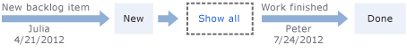

Title: History and auditing | Visual Studio Online
Description: Track changes and use tools to support audit requirements when working in Visual Studio ALM and Team Foundation Server (TFS) 
ms.TocTitle: History & auditing 
ms.ContentId: A5AC271A-8DF0-40AD-9867-1B1E9E5B1FE9


 

#History & auditing  
The history of a work item tells you who opened the item, what changed, and why. This information helps you track how an item changes over time. When you enter information in the history field, provide as much information as possible to help the next work item owner understand what has happened and what they have to do.  

You can use either the web portal or Team Explorer to view the history of a work item or find work items based on the contents of the ```History``` field. When you perform a search on the contents of the ```History``` field, it returns only work items that have changes recorded in that field. That is, it doesn't register changes that were made to text in other fields.


           
##Find work items based on the contents of the History field 

You use the query editor to add the History field to a [query clause](using-queries.md). 

You can filter for work items by the date on which they were changed or for a specific time period. If you limit the scope of your query, it can help with performance by only returning those results that fit the date range that you want to include. 

<table>
<tbody valign="top">
<tr>
<th>Filter for</th>
<th>Include these query clauses</th>
</tr>
<tr>
<td>Items whose History field contains the word "reproducible"  
</td>
<td>
```History Contains Words reproducible```  
</td>
</tr>
<tr>
<td>Items whose History field doesn't contain the word "beta"
</td>
<td>
```History Does Not Contain Words beta```
</td>
</tr>
<tr>
<td>
Items that contain the phrase "stack traces" and were closed but reactivated
</td>
<td>
&nbsp;&nbsp;&nbsp;&nbsp;&nbsp;&nbsp;```History Contains Words stack traces```  
```And```  
&nbsp;&nbsp;&nbsp;&nbsp;&nbsp;&nbsp;```State   Was Ever   Closed ```  
```And```  
&nbsp;&nbsp;&nbsp;&nbsp;&nbsp;&nbsp;```State   <>   Closed ```  
</td>
</tr>
<tr>
<td>
Items closed within a specified time period
</td>
<td>
&nbsp;&nbsp;&nbsp;&nbsp;&nbsp;&nbsp;```State   =   Done```  
```And```  
&nbsp;&nbsp;&nbsp;&nbsp;&nbsp;&nbsp;```Closed Date   >   7/1/2015```  
```And```  
&nbsp;&nbsp;&nbsp;&nbsp;&nbsp;&nbsp;```Closed Date   <=   7/21/2015```  
</td>
</tr>
<tr>
<td>
Items I've been associated with 
</td>
<td>
&nbsp;&nbsp;&nbsp;&nbsp;&nbsp;&nbsp;```History    Contains Words    MyName```  
```Or```  
&nbsp;&nbsp;&nbsp;&nbsp;&nbsp;&nbsp;```Assigned To   Was Ever    @Me```  
</td>
</tr>
</tbody>
</table>  

###Tips for using the query editor
<ul>
<li>Type the complete word or phrase that is specified in the ```History``` fields of those work items that you want to find.</li>
<li>Enter the full text for the word that you want to search. The History field is indexed for full-text search. If you enter only a partial word, the query will not return work items that contain the full word. For example, if the History field contains the phrase *reproducible behavior* and you search for *repro*, the work item will not be found. However, if you search for the complete word *reproducible*, the work item will be found. You can also search for the string with a wild card, such as ```repro*```. </li>
<li>The query editor ignores common words or stop words as defined in [Configure and Manage Stopwords and Stoplists for Full-Text Search](https://msdn.microsoft.com/library/ms142551.aspx).</li>
<li>On the query editor toolbar, click  or  icon and confirm that your query returns expected results.</li>
<li>If you don't receive the results you expect, adjust the word or phrase that you entered, and run the query again.</li> 
</ul> 


##View the history of work items  

1. Open an existing work item, and then choose the History tab, or for some work item types, choose the Details tab.  
	If you open the work item from the web portal, you'll see the state change history diagram. To see the entire history of state changes, choose **Show all**.
 
	  

2.	To view only the comments that were added to the log, choose the <b>Discussion Only</b> tab. To view all changes made to the item, choose the <b>All Changes</b> tab, and then choose the <b>show all changes</b> link for a specific date and time.  

	  

##Fields that support history, auditing, and revision tracking 

You can use the following fields to filter queries and create reports. Several of these fields are populated with information as a work item progresses from one state to another. Other fields update when the work item is modified. Some fields don't appear on the work item form, but they are tracked for the WITs listed.  


<table>
<tbody valign="top">
<tr>
  <th width="14%">Field name</th>
  <th>Description</th>
  <th>Work item type</th>
</tr>

<tr>
<td>
<p>Changed By</p>
</td>
<td>
The name of the team member who modified the work item most recently.
</td>
<td>All</td>
</tr>
<tr>
  <td>
    <p>Change Date</p>
  </td>
  <td>
    <p>The date and time when a work item was modified.</p>
  </td>
<td>All</td>
</tr>
<tr>
  <td>
    <p>Closed Date <sup>1</sup> </p>
  </td>
  <td>
    <p>The date and time when a work item was closed.</p>
  </td>
<td>All</td>
</tr>
<tr>
  <td>
    <p>Created Date</p>
  </td>
  <td>
    <p>The date and time when a work item was created.</p>
  </td>
<td>All</td>
</tr>
<tr>
<td>History</td>
<td>
The record of changes that were made to the work item after it was created. Every time that the work item is updated, information is appended to the history, which specifies the date of the change, who made the changes, and which fields were changed. 
<p>You can add formatted text to the history field. Once you've saved the work item, you can't alter the history. </p>
<p>The ```History``` field, along with the ```Description```, ```Steps to Repro``` and ```Title``` fields are automatically indexed for full-text search as described in [Query fields, operators, values, and variables](https://msdn.microsoft.com/en-us/library/dd286638%28v=vs.140%29.aspx). </p>
</td>
<td>
All
</td>
</tr>
<tr>
  <td>
    <p>Resolved Date <sup>1</sup> </p>
  </td>
  <td>
    <p>The date and time when the work item was moved into a Resolved state. </p>
  </td>
  <td>Bug (Agile and CMMI process templates only)
  </td>
</tr>

<tr>
<td>
<p>Rev</p>
</td>
<td>
<p>A number that is assigned to the historical revision of a work item. </p>
</td>
<td>All</td>
</tr>


<tr>
  <td>
    <p>State Change Date</p>
  </td>
  <td>
    <p>The date and time when the value of the State field changed.</p>
  </td>
<td>All</td>
</tr>

<tr>
  <td>
Test Suite Audit
  </td>
  <td>
Tracks additional operations performed when modifying a test suite, for example: adding tests to a test suite or changing configurations. This field can be viewed through the History tab or through a separate query. There will be a consolidated history view, including changes performed to work items field and changes resulting from related artifacts such as test points and configurations.

  </td>
  <td>
Test Suite
  </td>
</tr>
</tbody>
</table>

<sup>1</sup>  For these fields to be defined for a WIT, they must be included in the ```WORKFLOW``` section of the WIT definition. For example, this syntax is included within the ```FIELDS``` definition when transitioning to a Resolved state:  
```
<FIELD refname="Microsoft.VSTS.Common.ResolvedDate">  
   <SERVERDEFAULT from="clock" />  
</FIELD>  
```


##Related tracking notes
To learn more about creating and saving queries, see these resources: 

*	[Using queries](using-queries.md)
*	[Query by date or current iteration](query-by-date-or-current-iteration.md)
*	[Query fields, operators, values, and variables](https://msdn.microsoft.com/en-us/library/dd286638%28v=vs.140%29.aspx)
*	[Set permissions on queries](https://msdn.microsoft.com/en-us/library/dd286628%28v=vs.140%29.aspx)

###Getting the history programmatically
See the following resources for ways to extract history information programmatically.
####Visual Studio Online REST APIs

- [Discussion history](https://www.visualstudio.com/integrate/api/wit/history)  
- [Work item updates](https://www.visualstudio.com/integrate/api/wit/updates)  
- [Work item revisions](https://www.visualstudio.com/integrate/api/wit/revisions)  

####On-premises TFS 
- [Query for Bugs, Tasks, and Other Work Items](https://msdn.microsoft.com/en-us/library/bb130306.aspx)
- [TFS SDK: Work Item History Visualizer using TFS API](http://geekswithblogs.net/TarunArora/archive/2011/08/21/tfs-sdk-work-item-history-visualizer-using-tfs-api.aspx)

 
