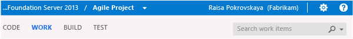
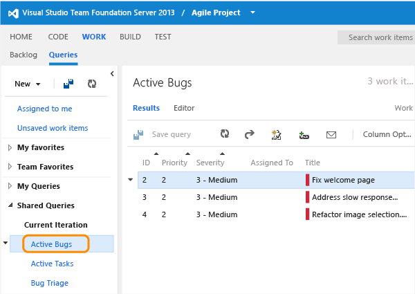
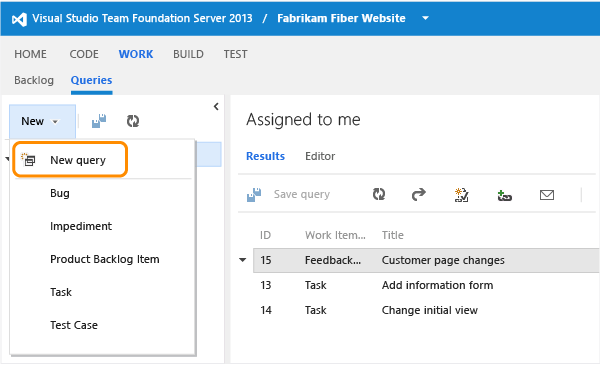

Title: Using queries | Visual Studio Online and TFS
Description: Track work by creating queries to list items using Visual Studio Online or Team Foundation Server (TFS)
ms.TocTitle: Using queries
ms.ContentId: 364000d3-200a-495a-bfb9-83915240af67

#Query for work items

Queries help you find work items that you want to review, triage, update, or list in a report.  

To quickly find a work item by ID, simply enter the ID in the work item search box. Enter a keyword to list items containing the keyword in its title, description, or history. 

Otherwise, you can use the Query Editor to craft simple or more complex queries based on the filter clauses you specify. Start by choosing from these three query types:
*	[Flat list of work items](#flat-list-query)
*	[Hierarchical list using a tree query](#tree-query)
*	[List showing dependencies using a direct links query](#directs-link-query) 

You can create queries in Visual Studio Online, the  web portal for Team Foundation Server (TFS), and Team Explorer. Also, you can open a query in [Excel](https://msdn.microsoft.com/library/dd286627%28v=vs.140%29.aspx) or [Project](https://msdn.microsoft.com/library/dd286701%28v=vs.140%29.aspx) to perform bulk additions and modifications.  


## Use the search box to find a work item by its ID  

Type the ID in the Search work items box and then choose the search icon.  

  

Use the  context menu to add a filter based on [assignment, status, a keyword, or a work item type.](https://msdn.microsoft.com/library/cc668120%28v=vs.140%29.aspx) 

For example, enter ```A=@Me T=Task``` to list all tasks assigned to you.  

<a id="flat-list-query"/>
## Open and edit a flat list query  

The easiest way to define a query is to start with an existing shared query. 
The following example shows how to find all closed bugs by modifying the 
Active Bugs shared query provided with the Agile process template. Examples are based on the user interface provided through the web portal. 

1.	Open a shared query. For example, open the Active Bugs or similar flat list query.   
  
	

2.	Edit the query to find closed bugs and then run the query. 
	Use  to insert a clause above the current clause. Use  to delete a clause.    
	
	  
  
3.	Save the query to your My Queries folder.  
	  
	      
	  
	  To save a query to the Shared Queries folder, you need to be a [team administrator](../scale/manage-team-assets.md#add-team-admin), a member of the [Project Administrators group](https://msdn.microsoft.com/library/bb558971.aspx), or have your Contribute permissions on the folder set to Allow.

<a id="flat-list" />
## Create a query

You can start a fresh, new query from the Queries page in the web portal or the Work Items page in Team Explorer.

  

## Group clauses to refine your list

Grouped clauses operate as a single unit separate from the rest of the query, similar to putting parentheses around a mathematical equation or logic expression. The And or Or operator for the first clause in the group applies to the whole group.

In the next example, the first expression returns all work items that are priority 1 and all active bugs of any priority. The second expression returns all active priority 1 work items and all priority 1 bugs, whether they are active or not.

| Grouped clauses                                   | Logical expression                                    |
| ------------------------------------------------- | ----------------------------------------------------- |
|  | Priority = 1 OR (Work Item Type=Bug AND State=Active) |
|  | Priority = 1 AND (Work Item Type=Bug OR State=Active) |

To group one or more clauses, select them and then choose the [Placeholder Image 9 Group Query Clause] group clauses icon.


If your query results do not return your expected set of work items, follow these steps: 

- Make sure that each clause is defined as you intended.


- Verify And/Or assignments to each clause. If your results contain more work items than expected, often an Or clause is present instead of an And clause. 


- Determine if you need to group or change the grouping of the query clauses and the And/Or assignments of each grouped clause. 


- Add more query clauses to refine your query filter criteria. 


- Review the options available to specify [fields, operators, and values.](https://msdn.microsoft.com/library/dd286638.aspx) 

<a id="tree-query" />
## Use a tree query to view a hierarchical list

Use the tree query () to view a multi-tiered, nested list of work items. For example, you can view all backlog items and their linked tasks.


Expand (Expand node () or collapse () leaf nodes to focus on different parts of the tree.

Define the filter criteria for both parent and child work items. 

 

To find linked children, select Match top-level work items first. To find linked parents, select Match linked work items first.

<a id="directs-link-query" />
## Use a direct link query to view dependencies

Use the direct links query () to track work items that depend on other tracked work, such as tasks, bugs, issues, or features. For example, you can view backlog items that depend on other items being implemented or a bug being fixed. 


Use the direct links query to track dependencies your team has that other teams work on, or manage commitments your team has made to other teams. Specify the filter criteria for both top and linked work items, and select the types of links used to filter the dependencies. 


Filter your first-tier list of work items by choosing one of these options:

- Only return work items that have the specified links: First-tier work items are returned, but only if they have links to work items specified by the linked work items filter criteria. 


- Return all top level work items: All first-tier work items are returned regardless of the linked work items filter criteria. Second-tier work items that are linked to the first tier are returned if they match the linked work items filter criteria.


- Only return work items that do not have the specified links: First-tier work items are returned, but only if they do not have links to work items specified by the linked work items filter criteria.

## Related query notes

That's the basics about using queries. Refer to one of the following topics for more details and examples:  
*	[Query fields, operators, values, and variables](https://msdn.microsoft.com/library/dd286638.aspx)
*	[Example work item queries](https://msdn.microsoft.com/library/dd576358.aspx) 
*	[Example search box queries](https://msdn.microsoft.com/library/cc668120.aspx)
*	[Filter queries using tags](add-tags-to-work-items.md)
*	[Set query permissions](https://msdn.microsoft.com/library/dd286628.aspx)
*	[Email URL links to work items and queries](https://msdn.microsoft.com/library/bb822129.aspx)


## Q & A
<!-- BEGINSECTION class="md-qanda" -->

### Q: What query operators and variables can I use?
**A: **The operators and variables available for selection depend on the field that you select. The four variables are:
*	```@Project``` specifies the current project when filtering on the Team Project field   
*	```@Me``` specifies your user or account name when filtering on a person-name field  
*	```@CurrentIteration``` specifies the [current sprint for the selected team](https://msdn.microsoft.com/library/dn947439.aspx) when filtering on the Iteration Path (works only from the web portal) 
*	```@Today``` specifies the current date when filtering on a  date-time field  
*	```[Any]``` specifies any value when filtering on Work Item Type field.    


### Q: Can I see a pie chart or trend chart of a query?
**A: **Yes, you can [chart the results of any flat-list query](../../Report/charts.md). 

Or, you can open a [query in Excel](../../Report/excel/create-status-and-trend-excel-reports.md) and use the features of Excel to generate a chart.


### Q: How do I add or change columns in the results list?
**A: **Open Column Options to add or remove columns, change the sequence of columns, and change the sort order within a column.


Also, from the results list, you can drag a column to a new position and select the column title to change the sort order by column.

### Q: Can I use query results to modify links between work items?
**A: **From the Team Explorer plug-in for Visual Studio, you can indent (), outdent (), and drag work items to modify the hierarchy. 

Also, you can open a query in [Excel](https://msdn.microsoft.com/library/dd286627.aspx) or [Project](https://msdn.microsoft.com/library/dd286701%28v=vs.140%29.aspx) to bulk-modify parent-child and predecessor-successor link relationships.


### Q: How do I add a query to Shared Queries or as a team favorite?
**A: **To save a query to the Shared Queries folder, get added to the [project administrators group](https://msdn.microsoft.com/library/bb558971.aspx) or have your [permissions set for a folder under Shared Queries](https://msdn.microsoft.com/library/dd286628.aspx). 

To add a query as a team favorite, open the  context menu for the query and [add it as a team favorite](../../Report/dashboards.md). You need to be a [team administrator](../scale/manage-team-assets.md#add-team-admin) to add queries to team favorites.

You can only add shared queries to team favorites, and only if you have [team administrator permissions](../scale/manage-team-assets.md#add-team-admin).
 

### Q: Can I define a hyperlink that opens a query?
**A: **Yes. The easiest way to define a hyperlink is to create a query that matches what you want and then copy the URL for the query. The hyperlink uses the work item query language (WIQL), which resembles Transact-SQL, and matches this syntax:

```
http://ServerName:8080/tfs/CollectionName/TeamProjectName/q.aspx?pname=Project&wiql=WorkItemQueryLanguage
```

For example, the following hyperlink lists the ID, title, and state of all bugs that have build number 9.0.30304 defined for the AdventureWorksProject project.

```
http://AdventureWorks:8080/tfs/ /q.aspx?pname=AdventureWorksProject&wiql==SELECT [System.ID], [System.Title], [System.State] FROM WorkItems WHERE [System.TeamProject]='AdventureWorksProject' AND [System.WorkItemType]='Bug' AND [System.FoundIn]='9.0.30304' http://Server1:8091/tfs/web/wi.aspx?id=9035 
```
### Q: Can I export a query?
**A: **Yes. From the query editor in Team Explorer, use the File menu to save a query as a .wiq file. When you create a team project, the shared queries are created based on [.wiq files defined in a process](https://msdn.microsoft.com/library/aa721742%28v=vs.140%29.aspx). 

### Q: Why do the contents of the task board differ from those listed with its created query?
**A: **It's possible to assign tasks to an iteration but not have them linked to a parent backlog item. These items will show up in the created query, but will not show up on the task board itself. TFS runs the query and then applies a few background processes before displaying the task board items.

These three reasons can cause work items that belong to the Task Category to not appear on a sprint backlog or task board: 

- The task hasn't been linked to a parent backlog item. Only those bugs and tasks that you have linked to a parent product backlog item (Scrum), user story (Agile), or requirement (CMMI) whose iteration path is set to the sprint will appear on the sprint backlog page. 


- The task is a parent of another task. If you've created a hierarchy of tasks, [only the child-level tasks at the bottom of the hierarchy appear](../customize/show-bugs-on-backlog.md#leaf-nodes). 


- The task's linked parent corresponds to a backlog item defined for another team. Or, the area path of the task's parent backlog item differs from the task's area path. 

### Q: Can I programmatically query for work items? Can I create a dynamic query?
**A: **Yes. See [Query for Bugs, Tasks, and Other Work Items](https://msdn.microsoft.com/library/bb130306.aspx).
 
<!-- ENDSECTION -->
