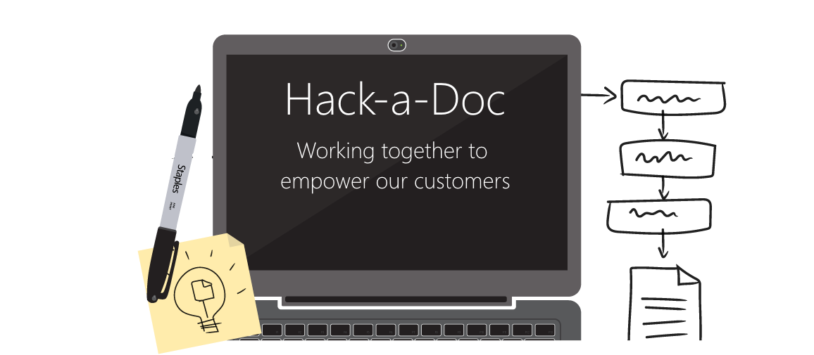

Title: Visual Studio ALM Hack-a-Doc 2015 Q2
ms.TocTitle: VS ALM Hack-a-Doc
Toc: show
ms.ContentId: FD348F1C-BE56-4E8C-A419-BBBEF2FEF58E

# Visual Studio ALM Hack-a-Doc 2015 Q2

Help tell one of our stories to encourage adoption and empower more customers

We want great documentation.  It helps our customers discover, learn and become engaged to with our product.   We think that means the ability for everyone to contribute their expertise directly to customers.

## Goals

Our goals for the event: 

 * Get more people involved!  Increase the number of contributors coming directly from the PM and engineering teams.

 * Refresh and validate content on visualstudio.com and ALM documentation in MSDN for technical accuracy.

 * Improve overall ALM documentation.

 * Train everyone how to use git + markdown + VSO tools (via open authoring) to make changes to our ALM documentation on visualstudio.com and MSDN.

 * Generate some excitement to continue to contribute to documentation.

## Redmond, Tuesday, May 26

The Workshop (aka The Garage) in Building 18

5701 NE 39th St 
Redmond, WA 98052

[Map it](http://binged.it/1KyrcvO)

## Raleigh, Tuesday, June 2

Customer Area (Raleigh/1020-1030)

4825 Creekstone Drive 
Durham, NC 27703

[Map it](http://binged.it/1JXBsNr)

## Agenda

<table>
<thead>
<tr>
<td>Time</td>
<td>Activity</td>
</tr>
</thead>
<tr>
<td>8:00</td>
<td>Breakfast and coffee</td>
</tr>
<tr>
<td>9:00</td>
<td>Intro - some training for those who'd like to learn about using open authoring with our content repos, how to insert high resolution screenshots, and guidelines on voice.</td>
</tr>
<tr>
<td>10:00</td>
<td>Hack-a-Doc! - people are welcome to return to their offices/team rooms after the training, or continue to hack in the room together.</td>
</tr>
<tr>
<td>12:00</td>
<td>Lunch</td>
</tr>
<tr>
<td>4:00</td>
<td>Final push - wrap it up</td>
</tr>
<tr>
<td>5:00</td>
<td>Review our progress together</td>
</tr>
</table>
                
## Prepare

To make the most of this opportunity, take a few moments to prepare.

### Plan your work

Pick up or create a user story to help avoid collisions and duplicate work:

 * [Check out our list of stories](http://aka.ms/hackadoc-work)

  - See one you like that is not yet assigned? Assign it to yourself!

 * [Create a new doc story](https://mseng.visualstudio.com/DefaultCollection/VSOnline/Agile/_workItems/create/User%20Story?%5BSystem.Tags%5D=Doc%3B+Hack&%5BSystem.AreaPath%5D=VSOnline%5CVS+Cloud+Services%5C)

  - Add your feature team's area path so we can partner you with the writer who can help you slot the story into our content set.

[!INCLUDE [temp](_shared/markdown-get-started.md)]

[!INCLUDE [temp](_shared/get-tools.md)]

### Read me 

Want to be super prepared? Get oriented on our repos, art processes, internal Markdown conventions, previewing your work, and other tips and tricks: [Visual Studio ALM ReadMe](http://vssplatform/_readme/?branch=origin/releases/hack) 
                    

## Q&A

### Who can participate?

Anyone on the VS ALM product team is welcome to join, but PM's are highly encouraged to do so.

Tell your friends! http://aka.ms/hack-a-doc.

### Should I bring anything?

Bring your laptop and your passion to share what you know to empower our customers.

### Any other questions?

[vshackadoc@microsoft.com](mailto:vshackadoc@microsoft.com)