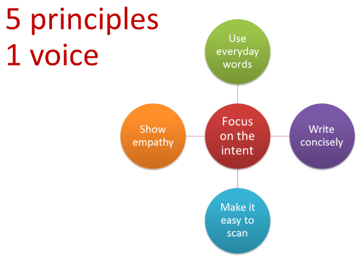
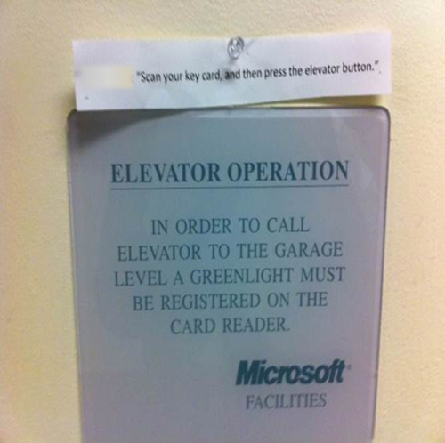
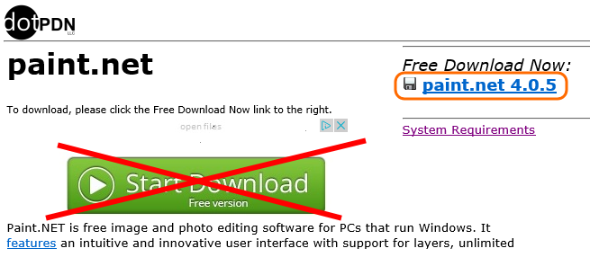
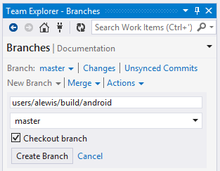
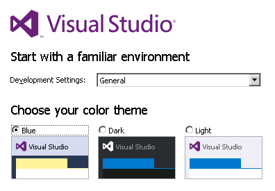
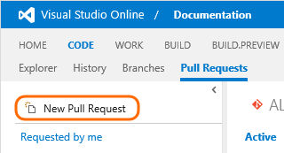
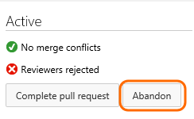
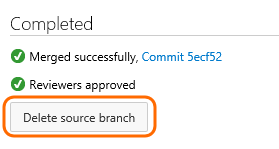

ms.TocTitle: Read me
Title: Read me
Description: Read me if you want to help tell our story to customers.
ms.ContentId: 813AC051-B6E6-4BDD-AD69-D202CEC56A59
Toc: show

<div style="color:white;background-color:#800080;line-height:default;padding:20px 10px 12px 10px;text-align:right;font-weight:600">
<table style="margin-left:auto;margin-right:auto">
<tr>
<td style="padding:15px;">Page Owner: Andy Lewis</td>
<td style="padding:15px;">Playbook Quality Rating: InProgress</td>
<td style="padding:15px;">Sponsor: Mario Rodriguez (VSNC)</td>
</tr>
</table>
</div>

# Read me

<!--*...and help us tell our story so we can encourage adoption and empower more customers.*-->

We write documentation that is integral to our products so we can encourage more adoption and empower more customers. We collaborate on our "docs" in open authoring using the same lightweight processes and tools we use to build our products: Visual Studio, Team Foundation Server, and Visual Studio Online. 

Whether you are a writer, PM, or developer, this page is here to get you up to speed to write some docs today.

A nicer way to read me is here: http://vssplatform/_readme

## Join us

<div style="background-color:#FFE97F;font-size:125%;padding:12px 10px 12px 10px">
Before you get started, please [join VSOnline Content Contributors](http://idwebelements/GroupManagement.aspx?Group=vsocontc&Operation=join) so we can notify you about releases, issues, changes, and outages.
</div>


## Types (Why, What)

<!--*Different kinds of customers come to us with different needs.*-->

Who is your customer? What do they need?

 * **Get started** Onboarding topics show newbies the "happy path" to success.

  - **VSO get started** gets newbies up and running broadly, across all domains. From new account, to code, to build, etc. [Build your app](https://www.visualstudio.com/get-started/build/build-your-apps-vs)

  - **MSDN get started** helps newbies get up to speed quickly and then go deeper. [Build your Visual Studio solution](http://msdn.microsoft.com/en-us/Library/vs/alm/build/vs/define-build)
 
 * **How-to** topics are for an audience that knows the basics and now has a more advanced task to perform. [Run a script](https://msdn.microsoft.com/en-us/Library/vs/alm/Build/scripts/index)
 
 * **Q&A** We often answer specific questions at the bottom of some topics to to cover ancillary, less common, but still very important bits of guidance. [Build your app Q&A](http://msdn.microsoft.com/en-us/Library/vs/alm/build/vs/define-build#qa)

  - How do I automatically purge builds I don't need?

  - Where can I get a newer version of PowerShell?
 
 * **Technical reference** Some users need to know "How do I work this?" A reference enables customers to leverage a functional surface that is typically offered programatically (e.g. an API), but could be offered via a special syntax in the UX (e.g. a command prompt argument provided in an input box).

  - [Use build numbers to give meaningful names to completed builds](https://msdn.microsoft.com/en-us/library/hh190719.aspx)

  - [Predefined variables](http://msdn.microsoft.com/en-us/Library/vs/alm/build/scripts/variables)

  - [Use Team Foundation version control commands](https://msdn.microsoft.com/en-us/library/cc31bk2e.aspx)
 
 * **What's New** helps our existing customers stay competitive by quickly telling them about the new value we've just shipped. Also encourages adoption. [What's new in version control](https://msdn.microsoft.com/en-us/library/hh994655.aspx)
 
 * **Articles** offer opinionated and specialized guidance. Customers are asking for our opinions and expertise. These pieces can also serve as a way for us to highlight new features.

  - [Setting up the Perfect Git Command Line Environment on Windows](http://www.woodwardweb.com/git/setting_up_the.html)

  - [Merging vs. Rebasing](https://www.atlassian.com/git/tutorials/merging-vs-rebasing)


## Plan, track, report (When)

<!--*On same train and tracks with the product*-->

Writers, PMs, and engineers do this work together, so we plan, track, and report on user stories in the same area paths as the product team.

[Here are our open content Stories](https://mseng.visualstudio.com/DefaultCollection/VSOnline/_workitems#path=Shared+Queries%2FVSCS+NC%2FDocs%2FAll+Content+Stories&_a=query)

[!INCLUDE [temp](_shared/create-content-work-items.md)]

Feature team PMs should report on these completed stories in their sprint summary email.

## Personas (Who)

<!--*Assume the role and take the stage*-->

LCA requires us to use their fictional names for companies and people.

### Fabrikam

All our personas work for Fabrikam. So use that or variations of that name as the name of your VSO accounts, team projects, repos, etc. 

### Personas

LCA requires us to use names they give us in our screenshots (you can't use your own name!).


Following are our personas. To assume one of these roles:
 
 * If you are using an on-premises server, you can grant permissions and log on to corpnet using one of the NORTHAMERICA aliases. 
 
 * If you are using a VSO server, you can log on using a Microsoft account and change the profile to use one of these names.

 * Add the appropriate avatar to the account profile if it has not already been added.

### Persona names and aliases

Andy Lewis and Kathryn Elliott maintain these NORTHAMERICA domain accounts. 

The passwords are [here](https://microsoft.sharepoint.com/teams/CE_CSI/EMBA/_layouts/OneNote.aspx?id=%2fteams%2fCE_CSI%2fEMBA%2fSiteAssets%2fEnable%20Modern%20Business%20Apps%20Notebook&wd=target%28ALM%20Team%2fMisc.one%7cDE9AE9FC-0F13-4B9A-A31E-204DB79EC398%2fInfo%20on%20passwords%7c8BD58369-3A0E-4966-B999-A66243336A86%2f%29). 

<table>
<tr>
<td>NORTHAMERICA alias</td>
<td>Display name</td>
<td>Title</td>
<td>Avatar</td>
</tr>
<tr><td>ctsoapo</td>
<td>Christie Church (Fabrikam)</td>
<td>Agile Product Owner</td>
<td></td>
</tr>
<tr><td>ctsoasm</td>
<td>Jamal Hartnett (Fabrikam)</td>
<td>Agile Scrum Master</td>
<td></td>
</tr>
<tr><td>ctsobld</td>
<td>Mateo Escobedo (Fabrikam)</td> 
<td>Build Engineer</td>
<td></td>
</tr>
<tr><td>ctsodev1</td>
<td>Raisa Pokrovskaya (Fabrikam)</td> 
<td>Developer</td>
<td></td>
</tr>
<tr><td>ctsodev2</td>
<td>Francis Totten (Fabrikam)</td> 
<td>Developer</td>
<td></td>
</tr>
<tr><td>ctsoita</td>
<td>Helena Petersen (Fabrikam)</td> 
<td>IT Admin</td>
<td></td>
</tr>
<tr><td>ctsopm</td>
<td>Chuck Reinhart (Fabrikam)</td>
<td>Project Manager</td>
<td></td>
</tr>
<tr><td>ctsora</td>
<td>Jia-hao Tseng (Fabrikam)</td> 
<td>Requirements Analyst</td>
<td></td>
</tr>
<tr><td>ctsotst1</td>
<td>Johnnie McLeod (Fabrikam)</td> 
<td>Tester</td>
<td></td></tr>
<tr><td>ctsotst2</td>
<td>Nicole Zamora (Fabrikam)</td> 
<td>Tester</td>
<td></td>
</tr>
</table>

**Q:** Why do all the personal user names begin with "ctso"? **A:** Because our sample company used to be Contoso.


## Voice

From editor Patricia Wagner

</img>

### Our voice is always human.

We write naturally. We use the <span style="font-weight:bold;color:#C00000">everyday language</span> that you use when talking to a friend.

We use <span style="font-weight:bold;color:#C00000">short words. Short sentences.</span> We <span style="font-weight:bold;color:#C00000">lead with what's most important.</span> We eliminate anything that's not essential.

Our voice means <span style="font-weight:bold;color:#C00000">never having to read something twice.</span> You get it the first time. 

And you're <span style="font-weight:bold;color:#C00000">inspired</span> to move forward.

### Official vocabulary

<table style="border:0">
<tr>
<td style="border:0;vertical-align:top;font-size:150%">
    <table style="border:0">
    <thead>
    <tr>
    <td style="font-weight:bold;color:#C00000;padding:10px 70px 10px 10px; border:0">Before</td>
    <td style="font-weight:bold;color:#C00000;padding:10px 70px 10px 10px;border:0">After</td>
    </tr>
    </thead>
    <tr>
    <td style="padding:10px;border:0">modify</td>
    <td style="padding:10px;border:0">change</td>
    </tr>
    <tr>
    <td style="padding:10px;border:0">perform</td>
    <td style="padding:10px;border:0">do</td>
    </tr>
    <tr>
    <td style="padding:10px;border:0">purchase</td>
    <td style="padding:10px;border:0">buy</td>
    </tr>
    <tr>
    <td style="padding:10px;border:0">terminate</td>
    <td style="padding:10px;border:0">end</td>
    </tr>
    <tr>
    <td style="padding:10px;border:0">obtain</td>
    <td style="padding:10px;border:0">get</td>
    </tr>
    <tr>
    <td style="padding:10px;border:0">utilize</td>
    <td style="padding:10px;border:0">use</td>
    </tr>
    </table>
</td>
<td style="border:0">
</td>
</tr>
</table>

For more, including a video from Patricia, see [Modern Voice, Strategic Reviews, Peer Reviews](https://microsoft.sharepoint.com/teams/CE_CSI/EMBA/_layouts/15/start.aspx#/Shared%20Documents/Forms/AllItems.aspx?RootFolder=%2Fteams%2FCE%5FCSI%2FEMBA%2FShared%20Documents%2FModern%20Voice%2C%20Strategic%20Reviews%2C%20Peer%20Reviews&FolderCTID=0x012000559CC8919D938E4DB5E99010D789B73E&View=%7B9A9D6625%2D8252%2D4699%2DAB22%2D80).

<a name="tools"></a>
## Tools

[!INCLUDE [temp](_shared/get-tools.md)]

### Get art tools

Some tools we use to paint a picture for the user.

#### To shoot screenshots
 
To show the user how to do it, shoot a screenshot:

  * [OneNote](https://support.office.com/en-us/article/Create-screen-clippings-from-the-web-a6a10e94-4a0e-4e8f-87db-f702657fb374)

  * http://getgreenshot.org/

#### To touch up screenshots

Sometimes you need to enhance or touch up the screenshot. For example, we add highlights to screenshots to emphasize the regions that the user needs to focus on to accomplish the task. 

Many of us use Paint.NET because it is free and easy to use. But it is a little tricky to download:

http://www.dotpdn.com/downloads/pdn.html



**Important:** Before you touch up art in Paint.NET, make sure to **[preserve and share the original raw image] (#raw_art)**!

#### To draw conceptual art
 
Tools people use include:
 
 * Visio
 
 * PowerPoint

<a name="where"></a>
## Repos, branches (Where)

<!--*Where and how we keep our stuff and ship it to customers*-->

<a name="repos"></a>
### Find your repo

<table>
<thead>
<tr>
<td style="vertical-align:top">If you are writing...</td>
<td style="vertical-align:top">Use this repo...</td>
</tr>
</thead>
<tr>
<td style="vertical-align:top">For [MSDN](http://msdn.microsoft.com/en-us/Library/vs/alm/build/overview)</td>
<td style="vertical-align:top">[Content.ALM](https://mseng.visualstudio.com/DefaultCollection/VSOnline/_git/Content.ALM#path=%2F&version=GBmaster&_a=contents)</td>
</tr>
<tr>
<td style="vertical-align:top">For [VisualStudio.com (VSO)](https://www.visualstudio.com/)</td>
<td style="vertical-align:top">[Content.VS](https://mseng.visualstudio.com/DefaultCollection/VSOnline/_git/Content.VS#path=%2F&version=GBmaster&_a=contents)</td>
</tr>
<tr>
<td style="vertical-align:top">Opinionated or specialized articles
<p>[What are articles? Where will we publish them?] (#articles)</p>
</td>
<td style="vertical-align:top">[Content.VS.Articles](https://mseng.visualstudio.com/DefaultCollection/VSOnline/_git/Content.VS.Articles#path=%2F&version=GBmaster&_a=contents)
</td>
</tr>
</table>

<a name="branch"></a>
### Create your topic branch

Begin writing by [creating your topic branch](https://msdn.microsoft.com/en-us/library/jj190809.aspx#create) from ```master```.



**Note:** In Git speak, a "topic branch" is simply a branch you create for your work. Your topic branch can include work on as many topics as you want. 

**Tip:** Please follow standard naming conventions for topic branches. For example:

 - **users**/britt/great-stuff

 - **features**/build/cool-app

 - **deployments**/m84/feature-list-update

<a name="author"></a>
## Author (How)

[!INCLUDE [temp](_shared/markdown-get-started.md)]

### Create a topic

After you have [created your topic branch] (#branch), you can edit topics, and add more topics.

If you are using Visual Studio: 
 
0. File -> New -> File -> Text File. 

0. File -> Save as
 
0. Select Save as type: **All files (&#042;.&#042;)**

0. Specify the *&lt;name&gt;*.md in the appropriate folder in your repo.

### Add metadata

At the top of your markdown topic, you must add this metatdata (otherwise you'll get build errors):

```
Title: This is my title in long form
Description: This is my description
ms.TocTitle: My short title
ms.ContentId: 00000000-0000-0000-0000-000000000000

```

Set ```ms.ContentId``` to a new GUID. You can get one from Visual Studio: Tools -> Create GUID.

**Tip:** Are you about to copy from another topic and paste into your topic? Are you writing something that you think needs to be used in multiple topics (for example, a common Q&A item)? **[You can write it once and use an include!] (#include)**

### Structure 

<!--*The best stories also have great structure*-->


#### Folder structure

Use these subfolder conventions to keep our repo experience happy:

 * ```_shared``` - content you intend to share using an include reference. For example ```\library\vs\alm\build\_shared``` contains content that is included in both ```\library\vs\alm\build\index.md``` and ```\library\vs\alm\build\overview.md```.

 * ```_img``` - images used in topics, including screenshots and conceptual art. For example the images used in ```\library\vs\alm\build\vs\define-build.md``` are stored in ```\library\vs\alm\build\vs\_img``` or in ```\library\vs\alm\build\vs\_img\define-build``` if you have a lot of topics in ```\library\vs\alm\build\vs\```.

 * ```_shared\_img``` - shared images. For example, images shared among multiple build topics are stored in ```\Library\vs\alm\Build\_shared\_img```.

#### Q&A sections

Use Q&A sections to share important information that isn't part of the main happy path. Make sure you remember to close them. 
 
	## Q & A
	
	<!-- BEGINSECTION class="md-qanda" -->
	
	#### Q: Should I use Q&A sections?
	
	A: Yes!
	
	<!-- ENDSECTION -->

<a name="md_images"></a>
#### Images

*The image examples in here include blanks after !  and ] because of build issues with code blocks. After that's fixed, we'll correct them.*

To break a line between a step and an image, use a blank line and indent the image with a space character (instead of ending it with a BR tag).

	0. Begin the process.
	
	   ! [Click the begin button] (_img/IC680095.png)

**Tip:** Don't use a tab character to indent the image, or Markdown will treat the image tag as code.

Don't include title text. Do this:

	! [alt-text] (image.png).
	
Without the image title text (so not this):

    ! [alt-text] (image.png "title-text"). 

#### Links to markdown files

*The example link here adds a blank after ] because of a build problem with code blocks.
We'll remove that when it's fixed.*

To link to other markdown files, make sure to include the ".md" extension. E.g.: 

	[Run tests in your build] (run-tests-with-builds-vs.md)

#### Intra-page links

To link to another place in the document:

```html
    [Something great lower in the doc] (#great_stuff)

    blah

    blah

    blah

    <a name="great_stuff"></a>
    ## Great stuff

    awesome
```


<a name="include"></a>
#### Include shared content

*The example link here adds a blank after ] because of a build problem with code blocks.
We'll remove that when it's fixed.*

If you want to offer the same blurb of content in two different topics, 
use a content include instead of copying and pasting. 

For example, you 
want to offer the same Q&A item in a few different topics. Put the content in 
a _shared folder and add the include tag in the files where you 
want the show the Q&A item:

    [!INCLUDE[temp] (../_shared/qa-vs-launch-fail.md)]

When you use an include, you must:

 * Include a ms.ContentId GUID metadata variable as described above. You can skip the other metadata items.
 * If your shared markdown file has images, use absolute paths (from the root of the center) to the images. Relative paths will fail to be resolved when the rendered page is built.

You should store shared content in a ```_shared``` sub-folder.

## Art

<!--*Show don't tell...-->

Designer: Frederic Francois

Customers love art. When we use screenshots in step-by-step tasks we've found that customers are more satisfied. Conceptual images (e.g. explaining a version control branching pattern) are vital to making complex concepts more understandable. 

But it is expensive to create art and potentially even more expensive to maintain it. So take at least a brief moment to consider the cost before you add a piece of art.


<a name="raw_art"></a>
### Important: Save and share the raw art with your colleagues!

Be sure to save a copy of your raw art and share it with others so that you or anyone else can later adjust the art without having to repeat all the work to set up, capture, etc.
 
 * For screenshots:

  - Save the uncropped screenshot as a separate .PNG file
 
  - If you use Paint.NET to touch it up, make sure to make all your alterations as separate layers.

 * For conceptual art, save the Visio or PowerPoint document.

 * Upload the raw art to [TFSContentRawArt](https://mseng.visualstudio.com/DefaultCollection/VSOnline/_git/Content.RawArt) 

**Q:** Why are we storing binaries in a Git repo? Isn't that bad? Shouldn't we be using Git media? **A:** It's OK for now. Stay tuned.

### Save the output file

However you create the art, save the final output as a .png file in a sub-folder below the topic named _img. Give the file an SEO-friendly name such as ```team-explorer-git-new-solution.png```. You can also create a sub-folder beneath that level if you have several topics with lots of images. 

For example:

```
![New solution from team explorer] (_img/share-your-code-in-git-vs/team-explorer-git-new-solution.png)
```

If you are saving art that you intend to share across topics, save it below a _shared folder. For example:

```
![Secret] (/library/vs/alm/build/_shared/_img/BldVarSecret.png)
```

For details on how to reference your image in Markdown, see [Images] (#md_images).


### Art guidelines

We follow some minimially viable guidelines to keep our image sharp while still keeping the process lightweight and scalable.

#### Art width

To keep the content experience smooth:

 * Keep the width at or below 718 pixels.

 * Try to stick with a couple of consistent widths for your screenshots within a topic. For example, make them all either 300 px or 600 px wide. Avoid having screenshots at lots of slightly different widths (e.g. 295 px, 310 px, 280 px, etc.).

#### Resizing art (don't do it!)

Never resize an image in your image editor or it will look bad.

Some UX (especially web UX) is difficult to capture within our width guideline. You can "cheat" a screenshot in an editor such as Paint.NET by selecting pieces and scooting them together to achieve a narrower result.

#### VS Theme

Use the Blue theme for all screenshots. 



This theme represents over 2/3 of all our users preferences, and it's our default theme. If you use a different theme in different screenshots, especially in the same topic, it looks bad.

#### Add highlights to a screenshot

Point the customer to the spot where you want them to look.


To highlight a screenshot:

 0. Shoot the screenshot.
 0. Open Paint.NET.
 0. Paste the capture into a new image (Keyboard: Ctrl + Alt + V).
 0. Add a new layer on the layers palette (Keyboard: F7).
 0. Select the default orange value (FF6A00) on the Primary palette from Colors (Keyboard: F8).
 0. Select the rounded rectangle tool (Keyboard: O, O, A).
 0. Increase the brush width to 3.
 0. Draw your highlight.

### Border

Don't add a border to your screenshots. We know that cropped screenshots of web UX can look dislocated with out it. We plan to fix this later as part of the authoring process.

<a name="preview_review_publish"></a>
## Preview, review, publish

<!--*This is not WYSIWYG exactly, but that's a good thing, and we will keep making it better...*-->

### Commit, publish the branch, and push

As you write:

* [Commit](https://msdn.microsoft.com/en-us/library/hh967655.aspx#changes) your changes at regular intervals. You don't have to commit every time you save. 
 
* When you are ready, [publish the branch](https://msdn.microsoft.com/en-us/library/jj190809.aspx#publish). 

 **Note:** In Git speak, when you "publish" a topic branch, you are sharing it with others within the company. This does not mean you are publishing your topic to the public. 

* As you continue working, you can continue to add to the published branch by [pushing your commits](https://msdn.microsoft.com/en-us/library/hh850436.aspx#push).

### Preview your local changes

Markdown is a very lightweight format, so it's not too hard read or tweak directly, even in the Visual Studio plain text editor. But for prolonged writing and reading, rendered content is more cognitively efficient.

You can get an approximate preview of your content in a web browser by running WebAPITools2. This is the same Node.js app that hosts http://vssplatform/ (intranet) and http://vsalmdocs.azurewebsites.net/ (public preview site).

 0. Clone https://mseng.visualstudio.com/DefaultCollection/Documentation/_git/WebApiTools2.

 0. Go to the root folder and run the viewer:

  * startviewer-vsalmdocs to preview ALMContent.

  * startviewer-vscom to preview VSContent.

Tip: Some authoring tools such as Visual Studio Code provide a basic preview. See [Tools] (#tools).

<a name="preview_remote"></a>
### Preview your topic branch remotely

If you have published your topic branch, you can preview your topic branch on http://vssplatform. 

For example, some writers are working on ```/Library/vs/alm/Admin/set-up.md``` in the ```features/admin``` topic branch. They can preview their work here: ```http://vssplatform/library/vs/alm/admin/set-up?branch=origin/features/admin```

The preview site does not match the formatting of our internal staging or live sites. 

http://vssplatform is owned and maintained by Will Smythe.

### Use a pull request to review your content

0. When you are ready for partners and stakeholders to review your content, [create a pull request](https://msdn.microsoft.com/en-us/Library/vs/alm/code/git/pull-requests).

 

0. Make sure the target is the same branch that is the basis of your topic branch. This is usually ```master```. 

0. You and your colleagues discuss the content. You can continue to push changes to the topic branch. 

0. It is just fine (and often the right thing to do) to abandon the pull request if you are not yet ready to publish your content.

 

 After you've done that, you can either reactivate the pull request later, or simply create a new one if you've made extensive additional changes.

0. When you are ready to publish the content, at least one of the content owners (writers or PMs) must approve the pull request. 

 **Tip:** If you are one of the content owners, you can appove your own pull request. To do this, you must add yourself to the pull request. (That said, it is still a best practice to get at least one additional pair of eyes on something you wrote.)

0. Complete the pull request. After the merge is successful, in most cases you should no longer need the source branch and you can delete it.

 

0. After you merge your pull request, check the build:

 - [MSDN.ALMContent.Stage](https://mseng.visualstudio.com/web/build.aspx?pcguid=0efb4611-d565-4cd1-9a64-7d6cb6d7d5f0&projectname=vsonline&definitionId=1287&action=viewBuilds)

 - [MSDN.VSContent.Stage](https://mseng.visualstudio.com/web/build.aspx?pcguid=0efb4611-d565-4cd1-9a64-7d6cb6d7d5f0&projectname=vsonline&definitionId=637&action=viewBuilds)

 If you find errors, create a new topic branch, fix the errors, and then create another pull request to merge the fixes.

0. Once the build has suceeded you can see how it will look when it goes live:

 * [MSDN staging server](https://int.msdn.microsoft.com/en-us/Library/vs/alm/Build/overview)

 * [VisualStudio.com (VSO) staging server](https://vscomint.tfsallin.net/en-us/get-started/setup/set-up-vs)

 [Q: I'm having trouble viewing the staging server. What do I do?] (#qa_staging_servers)

0. A [release manager](mailto:ceoacontmgr@microsoft.com) will publish the content in about a day.

[Q: Why do we need this process? Why do we need release managers? Why can't we publish right away?] (#qa_branch_policy_release)

[Q: Who are the release managers? How do they work?] (#qa_release_managers)

 

## Q & A

<!-- BEGINSECTION class="md-qanda" -->

<a name="articles"></a>
#### What are articles? Where will we publish them?

Customers are asking for our opinions and expertise. How should my team use branches? What are some best practices for using Git in the enterprise? I'm worried about my Git repo getting too big; how can I avoid problems? 

We plan to publish articles with opinionated and specialized knowledge from [Content.VS.Articles](https://mseng.visualstudio.com/DefaultCollection/VSOnline/_git/Content.VS.Articles):

 * Devops, owned by Andy Lewis and Chris Patterson

 * Java, owned by Andy Lewis and Paul Barham

 * Version control (Git and TFVC), owned by Andy Lewis, Matthew Mitrik, Saeed Noursalehi

Want to share how you think about these kinds scenarios and show some paths to success? Got an opinion about best practices and how our product helps implement them? Do you know someone on your team or a partner whose wisdom we should tap? 

We don't have a site yet, but we're working out the details. Contact [Andy Lewis](mailto:andy.lewis@microsoft.com).

#### Q: What about the old [Application Lifecycle Management with Visual Studio Team Foundation Server](https://msdn.microsoft.com/en-us/library/fda2bad5%28v=vs.140%29) site? 

A: For the VS 2015 version, we are redirecting the areas such as Code, Build, Work, Report, Administer, and Install from the TOC to our new OA site. We have plans to migrate other areas in the future.

#### Q: Where can I learn more about Open Authoring?

[Open Authoring Introduction](https://int.msdn.microsoft.com/en-us/openauthoring/introduction)

<a name="qa_staging_servers"></a>
#### Q: I'm having trouble viewing the staging server. What do I do?

A: You you might get a *403 - Forbidden: Access is denied* message if you don't enable itgproxy. This setting might break other sites. Hyperlinks might be broken and our layout is currently broken on the MSDN staging site. If you have questions, contact [Xiaokai He](mailto:hxiao@microsoft.com).

<a name="qa_branch_policy_release"></a>
#### Q: Why do we need this process? Why do we need release managers? Why can't we publish content ourselves right away?

A: We agree, and we're working to make it better. Our goal is to enable, as soon as possible:

 * Building, validating, and staging of content in Git topic branches.

 * Automatic self-serve publication for content owners.

<a name="qa_release_managers"></a>
#### Q: Who are the release managers? How do they work?

A: [Read me for release managers](http://vssplatform/_readme/release-managers).

#### Q: Hey, why is this branch locked? When will my content get published? Something changed, but nobody told me! Why?

A: Can't be sure, but a few things might help:

* Are you a member of VSOnline Content Contributors? If not, you might have missed the memo about releases, issues, changes, and outages. [Please join us!](http://idwebelements/GroupManagement.aspx?Group=vsocontc&Operation=join) 

* Contact [VS ALM Content Release Managers](mailto:ceoacontmgr@microsoft.com). 

#### Q: I found a topic that has a persona with a different name. What is the correct new name to use?

A: Here are how the old names map to the new names:

<table>
<tr>
<td>Northamerica alias</td>
<td>Old display name</td>
<td>New display name</td>
</tr>
<tr><td>ctsoapo</td>
<td>Annie Herriman (Fabrikam)</td>
<td>Christie Church (Fabrikam)</td></tr>
<tr><td>ctsoasm</td>
<td>Peter Waxman (Fabrikam)</td>
<td>Jamal Hartnett (Fabrikam)</td></tr>
<tr><td>ctsobld</td>
<td>Roberto Tamburello (Fabrikam)</td>
<td>Mateo Escobedo (Fabrikam)</td> </tr>
<tr><td>ctsodev1</td>
<td>Julia Ilyina (Fabrikam)</td>
<td>Raisa Pokrovskaya (Fabrikam)</td> </tr>
<tr><td>ctsodev2</td>
<td>Morten Rasmussen (Fabrikam)</td>
<td>Francis Totten (Fabrikam)</td> </tr>
<tr><td>ctsoita</td>
<td>Jill Frank (Fabrikam)</td>
<td>Helena Petersen (Fabrikam)</td> </tr>
<tr><td>ctsopm</td>
<td>Jack Creasey (Fabrikam)</td>
<td>Chuck Reinhart (Fabrikam)</td> </tr>
<tr><td>ctsora</td>
<td>Ming-Yang Xie (Fabrikam)</td>
<td>Jia-hao Tseng (Fabrikam)</td> </tr>
<tr><td>ctsotst1</td>
<td>Adam Barr (Fabrikam)</td>
<td>Johnnie McLeod (Fabrikam)</td> </tr>
<tr><td>ctsotst2</td>
<td>Isabelle Scemla (Fabrikam)</td>
<td>Nicole Zamora (Fabrikam)</td> </tr>
</table>

<!-- ENDSECTION -->


